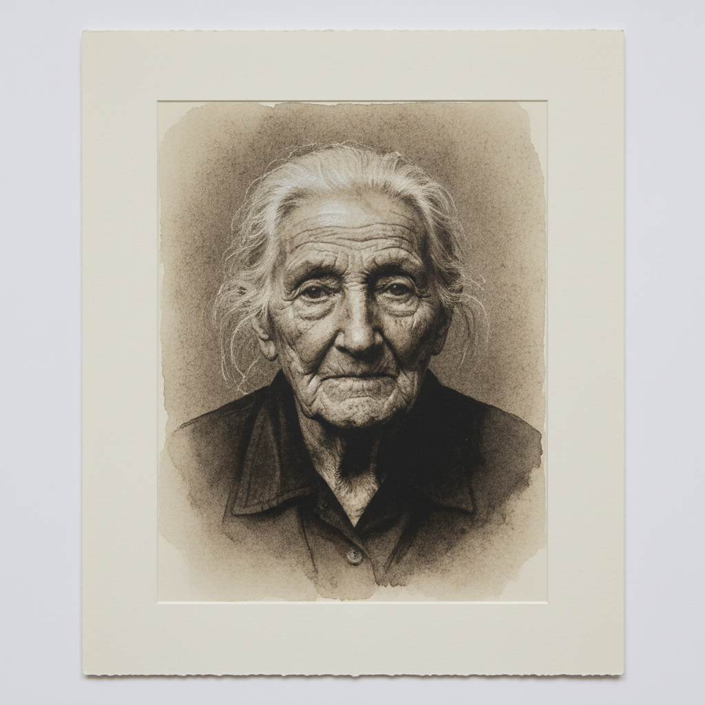

# Platinum Print Art 铂金印相艺术

> "Platinum printing is photography's noblest medium — metallic platinum embedded in the paper fibers produces an image of extraordinary tonal range, from the deepest velvety blacks to the most delicate silvery highlights. Unlike silver gelatin prints that sit on the paper surface, platinum images become part of the paper itself, as permanent as the precious metal they contain." — Unknown

## 概述

铂金印相艺术（Platinum Print Art）是一种使用铂金属（或钯金属）盐作为感光材料的摄影印刷工艺——将铂盐溶液涂在纸上，通过底片接触曝光后在显影液中还原为金属铂，产生嵌入纸纤维中的永久性图像。铂金印相以其极其丰富的色调范围、柔和的质感和极高的永久性著称。

铂金印相艺术的实践包括：1）涂布——将铂盐和铁盐溶液涂在纸上；2）干燥——在暗处干燥涂层；3）接触曝光——在紫外光下通过底片曝光；4）显影——在草酸钾溶液中显影；5）清洗——在稀盐酸中清除铁盐；6）钯印相——使用钯盐的变体工艺；7）当代铂金印相——将传统工艺与现代创作结合。

## 核心特征

| 特征 | 描述 |
|------|------|
| 铂金 | 使用贵金属铂 |
| 永久 | 极高的永久性 |
| 色调 | 极丰富的色调范围 |
| 嵌入 | 图像嵌入纸纤维 |
| 柔和 | 柔和的视觉质感 |
| 珍贵 | 材料极其昂贵 |

## 视觉特征

- **色调**：极其丰富的灰度层次
- **柔和**：柔和温暖的整体调性
- **深度**：深邃的暗部细节
- **质感**：纸张纤维的质感
- **永恒**：永恒感的视觉品质
- **高贵**：高贵典雅的气质

## 代表作品

| 作品 | 艺术家/文化 | 年代 | 意义 |
|------|-------------|------|------|
| *Frederick Evans cathedrals* | 英国 | 1900年代 | 埃文斯的教堂摄影 |
| *Edward Weston nudes* | 美国 | 1920-30年代 | 韦斯顿的人体摄影 |
| *Paul Strand portraits* | 美国 | 1910-20年代 | 斯特兰德的肖像 |
| *Irving Penn platinum prints* | 美国 | 1960-90年代 | 佩恩的铂金印相 |
| *Contemporary platinum* | 国际 | 当代 | 当代铂金印相 |

## 历史时间线

| 时期 | 事件 |
|------|------|
| 1873年 | William Willis发明铂金印相 |
| 1880-1920年代 | 铂金印相的黄金时代 |
| 一战期间 | 铂金价格暴涨导致衰落 |
| 1970年代 | 铂金印相的复兴 |
| 当代 | 铂金印相的艺术化发展 |

## 中国语境

铂金印相在中国的摄影艺术界有一定的认知和实践。中国的替代摄影工艺爱好者群体中，铂金印相作为最高品质的手工印相工艺——受到高度关注。中国的摄影教育中，铂金印相作为经典的贵金属印相工艺——在高等院校的摄影专业中教授。中国当代的摄影艺术家将铂金印相与中国传统的宣纸结合——创造出具有东方韵味的独特作品。中国的艺术市场中，铂金印相作品因其永久性和稀缺性——在收藏市场有较高价值。中国的一些高端摄影工作室提供铂金印相服务——满足对最高品质印相的需求。

## AI生成概念图

## 与其他风格的关系

- **Gum Bichromate** → 重铬酸胶印
- **Cyanotype** → 蓝晒法
- **Palladium Print** → 钯金印相
- **Silver Gelatin** → 银盐印相
- **Pictorialism** → 画意摄影
- **Fine Art Photography** → 艺术摄影

---

*浮光艺志 | Chronicle of Artistry*
