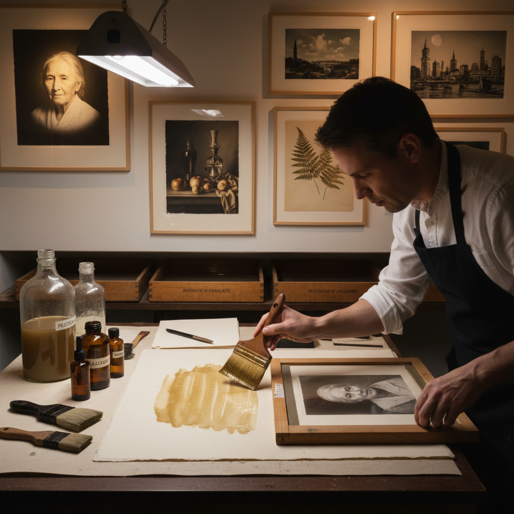

# Platinum Printing 铂金印相

> "Platinum printing is photography's equivalent of gold leaf in painting — the most permanent, the most luminous, the most subtle of all photographic processes, producing prints that will outlast the paper they are made on." — Unknown

## 概述

铂金印相（Platinum Printing / Platinotype）是一种使用铂金属（platinum）或钯金属（palladium）作为影像材料的摄影印相工艺——由威廉·威利斯（William Willis）于1873年获得专利。其过程是将铂盐（或钯盐）和铁盐的感光溶液涂布在纸张上，通过底片接触曝光后用草酸钾溶液显影——曝光部分的铁盐还原铂盐为金属铂，形成影像。

铂金印相被认为是所有摄影印相工艺中最优秀的——其优势包括：极其丰富的影调层次（从纯黑到纯白之间有无数层次）、影像嵌入纸张纤维中（而非浮在表面）、极其稳定和永久（铂金不会氧化或褪色）、独特的哑光质感和温暖色调。铂金印相在19世纪末至20世纪初被许多顶级摄影师使用，后因铂金价格上涨和银盐照片的普及而衰落，当代经历了强劲的复兴。

## 核心特征

| 特征 | 描述 |
|------|------|
| 铂金 | 使用铂金属 |
| 永久 | 极其永久稳定 |
| 影调 | 极其丰富的影调 |
| 嵌入 | 影像嵌入纤维 |
| 珍贵 | 材料珍贵 |
| 手工 | 完全手工制作 |

## 视觉特征

- **影调**：极其丰富的影调
- **哑光**：哑光的表面质感
- **温暖**：温暖的中性色调
- **深度**：深邃的暗部
- **纤维**：纸张纤维可见
- **永久**：永不褪色的品质

## 代表作品

| 作品 | 艺术家 | 年代 | 意义 |
|------|--------|------|------|
| *Platinum portraits* | Frederick Evans | 1890s | 建筑和肖像 |
| *Platinum landscapes* | Edward Weston | 1920s | 现代主义摄影 |
| *Platinum prints* | Paul Strand | 1910s-20s | 直接摄影 |
| *Palladium prints* | Irving Penn | 1960s-2000s | 当代大师 |
| *Contemporary platinum* | Various | 当代 | 当代铂金印相 |

## 历史时间线

| 时期 | 事件 |
|------|------|
| 1873 | Willis获得铂金印相专利 |
| 1880s-1900s | 铂金印相的黄金时代 |
| 1910s | 一战导致铂金价格暴涨 |
| 1920s | 铂金印相的商业衰落 |
| 1970s | 替代工艺运动中的复兴 |
| 当代 | 铂金/钯金印相的艺术复兴 |

## 中国语境

铂金印相在中国的摄影艺术圈中有一定的关注度。中国的一些高端摄影工作室和艺术家使用铂金/钯金印相创作限量版艺术品。中国的摄影教育中，铂金印相作为最高品质的印相工艺被介绍。中国的替代工艺摄影爱好者社群中，铂金印相因其"极致的影调和永久性"而被视为最高追求。中国的一些摄影收藏家对铂金印相作品有特别的兴趣。

## AI生成概念图

## 与其他风格的关系

- **Palladium Printing** → 钯金印相
- **Salt Printing** → 盐纸印相
- **Gum Bichromate** → 重铬酸胶印
- **Cyanotype** → 蓝晒法
- **Fine Art Photography** → 艺术摄影
- **Alternative Process** → 替代工艺

---

*浮光艺志 | Chronicle of Artistry*
