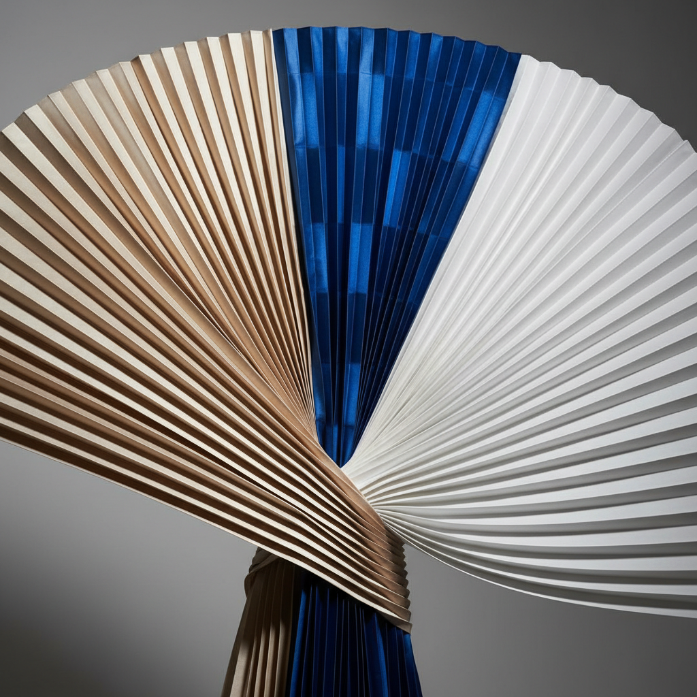

# Pleating Art 褶裥艺术

> "Pleating is the geometry of fabric — flat cloth folded into precise parallel ridges that add volume, movement, and architectural structure. From the knife-edge pleats of a Scottish kilt to the sunburst radiations of a Fortuny gown, pleating transforms two dimensions into three, creating surfaces that catch light in alternating bands of shadow and shine." — Unknown

## 概述

褶裥艺术（Pleating Art）是一种通过将织物折叠成规律的平行褶皱来创造立体效果和装饰纹理的纺织技法。褶裥是服装设计中最基本也最多变的造型手法之一——从简单的刀褶到复杂的太阳褶，从功能性的收腰到纯装饰性的表面处理，褶裥贯穿了整个服装史。

褶裥艺术的实践包括：1）刀褶（Knife Pleats）——单向折叠的平行褶；2）箱褶（Box Pleats）——对称折叠的方形褶；3）手风琴褶（Accordion Pleats）——交替折叠的细褶；4）太阳褶（Sunburst Pleats）——从窄到宽的放射褶；5）Fortuny褶——永久性的细密褶皱；6）折纸褶（Origami Pleats）——受折纸启发的立体褶；7）当代褶裥——将传统技法与现代设计结合的创作。

## 核心特征

| 特征 | 描述 |
|------|------|
| 折叠 | 规律的折叠结构 |
| 平行 | 平行的褶皱线条 |
| 立体 | 平面变为立体 |
| 光影 | 光影交替的效果 |
| 多变 | 多种褶型变化 |
| 建筑 | 建筑般的结构感 |

## 视觉特征

- **线条**：精确的平行线条
- **光影**：明暗交替的光影
- **节奏**：有节奏的重复
- **流动**：褶裥的流动感
- **立体**：强烈的立体效果
- **优雅**：优雅精致的质感

## 代表作品

| 作品 | 艺术家/文化 | 年代 | 意义 |
|------|-------------|------|------|
| *Delphos gown* | Mariano Fortuny | 1907年 | Fortuny褶裥长裙 |
| *Pleats Please* | Issey Miyake | 1993年起 | 三宅一生褶裥系列 |
| *Egyptian linen pleats* | 古埃及 | 古代 | 古埃及亚麻褶裥 |
| *Scottish kilt* | 苏格兰 | 传统 | 苏格兰裙的刀褶 |
| *Iris van Herpen* | 荷兰 | 当代 | 3D打印褶裥时装 |

## 历史时间线

| 时期 | 事件 |
|------|------|
| 古埃及 | 亚麻褶裥的早期使用 |
| 古希腊 | 希顿的褶裥 |
| 文艺复兴 | 拉夫领的精细褶裥 |
| 1907年 | Fortuny发明永久褶裥 |
| 当代 | 褶裥的技术创新和艺术化 |

## 中国语境

褶裥在中国服装传统中有重要地位。中国的马面裙以其精美的褶裥著称——是明清时期女性服饰的重要形式。中国的百褶裙传统——从古代的裳到现代的校服裙都使用褶裥。中国当代的服装设计师（如郭培、马可）——将褶裥作为重要的设计语言。中国的服装教育中，褶裥作为核心的造型技法——在服装设计和工艺课程中深入教授。中国的汉服复兴运动中，传统褶裥的复原和创新——是重要的研究方向。三宅一生的褶裥设计在中国有广泛影响——启发了许多中国设计师的创作。

## AI生成概念图

## 与其他风格的关系

- **Shirring** → 缩褶艺术
- **Origami** → 折纸艺术
- **Fashion Design** → 时装设计
- **Textile Art** → 纺织艺术
- **Fortuny** → Fortuny设计
- **Issey Miyake** → 三宅一生

---

*浮光艺志 | Chronicle of Artistry*
