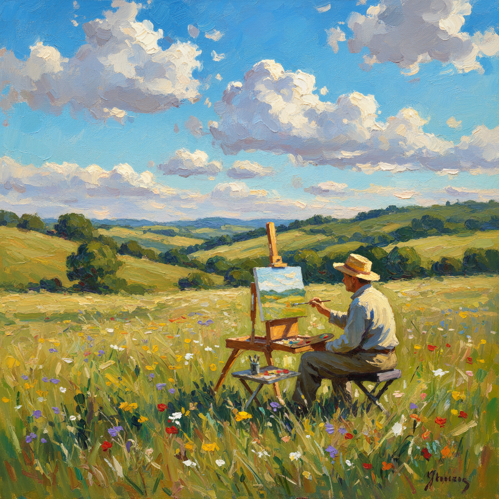

# Plein Air Painting 外光派绘画

> **时期：** 1830年代–至今  
> **关键词：** 户外写生、自然光线、便携画具、巴比松、即时性

## 概述

Plein Air Painting（外光派绘画，法语"在户外"）是19世纪随着便携画具和管装颜料的发明而兴起的户外写生传统。画家们离开画室，直接面对自然，在变化的光线中快速捕捉眼前的景象。从巴比松画派到印象派，外光写生彻底改变了画家观察和记录自然的方式——不再是记忆中的理想风景，而是此时此刻、这束光线下的真实世界。

## 风格特征

- **户外创作**：在自然中直接完成作品
- **光线敏感**：捕捉特定时刻的光照变化
- **快速笔触**：在光线改变前完成记录
- **鲜活色彩**：直接观察的真实色彩
- **即时性**：保留第一印象的新鲜感

## 代表人物与作品

- 约翰·康斯特布尔 英国乡村
- 卡米耶·柯罗 巴比松风景
- 克劳德·莫奈 户外系列
- 华金·索罗利亚 地中海光线

## 概念图

