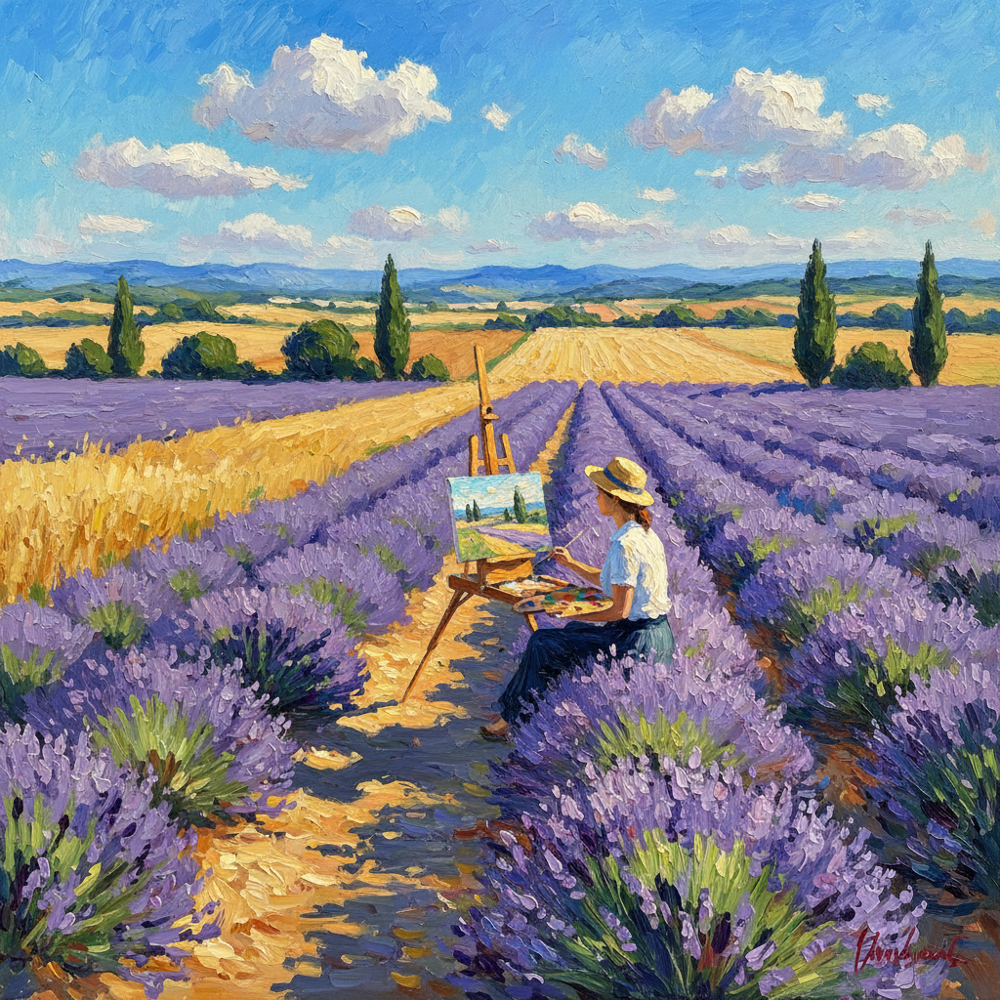

# Plein Air 外光画派

> "I must have flowers, always, and always." — Claude Monet

## 概述

外光画派（Plein Air，法语"露天"之意）是指直接在户外自然光下完成绘画的艺术实践和运动。虽然户外写生自古有之，但作为一种系统性的艺术理念，它在19世纪中期随着便携颜料管的发明和巴比松画派的实践而成为主流，并直接催生了印象派。

Plein Air 的核心信条是：只有在自然光下直接观察，才能捕捉到真实的色彩关系和大气效果。

## 核心特征

| 特征 | 描述 |
|------|------|
| 户外完成 | 整幅作品在户外一次性或少数几次完成 |
| 自然光线 | 捕捉特定时刻的真实光照条件 |
| 快速笔触 | 因光线变化快，需要迅速记录 |
| 色彩鲜活 | 直接观察产生的色彩比画室调色更生动 |
| 大气效果 | 关注空气、湿度、雾霭对色彩的影响 |
| 即时性 | 画面保留了创作瞬间的新鲜感 |

## 视觉特征

- **笔触**：可见的、快速的、有方向性的笔触
- **色彩**：高明度、高饱和度，阴影中有色彩
- **光线**：特定时刻的光照效果（晨光、午后、黄昏）
- **边缘**：柔和的边缘，物体融入环境
- **尺幅**：通常较小（便于携带），也有大型作品
- **题材**：风景、花园、海岸、乡村街道

## 代表人物

| 画家 | 代表作 | 特点 |
|------|--------|------|
| Claude Monet | *Impression, Sunrise* (1872) | 外光画的极致追求者 |
| Camille Pissarro | 蓬图瓦兹风景系列 | 乡村外光画 |
| Alfred Sisley | 泰晤士河与塞纳河风景 | 天空与水面的诗人 |
| Joaquín Sorolla | 地中海海滩系列 | 西班牙阳光大师 |
| John Singer Sargent | 水彩外光画 | 美国外光画巅峰 |
| Isaac Levitan | 俄罗斯风景 | 俄罗斯外光画代表 |

## 技术革新

- **1841年**：John Goffe Rand 发明可折叠锡管颜料管
- **便携画架**：法式画箱（French easel）的普及
- **铁路**：火车使画家能快速到达乡村写生地
- **新颜料**：合成颜料提供了更鲜艳的色彩选择

## 历史背景

1. **1830-40年代**：巴比松画家开始系统性户外写生
2. **1860年代**：莫奈、雷诺阿等人在塞纳河畔写生
3. **1874年**：第一次印象派展览，外光画成为运动
4. **1880-1900年代**：外光画传播到美国、俄罗斯、澳大利亚
5. **至今**：Plein Air 仍是活跃的绘画实践

## 与其他风格的关系

- **Barbizon School** → 直接先驱
- **Impressionism** → 外光画的最著名实践者
- **Luminism** → 美国版的光线追求
- **Australian Impressionism** → 海德堡画派的外光实践
- **Newlyn School** → 英国的外光画运动

## 概念图

---

*浮光艺志 | Chronicle of Artistry*
