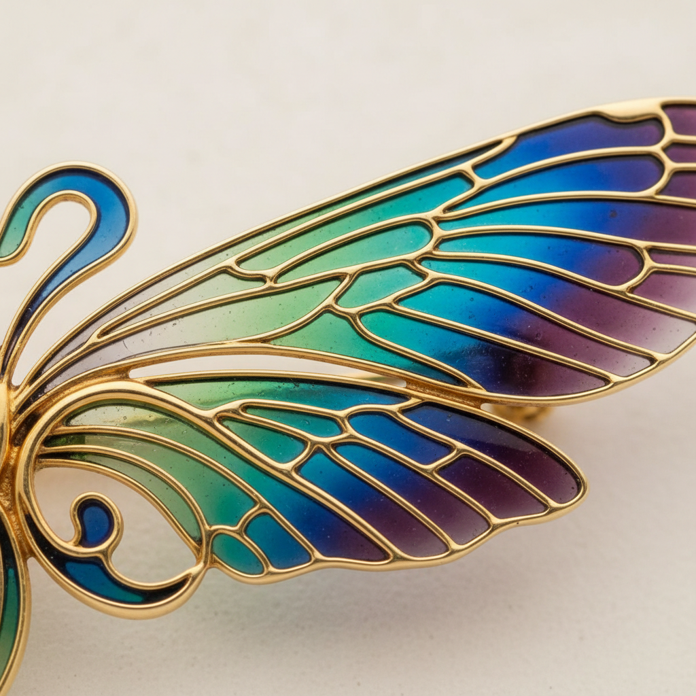

# Plique-à-jour Art 透光珐琅艺术

> "Plique-à-jour is stained glass in miniature — translucent enamel suspended in metal cells without any backing, so that light passes through the colored glass just as it does through a cathedral window. The effect is of jeweled wings, of butterfly scales made permanent in glass and gold. It is the most difficult and fragile of all enamel techniques, requiring absolute mastery of temperature, timing, and the mysterious behavior of molten glass." — Unknown

## 概述

透光珐琅艺术（Plique-à-jour Art）是一种将透明或半透明珐琅填入金属框架中但不使用底板的珐琅技法——使光线可以穿透珐琅，产生类似彩色玻璃窗的效果。Plique-à-jour（法语"让日光通过"）是所有珐琅技法中最困难和最精致的一种，因为没有底板支撑，珐琅必须仅靠表面张力悬挂在金属框架中。

透光珐琅艺术的实践包括：1）掐丝透光——在掐丝框架中填入透明珐琅；2）锯切透光——在金属板上锯出孔洞再填入珐琅；3）临时底板法——使用临时底板烧制后去除；4）毛细管法——利用珐琅的毛细作用填充；5）多次烧制——分多次填充和烧制；6）珠宝应用——在首饰中的透光珐琅；7）当代透光珐琅——将传统技法与现代设计结合的创作。

## 核心特征

| 特征 | 描述 |
|------|------|
| 透光 | 光线可以穿透 |
| 无底 | 没有底板支撑 |
| 困难 | 最困难的珐琅技法 |
| 脆弱 | 极其脆弱的作品 |
| 珍贵 | 极其珍贵和稀有 |
| 精致 | 极致精致的效果 |

## 视觉特征

- **透光**：光线穿透的彩色效果
- **宝石**：宝石般的光彩
- **精致**：极其精致的细节
- **色彩**：透明珐琅的鲜艳色彩
- **轻盈**：轻盈通透的质感
- **梦幻**：梦幻般的光影效果

## 代表作品

| 作品 | 艺术家/文化 | 年代 | 意义 |
|------|-------------|------|------|
| *Byzantine plique-à-jour* | 拜占庭 | 6世纪 | 最早的透光珐琅 |
| *Art Nouveau jewelry* | 法国 | 19-20世纪 | 新艺术珠宝 |
| *René Lalique works* | 法国 | 1900年代 | 拉利克透光珐琅 |
| *Japanese shippo* | 日本 | 明治时代 | 日本透光七宝 |
| *Contemporary plique-à-jour* | 当代 | 当代 | 当代透光珐琅 |

## 历史时间线

| 时期 | 事件 |
|------|------|
| 6世纪 | 拜占庭透光珐琅的起源 |
| 14世纪 | 欧洲透光珐琅的发展 |
| 19世纪末 | 新艺术运动中的黄金时代 |
| 明治时代 | 日本透光七宝的发展 |
| 当代 | 透光珐琅的艺术化发展 |

## 中国语境

透光珐琅艺术在中国有一定的认知和发展。中国传统的珐琅工艺中虽然以掐丝珐琅为主，但透光珐琅在一些高端作品中有应用。中国当代的珐琅艺术家开始探索透光珐琅技法——将其视为珐琅工艺的最高境界。中国的珠宝设计中，透光珐琅作为一种极其精致的装饰技法正在获得关注——特别是在高端定制珠宝中。中国的一些工艺美术大师开始研究和教授透光珐琅——将其作为珐琅技艺的进阶课程。中国的钟表和珠宝产业中，透光珐琅是最高端的装饰技法之一——代表着工艺的最高水平。中国的一些博物馆收藏有日本明治时期的透光七宝作品——作为东亚珐琅艺术的珍贵见证。

## AI生成概念图

## 与其他风格的关系

- **Cloisonné** → 掐丝珐琅
- **Champlevé** → 凹雕珐琅
- **Stained Glass** → 彩色玻璃
- **Art Nouveau** → 新艺术运动
- **Jewelry** → 珠宝艺术
- **Enamel Art** → 珐琅艺术

---

*浮光艺志 | Chronicle of Artistry*
