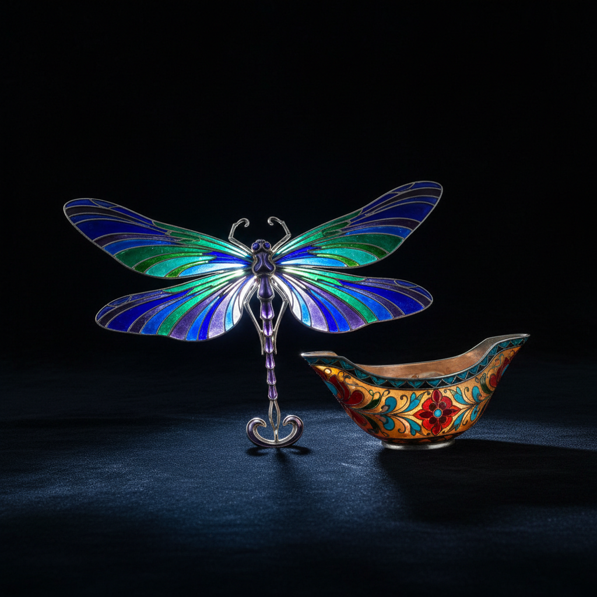

# Plique-à-jour 透光珐琅

> "Plique-à-jour is stained glass in miniature — light passes through enamel without a backing, like a butterfly's wing." — Unknown

## 概述

透光珐琅（Plique-à-jour，法语"让光通过"）是珐琅工艺中最精致、最困难的技法——将透明或半透明的珐琅釉料填入金属框架中，但不使用金属底板，使光线可以穿透珐琅，产生类似彩色玻璃窗的效果。这种技法要求极高的工艺精度，因为没有底板支撑，珐琅在烧制过程中极易破裂。成品如同微型的彩色玻璃窗，在光线下呈现出宝石般的透明色彩。

透光珐琅的魅力在于：它是珐琅中的"不可能"——没有支撑的色彩悬浮在金属骨架中，如同凝固的光。

## 核心特征

| 特征 | 描述 |
|------|------|
| 透光 | 光线可穿透珐琅 |
| 无底 | 没有金属底板 |
| 精细 | 极其精细的金属框架 |
| 脆弱 | 非常脆弱易碎 |
| 珍贵 | 因难度极高而珍贵 |
| 宝石感 | 如宝石般的透明色彩 |

## 视觉特征

- **透明**：光线穿透的透明色彩
- **宝石**：如宝石般的饱和色
- **金属框**：精细的金属丝框架
- **光影**：随光线变化的色彩
- **精致**：极其精致的细节
- **脆弱美**：脆弱中的极致美感

## 代表作品

| 作品 | 艺术家 | 年代 | 意义 |
|------|--------|------|------|
| *Russian kovsh* | 匿名 | 17-19世纪 | 俄罗斯透光珐琅酒器 |
| *Art Nouveau jewelry* | René Lalique | 1890s-1910s | 新艺术运动珠宝 |
| *Fabergé pieces* | Fabergé workshop | 1890s-1917 | 法贝热的透光珐琅 |
| *Japanese shippo* | 匿名 | 明治时代 | 日本透光七宝 |
| *Contemporary works* | Various | 当代 | 当代透光珐琅艺术 |

## 历史时间线

| 时期 | 事件 |
|------|------|
| 拜占庭时期 | 最早的透光珐琅尝试 |
| 14世纪 | 欧洲的早期透光珐琅 |
| 17世纪 | 俄罗斯的透光珐琅传统 |
| 1890s | Art Nouveau中的广泛应用 |
| 明治时代 | 日本的透光七宝 |
| 当代 | 作为极致工艺的传承 |

## 中国语境

透光珐琅在中国称为"透明珐琅"或"窗珐琅"，是珐琅工艺中最稀有的类型。中国传统珐琅以景泰蓝（掐丝珐琅）为主，透光珐琅的传统相对薄弱。但当代中国的珐琅工艺师正在学习和探索这一技法，特别是在高端珠宝设计领域。日本的透光七宝（尾张七宝）对中国当代珐琅艺术有一定影响。

## AI生成概念图

## 与其他风格的关系

- **Enamel** → 珐琅工艺的最高难度技法
- **Cloisonné** → 掐丝珐琅的透光版本
- **Stained Glass** → 彩色玻璃窗的微型版
- **Art Nouveau** → 新艺术运动的珠宝应用
- **Jewelry** → 高端珠宝工艺
- **Japanese Shippo** → 日本七宝烧

---

*浮光艺志 | Chronicle of Artistry*
