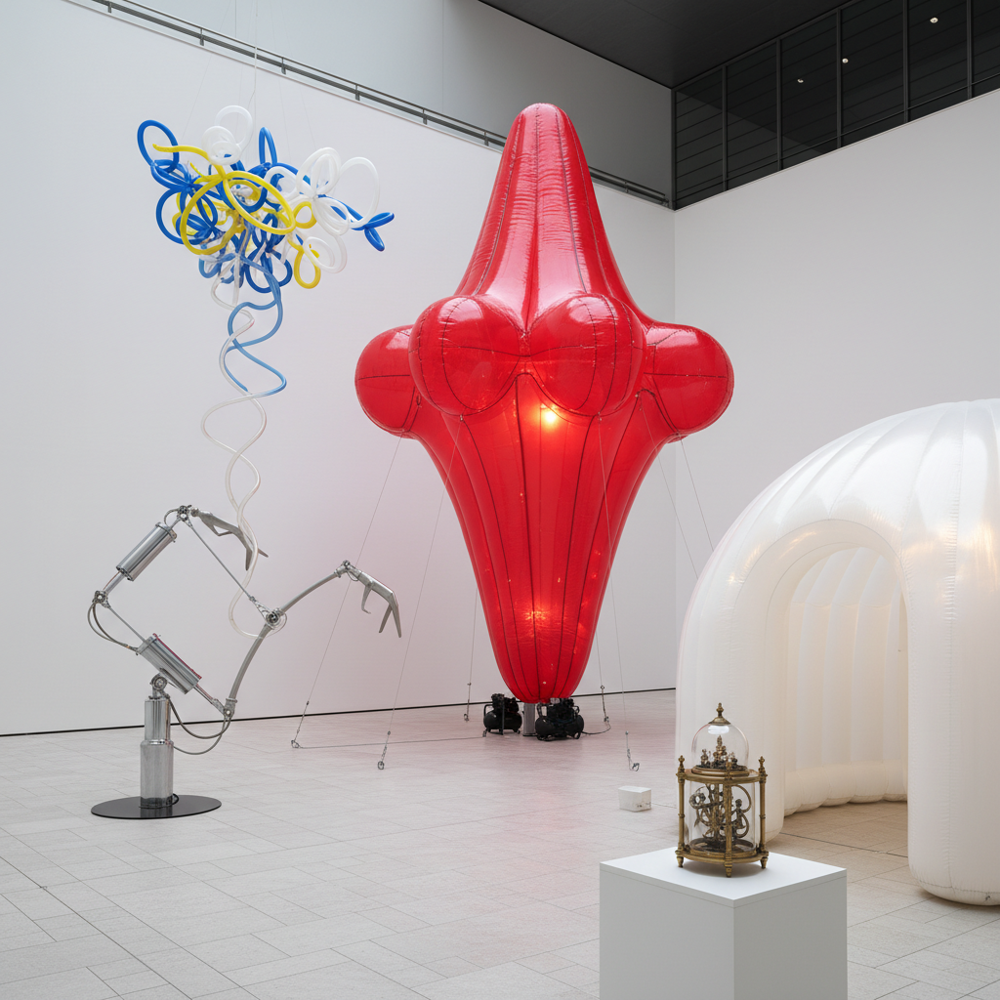

# Pneumatic Art 气动艺术

> "Pneumatic art breathes — literally. It is art inflated by air, shaped by pressure, animated by the invisible force that fills our lungs and lifts balloons. From massive inflatable sculptures that transform public spaces to delicate air-powered kinetic machines, pneumatic art makes the invisible visible, giving form to the formless, turning nothing but compressed air into movement, shape, and wonder." — Unknown

## 概述

气动艺术（Pneumatic Art）是利用空气压力、充气结构或气动机械进行艺术创作的艺术形式——包括充气雕塑、气动动力装置、气球艺术和利用空气流动的互动装置。气动艺术以其轻盈、可变形和动态的特性，创造出传统材料无法实现的艺术效果。

气动艺术的实践包括：1）充气雕塑——大型充气艺术装置；2）气动动力装置——利用气压驱动的动态雕塑；3）气球艺术——用气球创造的造型和装置；4）充气建筑——可充气的临时建筑和空间；5）气动互动装置——观众可以通过吹气或气压互动的装置；6）风力装置——利用自然风力的气动艺术；7）气动表演——利用充气道具的表演艺术。

## 核心特征

| 特征 | 描述 |
|------|------|
| 轻盈 | 极其轻盈的结构 |
| 可变 | 可充气和放气改变形态 |
| 大型 | 可创造巨大的体量 |
| 动态 | 随气流运动的动态 |
| 临时 | 临时性和可移动性 |
| 互动 | 可与观众互动 |

## 视觉特征

- **膨胀**：充气膨胀的圆润形态
- **半透明**：薄膜材料的半透明感
- **色彩**：鲜艳的塑料色彩
- **巨大**：超大尺度的体量
- **柔软**：柔软的表面质感
- **运动**：随风或气流的运动

## 代表作品

| 作品 | 艺术家 | 年代 | 意义 |
|------|--------|------|------|
| *Balloon Dog* | Jeff Koons | 1994-2000 | 充气美学雕塑 |
| *Leviathan* | Anish Kapoor | 2011 | 巨型充气装置 |
| *Inflatable sculptures* | Claes Oldenburg | 1960s | 波普充气雕塑 |
| *Sky Dancers* | Various | 当代 | 气动舞蹈装置 |
| *Pneumatic structures* | Various | 当代 | 充气建筑 |

## 历史时间线

| 时期 | 事件 |
|------|------|
| 18世纪 | 热气球的发明 |
| 1960年代 | 充气艺术和建筑的兴起 |
| 1970年代 | 实验性充气结构 |
| 1990年代 | Jeff Koons的充气美学 |
| 当代 | 大型充气公共艺术的流行 |

## 中国语境

气动艺术在中国近年来随着公共艺术和商业活动的发展而快速增长。中国的许多商业活动和节日庆典使用大型充气装置——从充气拱门到巨型充气卡通形象。中国的一些当代艺术家将充气结构作为严肃的艺术媒介——创造大型充气雕塑和装置。中国的气球艺术也非常发达——气球造型师在各种活动中创造精美的气球装饰和雕塑。中国传统的孔明灯是一种古老的气动艺术形式——利用热空气上升的原理。中国的一些建筑师和设计师在探索充气建筑的可能性——用于临时展览空间和活动场所。中国的儿童游乐设施中，充气城堡和充气滑梯是最受欢迎的项目之一。

## AI生成概念图

## 与其他风格的关系

- **Kinetic Art** → 动态艺术
- **Installation Art** → 装置艺术
- **Public Art** → 公共艺术
- **Balloon Art** → 气球艺术
- **Inflatable Architecture** → 充气建筑
- **Pop Art** → 波普艺术

---

*浮光艺志 | Chronicle of Artistry*
