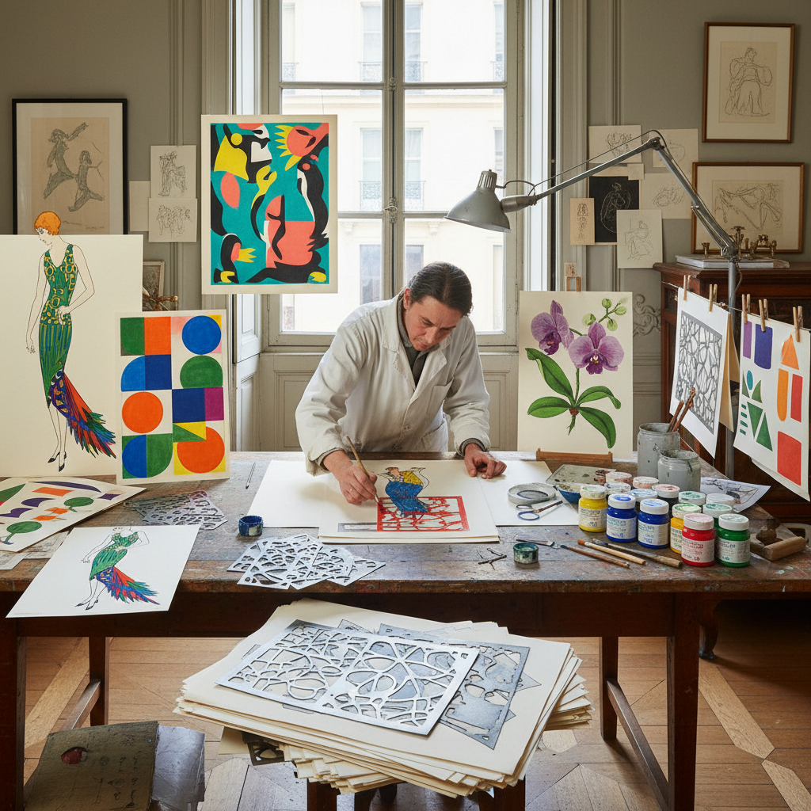

# Pochoir Art 模版着色

> "Pochoir is hand-coloring elevated to industrial precision — skilled artisans cutting intricate stencils from thin metal and applying gouache through them one color at a time, building up images of extraordinary vibrancy and flatness that look printed yet glow with the intensity of hand-applied pigment, each sheet passing through dozens of stencils to achieve the luminous color plates of Art Deco fashion and design." — Unknown

## 概述

模版着色（Pochoir），法语意为"stencil"（模版），是一种使用精密切割的金属或纸质模版，通过刷子将颜料（通常是水粉/gouache）逐层涂抹在纸张上的手工着色技法。Pochoir不是简单的模版印刷——它是一种极其精细的手工着色工艺，每幅图像可能需要使用20-30个甚至更多的模版，每个模版对应一种颜色，由熟练的工匠逐层精确对位涂色。

Pochoir在1920-30年代的法国达到鼎盛——Art Deco时期的时装插画、室内设计图册和艺术出版物大量使用pochoir技法。Pochoir的色彩极其鲜艳和平坦——因为使用的是不透明的水粉颜料直接涂抹，而非印刷油墨。著名的pochoir出版物包括《Gazette du Bon Ton》时装杂志和各种Art Deco设计图册。

## 核心特征

| 特征 | 描述 |
|------|------|
| 模版 | 精密切割的模版 |
| 手工 | 手工逐层涂色 |
| 多层 | 多层模版叠加 |
| 鲜艳 | 极其鲜艳的色彩 |
| 平坦 | 平坦的色块效果 |
| 精密 | 精密的对位 |

## 视觉特征

- **鲜艳**：极其鲜艳的色彩
- **平坦**：平坦的色块
- **锐利**：锐利的边缘
- **装饰**：装饰性的风格
- **优雅**：优雅的Art Deco感
- **手工**：手工涂色的质感

## 代表作品

| 作品 | 艺术家 | 年代 | 意义 |
|------|--------|------|------|
| *Gazette du Bon Ton plates* | Various | 1912-1925 | 时装杂志pochoir |
| *Art Deco pochoir prints* | Various | 1920-30年代 | Art Deco pochoir |
| *Matisse Jazz* | Henri Matisse | 1947 | 马蒂斯爵士乐 |
| *Sonia Delaunay pochoirs* | Sonia Delaunay | 1920年代 | 德劳内pochoir |
| *Pochoir fashion illustrations* | Georges Lepape | 1910-20年代 | 时装pochoir插画 |

## 历史时间线

| 时期 | 事件 |
|------|------|
| 18世纪 | 模版着色的早期实践 |
| 1900-10年代 | Pochoir在出版中的应用 |
| 1920-30年代 | Art Deco时期的鼎盛 |
| 1940年代 | 马蒂斯的pochoir作品 |
| 当代 | Pochoir的收藏和复兴 |

## 中国语境

模版着色在中国有相关的传统——中国的传统印染中有"夹缬"（夹板印花）和"蜡缬"（蜡染）等模版类技法。中国的民间年画中也有使用模版套色的传统。当代中国的一些设计师和插画师对Art Deco时期的pochoir风格感兴趣。中国的一些艺术出版物和限量版画使用类似pochoir的手工着色技法。中国的丝网印刷（screen printing）在某种程度上是pochoir的现代化发展。

## AI生成概念图

## 与其他风格的关系

- **Stencil Art** → 模版艺术
- **Screen Printing** → 丝网印刷
- **Art Deco** → 装饰艺术
- **Fashion Illustration** → 时装插画
- **Gouache** → 水粉画
- **Printmaking** → 版画

---

*浮光艺志 | Chronicle of Artistry*
