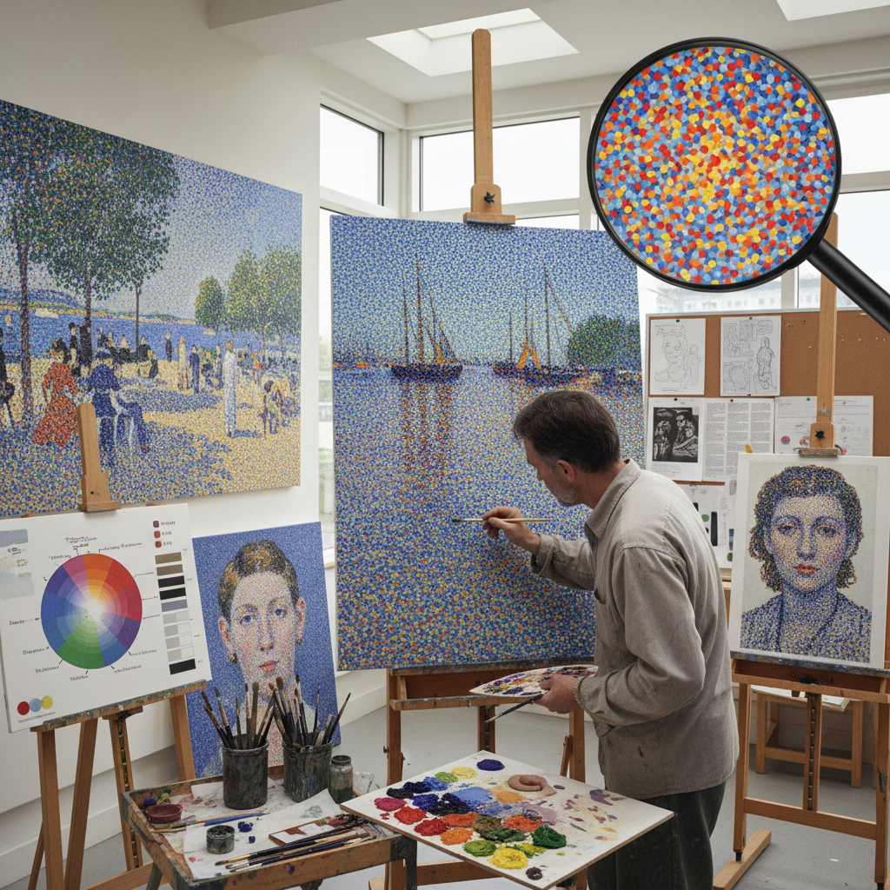

# Pointillism Technique 点彩技法

> "Pointillism is painting decomposed into atoms — each dot of pure color placed beside its neighbor with scientific precision, the mixing happening not on the palette but in the viewer's eye at a distance, the canvas becoming a field of vibrating chromatic energy where red dots beside blue dots create a purple more luminous than any mixed pigment could achieve, proving that light itself can be reconstructed from its component wavelengths." — Unknown

## 概述

点彩技法（Pointillism）是一种使用纯色小点（dots）密集排列在画面上，通过观者眼睛的光学混合（optical mixing）来产生色彩效果的绘画技法。与传统的在调色板上混合颜料不同，点彩画家将未混合的纯色颜料以小点的形式并置在画布上——当观者从一定距离观看时，这些小点在视网膜上融合，产生比物理混合更加明亮和振动的色彩效果。

Pointillism由乔治·修拉（Georges Seurat）在1886年创立——他的《大碗岛的星期天下午》是点彩技法的里程碑作品。修拉受到了光学科学家谢弗勒尔（Chevreul）和鲁德（Rood）的色彩理论影响，试图将绘画建立在科学的色彩原理之上。保罗·西涅克（Paul Signac）是点彩运动的另一位重要人物。点彩技法极其耗时——修拉的大型作品需要数年才能完成。

## 核心特征

| 特征 | 描述 |
|------|------|
| 纯色点 | 使用纯色小点 |
| 光学混合 | 眼睛的光学混合 |
| 科学 | 基于色彩科学 |
| 并置 | 颜色的并置排列 |
| 耗时 | 极其耗时的技法 |
| 明亮 | 比物理混合更明亮 |

## 视觉特征

- **点状**：密集的色点表面
- **振动**：色彩的光学振动
- **明亮**：异常明亮的色彩
- **距离**：需要一定观看距离
- **科学**：科学的色彩排列
- **统一**：统一的表面质感

## 代表作品

| 作品 | 艺术家 | 年代 | 意义 |
|------|--------|------|------|
| *A Sunday on La Grande Jatte* | Georges Seurat | 1884-1886 | 点彩技法的里程碑 |
| *The Pine Tree at Saint-Tropez* | Paul Signac | 1909 | 西涅克的点彩风景 |
| *Circus Sideshow* | Georges Seurat | 1887-1888 | 修拉的点彩杰作 |
| *Portrait of Félix Fénéon* | Paul Signac | 1890 | 西涅克的点彩肖像 |
| *Contemporary pointillism* | Various | 当代 | 当代点彩实践 |

## 历史时间线

| 时期 | 事件 |
|------|------|
| 1884-1886 | 修拉创立点彩技法 |
| 1886-1891 | 新印象派运动的鼎盛 |
| 1891 | 修拉去世，运动衰落 |
| 20世纪 | 点彩对现代艺术的影响 |
| 当代 | 点彩的数字化和当代实践 |

## 中国语境

点彩技法在中国的美术教育中是重要的色彩理论教学内容。中国的美术院校在色彩学课程中讲解点彩的光学混合原理。中国的一些画家在创作中借鉴点彩技法。有趣的是，中国传统绘画中的"点苔"技法（用墨点表现苔藓和远处的树木）与pointillism有形式上的相似性。当代中国的一些数字艺术家使用像素化的方式致敬点彩传统。中国的印刷技术教育中也会讲解点彩与半色调印刷的关系。

## AI生成概念图

## 与其他风格的关系

- **Divisionism** → 分色主义
- **Neo-Impressionism** → 新印象派
- **Seurat** → 修拉
- **Color Theory** → 色彩理论
- **Optical Art** → 光学艺术
- **Impressionism** → 印象派

---

*浮光艺志 | Chronicle of Artistry*
