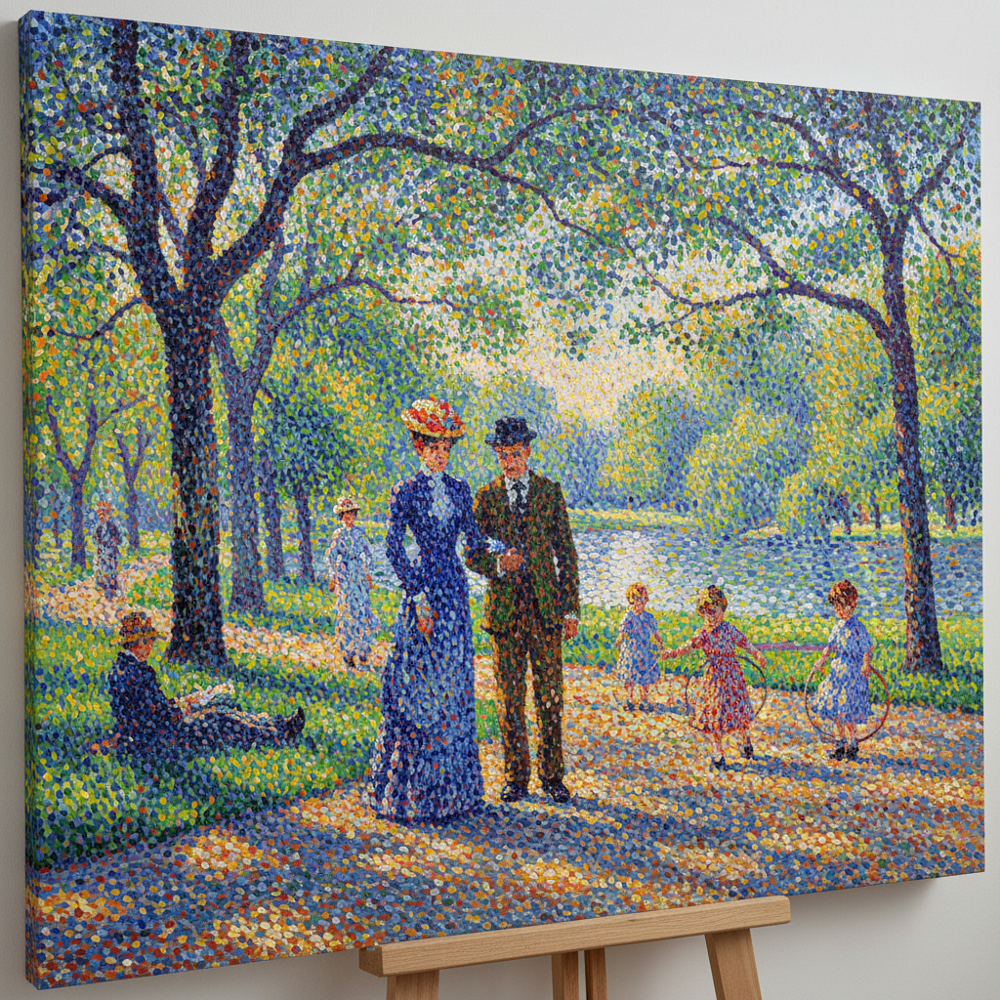

# Pointillism 点彩派

> "Some say they see poetry in my paintings; I see only science." — Georges Seurat

## 概述

点彩派（Pointillism）是新印象主义的核心技法——用纯色的小圆点并置在画布上，让观众的眼睛在一定距离外自动将它们混合成丰富的色彩。乔治·修拉在1886年以《大碗岛的星期天下午》震惊巴黎画坛，将印象派的直觉色彩提升为科学的光学系统。

点彩派的革命在于：它将绘画从手的艺术变成了眼的科学——每一个点都是精确计算的光学单元。

## 核心特征

| 特征 | 描述 |
|------|------|
| 纯色点 | 使用未混合的纯色小点 |
| 光学混合 | 依赖视觉的自动混合 |
| 科学性 | 基于色彩理论和光学原理 |
| 系统性 | 高度系统化的创作方法 |
| 光感 | 创造强烈的光感和振动 |
| 耐心 | 需要极大的耐心和精确 |

## 视觉特征

- **圆点**：均匀的纯色小圆点
- **振动**：色彩的光学振动效果
- **明亮**：比调色板混合更明亮的色彩
- **距离**：需要一定观看距离
- **均匀**：均匀的笔触大小和间距
- **互补**：大量使用互补色并置

## 代表作品

| 作品 | 艺术家 | 年代 | 意义 |
|------|--------|------|------|
| *A Sunday on La Grande Jatte* | Georges Seurat | 1886 | 点彩派的宣言 |
| *The Circus* | Georges Seurat | 1891 | 点彩法的动态表现 |
| *Portrait of Félix Fénéon* | Paul Signac | 1890 | 点彩肖像画 |
| *The Pine Tree at Saint-Tropez* | Paul Signac | 1909 | 点彩风景 |
| *Self-Portrait* | Théo van Rysselberghe | 1890s | 比利时点彩派 |
| *Divisionist works* | Giovanni Segantini | 1890s | 意大利分色主义 |

## 历史时间线

| 时期 | 事件 |
|------|------|
| 1884 | Seurat开始发展点彩技法 |
| 1886 | 《大碗岛》展出——点彩派诞生 |
| 1886-91 | Seurat的短暂而辉煌的创作期 |
| 1891 | Seurat去世，Signac继承 |
| 1890s | 点彩法传播到比利时和意大利 |
| 20世纪初 | 影响野兽派和未来主义 |
| 当代 | 像素艺术和数字点阵的精神先驱 |

## 中国语境

点彩派在中国美术教育中是色彩理论的重要教学案例。中国当代艺术家也有运用点彩技法的探索。有趣的是，中国传统刺绣中的"打籽绣"和点彩有异曲同工之妙——都是用离散的色彩单元构建整体图像。数字时代的像素概念也让点彩派获得了新的理解维度。

## AI生成概念图

## 与其他风格的关系

- **Impressionism** → 印象派是点彩派的直接前身
- **Neo-Impressionism** → 新印象主义包含点彩派
- **Pixel Art** → 像素艺术是数字时代的点彩
- **Divisionism** → 分色主义是点彩的意大利变体
- **Op Art** → 光效应艺术继承了光学混合原理
- **Fauvism** → 野兽派受点彩色彩理论影响

---

*浮光艺志 | Chronicle of Artistry*
