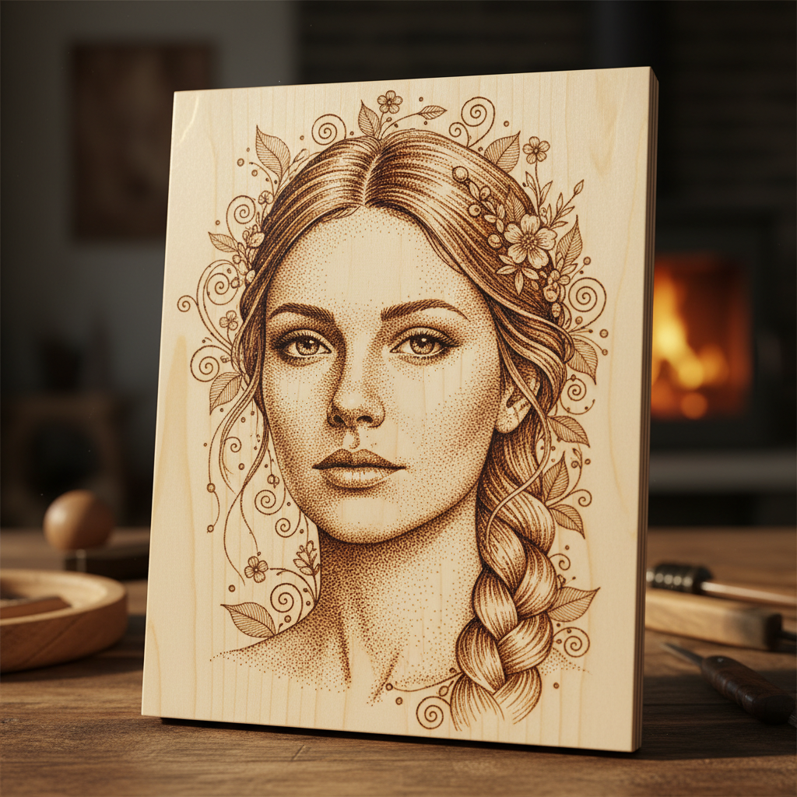

# Pokerwork Art 烙画艺术

> "Pokerwork is drawing with fire — a heated metal point pressed against wood burns a line as permanent as any engraving, the depth and darkness controlled by temperature, pressure, and the speed of the hand. The smell of scorched timber accompanies the creation of images that range from delicate stippled portraits to bold branded patterns, all rendered in the infinite gradations between pale tan and deep chocolate brown." — Unknown

## 概述

烙画艺术（Pokerwork Art）是一种使用加热的金属工具在木材、皮革或其他有机材料表面烧灼出图案的装饰技法——也称为pyrography（火写术）。烙画通过控制温度、压力和速度来创造从浅棕到深褐的色调变化，是一种古老而独特的绘画方式。

烙画艺术的实践包括：1）线条烙画——用尖头烙铁画出线条；2）明暗烙画——通过温度和压力控制明暗；3）点刺烙画——用点状烧灼创造色调；4）平面烙画——用平头烙铁创造大面积色调；5）皮革烙画——在皮革上进行烙画；6）葫芦烙画——在葫芦上进行烙画；7）当代烙画——将传统技法与现代创作结合。

## 核心特征

| 特征 | 描述 |
|------|------|
| 火烧 | 用火烧灼创造图案 |
| 永久 | 永久性的标记 |
| 色调 | 棕色系的色调变化 |
| 木材 | 主要在木材上工作 |
| 控制 | 温度和压力的控制 |
| 古老 | 古老的装饰技法 |

## 视觉特征

- **棕色**：棕色系的色调范围
- **线条**：清晰的烧灼线条
- **渐变**：从浅到深的渐变
- **纹理**：木纹与烙痕的结合
- **温暖**：温暖的整体色调
- **自然**：自然材料的质感

## 代表作品

| 作品 | 艺术家/文化 | 年代 | 意义 |
|------|-------------|------|------|
| *Victorian pokerwork* | 英国 | 19世纪 | 维多利亚时代烙画 |
| *Australian Aboriginal pyrography* | 澳大利亚 | 传统 | 澳大利亚原住民烙画 |
| *Chinese gourd pyrography* | 中国 | 传统 | 中国葫芦烙画 |
| *Contemporary pyrography* | 国际 | 当代 | 当代烙画艺术 |
| *Leather pyrography* | 国际 | 传统-当代 | 皮革烙画 |

## 历史时间线

| 时期 | 事件 |
|------|------|
| 古代 | 烙画的早期使用 |
| 中世纪 | 欧洲烙画的发展 |
| 维多利亚时代 | 烙画作为休闲手工的流行 |
| 20世纪 | 电烙铁的发明改变烙画 |
| 当代 | 烙画的艺术化发展 |

## 中国语境

烙画在中国有悠久的传统和广泛的实践。中国的烙画（火笔画）是国家级非物质文化遗产——有数百年的历史。中国的葫芦烙画是独特的民间艺术形式——在山东、河南等地有深厚的传统。中国的木板烙画——在各地都有实践者和传承人。中国的烙画艺术家能够创造出极其精细的写实作品——达到照片般的效果。中国的工艺美术教育中，烙画作为传统工艺——在相关课程中教授。中国的文创市场中，烙画作品——因其独特的材料感和手工性而受到欢迎。中国的烙画传承人——在各地积极推广和教授这一传统技艺。

## AI生成概念图

## 与其他风格的关系

- **Pyrography** → 火写术
- **Wood Art** → 木艺
- **Drawing** → 素描
- **Leather Craft** → 皮革工艺
- **Folk Art** → 民间艺术
- **Gourd Art** → 葫芦艺术

---

*浮光艺志 | Chronicle of Artistry*
