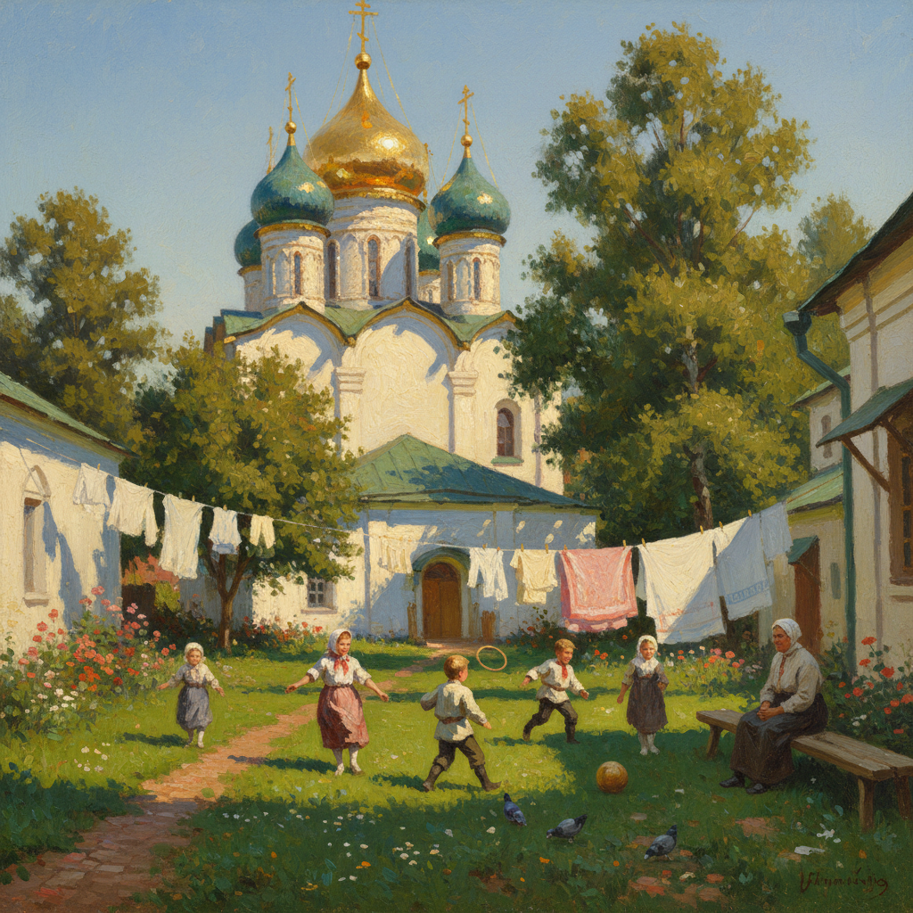

# Polenov Art 波列诺夫艺术

> "Art should give happiness and joy, otherwise it is worth nothing." — Vasily Polenov

## 概述

波列诺夫艺术（Polenov Art）是19世纪俄罗斯风景画大师瓦西里·德米特里耶维奇·波列诺夫（Vasily Dmitrievich Polenov, 1844-1927）创立的外光派风景画风格。波列诺夫被誉为俄罗斯"外光画"（plein air）的先驱——他将法国印象派对光色的探索与俄罗斯风景画的抒情传统相结合，创造了一种明亮、温暖、充满阳光的风景画风格。

波列诺夫最著名的作品《莫斯科庭院》（1878）描绘了一个阳光明媚的莫斯科老城庭院——金色的阳光、白色的教堂、绿色的草地和嬉戏的孩子——这幅画以其温暖明亮的色调和宁静祥和的氛围成为俄罗斯风景画的经典。波列诺夫还创作了大量以巴勒斯坦和中东为题材的作品，展现了他广阔的视野。

波列诺夫艺术的核心要素包括：1）外光写生——户外直接写生的方法；2）明亮色彩——温暖明亮的色调；3）阳光表现——对阳光效果的精妙捕捉；4）空间深度——精确的空间透视；5）生活气息——充满生活情趣的场景；6）教育贡献——培养了列维坦等大师；7）东方题材——巴勒斯坦和中东风景。

## 核心特征

| 特征 | 描述 |
|------|------|
| 外光写生 | 户外直接写生方法 |
| 明亮色彩 | 温暖明亮色调 |
| 阳光表现 | 阳光效果精妙捕捉 |
| 空间深度 | 精确空间透视 |
| 生活气息 | 充满生活情趣场景 |
| 教育贡献 | 培养列维坦等大师 |

## 视觉特征

- **阳光庭院**：阳光明媚的庭院和花园
- **明亮色调**：温暖的黄色和金色调
- **白色建筑**：阳光下的白色教堂和房屋
- **绿色植被**：生机勃勃的绿色草地和树木
- **河流风景**：奥卡河畔的风景
- **东方风情**：巴勒斯坦的阳光和建筑

## 代表作品

| 作品 | 年代 | 意义 |
|------|------|------|
| *莫斯科庭院* (Moscow Courtyard) | 1878 | 最著名的作品 |
| *长满杂草的池塘* (Overgrown Pond) | 1879 | 抒情风景杰作 |
| *奥卡河上的金秋* (Golden Autumn) | 1893 | 秋天的诗意 |
| *基督与罪妇* (Christ and the Sinner) | 1888 | 宗教历史画 |
| *耶路撒冷* (Jerusalem) | 1882 | 东方题材 |
| *祖母的花园* (Grandmother's Garden) | 1878 | 生活的诗意 |

## 历史时间线

| 时期 | 事件 |
|------|------|
| 1844年 | 出生于圣彼得堡 |
| 1863-1871年 | 就读圣彼得堡美术学院 |
| 1872-1876年 | 游历欧洲和中东 |
| 1878年 | 创作《莫斯科庭院》 |
| 1882年 | 成为莫斯科绘画学校教授 |
| 1927年 | 在博罗克庄园去世 |

## 中国语境

波列诺夫在中国美术教育中有着重要的地位。他的外光写生方法——强调在户外直接观察和捕捉阳光效果——通过苏联美术教育体系传入中国，成为中国油画风景写生教学的重要参考。《莫斯科庭院》在中国被视为"生活化风景画"的典范——它证明了日常生活场景同样可以成为伟大的艺术。波列诺夫对色彩的明亮处理和对阳光的敏感捕捉，为中国油画家提供了一种不同于希施金式精确写实的风景画路径——更加注重色彩的表现力和光线的诗意。作为列维坦的老师之一，波列诺夫在俄罗斯风景画从写实主义向印象主义过渡中起到了关键的桥梁作用。

## 概念图

## 与其他风格的关系

- **Levitan** → 列维坦（学生，抒情风景）
- **Savrasov** → 萨夫拉索夫（俄罗斯风景先驱）
- **Shishkin** → 希施金（精确写实风景）
- **Impressionism** → 印象主义（外光画法）
- **Peredvizhniki** → 巡回展览画派
- **Plein Air** → 外光派

---

*浮光艺志 | Chronicle of Artistry*
