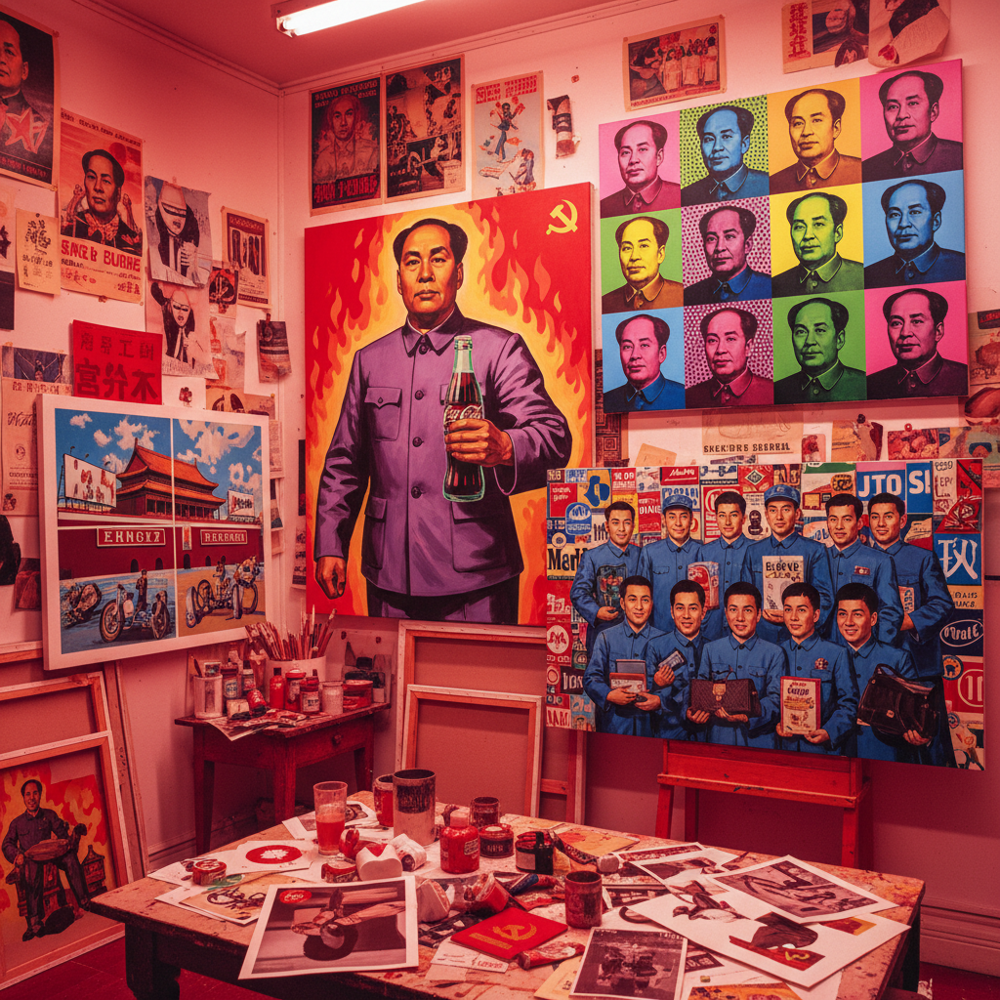

# Political Pop Art 政治波普艺术

> "Political Pop took the visual language of Mao-era propaganda — the red flags, the heroic workers, the beaming Chairman — and married it to the candy-colored commercial aesthetics of Western Pop Art, creating images that were simultaneously nostalgic and ironic, celebratory and critical, familiar and deeply strange, a visual strategy that allowed Chinese artists to process the whiplash of living through both the Cultural Revolution and the arrival of Coca-Cola, McDonald's, and the free market in a single lifetime, turning political trauma into marketable spectacle with a knowing smile." — Unknown

## 概述

政治波普（Political Pop / 政治波普）是1990年代初在中国兴起的一个重要艺术运动，将毛泽东时代的政治宣传图像与西方波普艺术的商业美学相结合。代表艺术家包括王广义、余友涵、李山和魏光庆。政治波普通过挪用和并置社会主义视觉符号与资本主义商品符号，创造出一种既怀旧又讽刺的视觉语言。

政治波普的核心策略是"去神圣化"——将曾经神圣不可侵犯的政治图像（毛泽东肖像、工农兵形象、红色标语等）从其原始的意识形态语境中抽离，与可口可乐、万宝路等商业品牌并置，从而消解其政治权威性。王广义的"大批判"系列是最具代表性的作品——将文革时期的工农兵宣传画与西方商标结合，暗示了意识形态宣传与商业广告之间的结构性相似。

## 核心特征

| 特征 | 描述 |
|------|------|
| 挪用 | 政治图像的挪用 |
| 并置 | 政治与商业的并置 |
| 反讽 | 反讽和戏仿 |
| 符号 | 符号的去语境化 |
| 怀旧 | 怀旧与批判的混合 |
| 商品 | 艺术的商品化 |

## 视觉特征

- **红色**：革命红色的大量使用
- **肖像**：毛泽东和工农兵形象
- **品牌**：西方商业品牌标志
- **宣传**：宣传画的视觉语言
- **平面**：平面化的图像处理
- **文字**：标语和口号

## 代表作品

| 作品 | 艺术家 | 年代 | 意义 |
|------|--------|------|------|
| *大批判 (Great Criticism)* | 王广义 | 1990起 | 王广义的标志性系列 |
| *毛泽东 (Mao)* | 余友涵 | 1990年代 | 余友涵的毛像系列 |
| *胭脂 (Rouge)* | 李山 | 1990年代 | 李山的花卉政治 |
| *红色幽默 (Red Humor)* | 魏光庆 | 1990年代 | 魏光庆的红色系列 |
| *闪闪红星 (Red Star)* | Various | 1990年代 | 红星符号的挪用 |

## 历史时间线

| 时期 | 事件 |
|------|------|
| 1990 | 王广义开始"大批判"系列 |
| 1993 | 威尼斯双年展的国际曝光 |
| 1990年代中 | 政治波普的高峰 |
| 2000年代 | 市场价格的飙升 |
| 当代 | 政治波普的历史化 |

## 中国语境

政治波普是中国当代艺术最具国际知名度的运动之一，但在中国国内的评价更为复杂。批评者认为政治波普迎合了西方对中国的"政治异国情调"想象，将复杂的历史经验简化为可消费的视觉符号。支持者则认为政治波普提供了一种处理集体创伤的有效方式——通过反讽和戏仿来消解政治图像的权威性。政治波普的商业成功也引发了关于艺术自主性和市场依赖的讨论。在当代中国，政治波普已经成为艺术史的一部分，其策略被后来的艺术家继承和发展。

## AI生成概念图

## 与其他风格的关系

- **Pop Art** → 波普艺术
- **Socialist Realism** → 社会主义现实主义
- **Cynical Realism** → 玩世现实主义
- **Appropriation Art** → 挪用艺术
- **Chinese Contemporary** → 中国当代艺术
- **Propaganda Art** → 宣传艺术

---

*浮光艺志 | Chronicle of Artistry*
