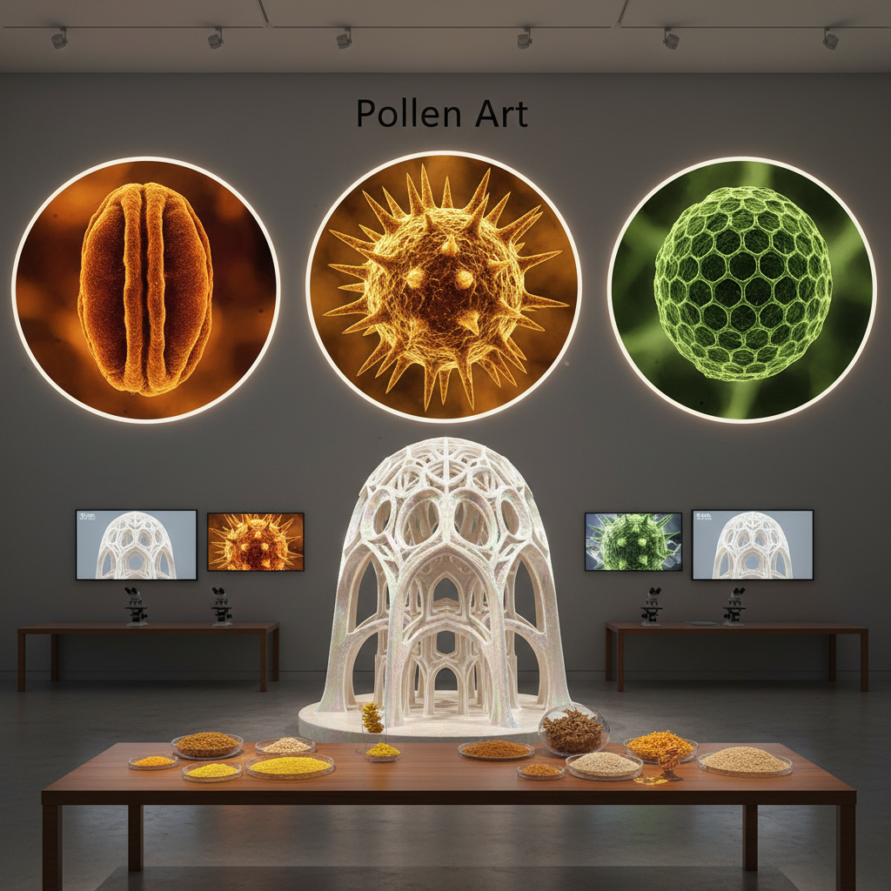

# Pollen Art 花粉艺术

> "Pollen art works with nature's most intimate messenger — the microscopic grain that carries the genetic future of flowering plants from one blossom to another. Under a microscope, pollen grains reveal an astonishing world of geometric perfection: spiky spheres, ridged ovals, honeycomb surfaces, and intricate sculptures smaller than a human hair. The pollen artist magnifies this hidden beauty, uses pollen as pigment, and celebrates the invisible dust that makes all flowering life possible." — Unknown

## 概述

花粉艺术（Pollen Art）是以花粉——植物的雄性生殖细胞——为创作材料、灵感和主题的艺术实践。花粉粒在显微镜下呈现出令人惊叹的几何美：每种植物的花粉都有独特的形态——球形、椭圆形、三角形，表面有刺、沟、孔等精细结构。

花粉艺术的实践包括：1）花粉显微摄影——用电子显微镜拍摄花粉粒的微观结构；2）花粉颜料——将花粉作为天然颜料使用（花粉具有鲜艳的黄色）；3）花粉图案——放大花粉的微观结构作为设计图案；4）花粉收集——收集和展示不同植物的花粉作为自然标本艺术；5）花粉过敏艺术——以花粉过敏和人与自然的关系为主题；6）授粉艺术——以授粉过程和蜜蜂为主题的生态艺术。

## 核心特征

| 特征 | 描述 |
|------|------|
| 微观 | 微观世界的美 |
| 几何 | 精确的几何结构 |
| 生殖 | 植物的生殖 |
| 黄色 | 花粉的金黄色 |
| 季节 | 季节性 |
| 生态 | 授粉生态 |

## 视觉特征

- **微观**：电子显微镜下的形态
- **球形**：各种球形结构
- **纹理**：精细的表面纹理
- **黄色**：花粉的金黄色调
- **对称**：高度对称的结构
- **粉尘**：细微的粉尘质感

## 代表作品

| 作品 | 艺术家 | 年代 | 意义 |
|------|--------|------|------|
| *Pollen micrographs* | Various | 1960年代至今 | 花粉显微摄影 |
| *Pollen paintings* | Wolfgang Laib | 1977至今 | 花粉绘画 |
| *Pollen sculptures* | Various | 2010年代 | 花粉放大雕塑 |
| *Pollination art* | Various | 2010年代 | 授粉主题艺术 |
| *Pollen collections* | Various | 当代 | 花粉收藏艺术 |

## 历史时间线

| 时期 | 事件 |
|------|------|
| 17世纪 | 显微镜下首次观察花粉 |
| 1960年代 | 电子显微镜花粉摄影 |
| 1977 | Wolfgang Laib开始花粉创作 |
| 2000年代 | 花粉3D打印放大 |
| 当代 | 授粉危机与花粉艺术 |

## 中国语境

花粉艺术在中国有独特的文化和科学背景。中国传统文化中"花"有极其丰富的象征意义——从"花开富贵"到"落花流水"，花是中国诗词和绘画中最重要的意象之一。中国是世界上生物多样性最丰富的国家之一，拥有超过三万种开花植物，花粉的多样性极其丰富。中国的孢粉学（palynology）研究在古气候重建和考古学中有重要应用——通过分析地层中的花粉化石来重建古代植被和气候。中国当代的一些艺术家在探索花粉艺术：将中国传统的"花"意象与花粉的微观美学结合、用中国特有植物的花粉创作、以及将中国蜜蜂授粉危机作为生态艺术的主题。

## AI生成概念图

## 与其他风格的关系

- **Micro Art** → 微观艺术
- **Bio Art** → 生物艺术
- **Natural Pigment Art** → 天然颜料艺术
- **Eco-Art** → 生态艺术
- **Scientific Illustration** → 科学插画
- **Seed Art** → 种子艺术

---

*浮光艺志 | Chronicle of Artistry*
