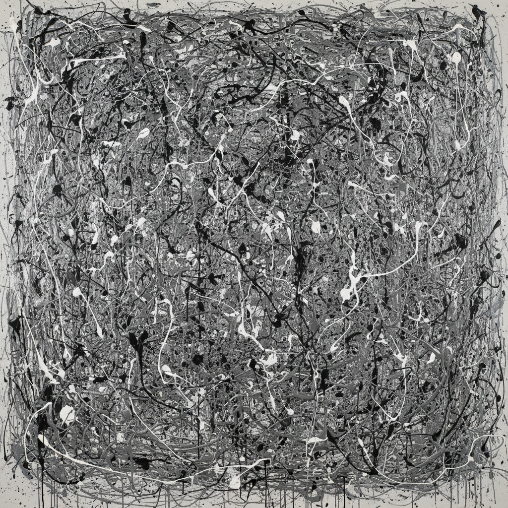

# Jackson Pollock 波洛克

> "Every good painter paints what he is." — Jackson Pollock

## 概述

杰克逊·波洛克（Jackson Pollock，1912–1956）是美国抽象表现主义的核心人物，以"滴画法"（drip painting）彻底改变了绘画的定义。他将画布铺在地上，用棍子和硬化的画笔将颜料甩、滴、泼在上面，创造出没有焦点、没有层次、无限延伸的"全面绘画"。

波洛克证明了绘画可以是一种身体行为——画家的整个身体在画布上方舞蹈，颜料的轨迹记录了这种运动的能量。

## 核心特征

| 特征 | 描述 |
|------|------|
| 滴画法 | 将颜料滴、甩、泼在铺地的画布上 |
| 全面构图 | 没有中心、没有层次——均匀覆盖 |
| 行动绘画 | 绘画是身体行为的记录 |
| 无意识 | 受荣格心理学影响——自动主义 |
| 巨大尺幅 | 画布大到可以走进去 |
| 分形结构 | 滴画中隐含的数学分形模式 |

## 视觉特征

- **线条**：连续的、缠绕的颜料线——无始无终
- **层次**：多层颜料的叠加和交织
- **色彩**：黑、白、银、铝漆——工业材料
- **质感**：厚薄不一的颜料——有时混入沙子、玻璃
- **构图**：全面的、无焦点的、可无限延伸
- **尺度**：巨大的——环绕观者的沉浸感

## 代表作品

| 作品 | 年代 | 意义 |
|------|------|------|
| *Number 1A, 1948* | 1948 | 滴画法的经典 |
| *Autumn Rhythm (Number 30)* | 1950 | 最优雅的滴画 |
| *Blue Poles* | 1952 | 最昂贵的波洛克 |
| *Convergence* | 1952 | 色彩的爆发 |
| *One: Number 31, 1950* | 1950 | 最大的滴画之一 |

## 真实作品（公共领域）

| 作品 | 来源 |
|------|------|
| *Number 1A, 1948* | [MoMA](https://www.moma.org/collection/works/78386) |
| *Autumn Rhythm* | [Met Museum](https://www.metmuseum.org/art/collection/search/488978) |
| *One: Number 31* | [MoMA](https://www.moma.org/collection/works/78699) |

> ⚠️ 本条目优先使用真实作品。

## AI生成概念图

## 与其他风格的关系

- **Abstract Expressionism** → 抽象表现主义的标志人物
- **Surrealism** → 受超现实主义自动主义影响
- **Action Painting** → 行动绘画的定义者
- **All-over Painting** → 全面绘画的开创者
