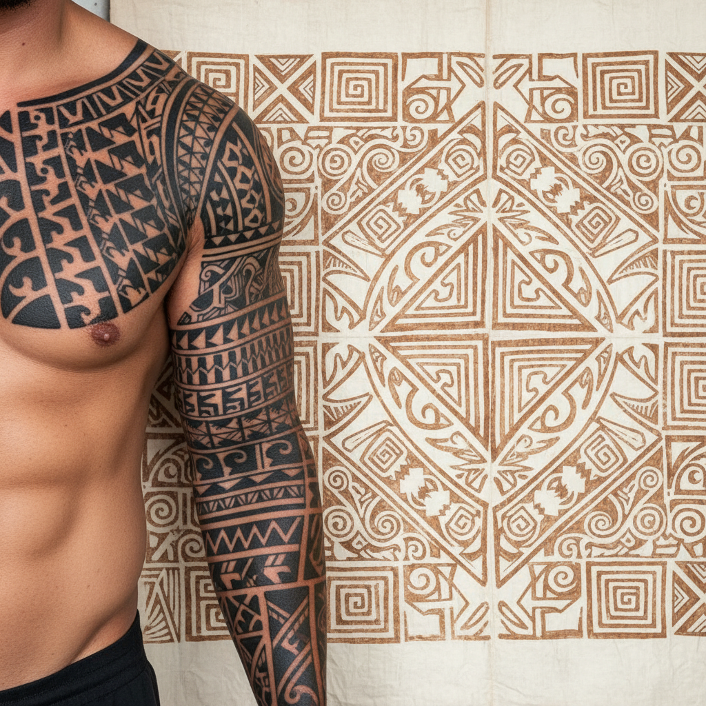

# Polynesian Tattoo & Tapa Art 波利尼西亚纹身与树皮布艺术

> **"皮肤是画布，身体是故事——每一条线都记录着血脉与航海。"**

## 概述

波利尼西亚艺术（Polynesian Art）是太平洋岛屿文明中最具视觉冲击力的艺术传统，涵盖纹身（Tatau）和树皮布（Tapa/Ngatu）两大核心形式。"Tattoo"一词即源自萨摩亚语"Tatau"。从毛利人的面部纹身（Tā moko）到汤加的树皮布仪式，波利尼西亚艺术以其大胆的几何图案、深厚的家族象征和与航海/自然的紧密联系，构成了人类视觉文化中独特的一章。

## 主要传统

### 纹身 Tatau
- **萨摩亚 Pe'a**：男性从腰到膝的全覆盖纹身，成年礼
- **毛利 Tā moko**：面部螺旋纹身，记录家族谱系和社会地位
- **马克萨斯群岛**：全身覆盖的精细几何纹身
- **夏威夷 Kakau**：几何图案，保护和身份标识
- **工具**：传统使用骨制或龟壳梳齿蘸墨敲击入皮肤

### 树皮布 Tapa / Ngatu
- **材料**：构树（Paper Mulberry）内皮捶打成薄片
- **技法**：多层叠加捶打、天然染料印花
- **汤加 Ngatu**：大型仪式用布，集体制作
- **斐济 Masi**：几何印花，烟熏上色
- **功能**：婚礼、葬礼、外交礼物、货币

## 核心图案元素

| 图案 | 含义 |
|------|------|
| Enata（人形） | 家族、守护者 |
| 海龟 | 长寿、航海、家庭 |
| 鲨鱼齿 | 力量、保护、适应力 |
| 矛头 | 勇气、战士精神 |
| 海浪/海洋 | 生命之源、旅途 |
| 太阳 | 重生、光明、领导力 |
| Koru（螺旋） | 新生、成长（毛利） |

## 视觉特征

- 粗犷有力的黑色几何图案
- 对称与重复的节奏感
- 曲线与直线的有机结合
- 填充式构图——图案覆盖整个表面
- 正负空间的戏剧性对比
- 与身体轮廓完美贴合的设计

## 与其他风格的关系

| 风格 | 关系 |
|------|------|
| 凯尔特结 | 共享连续线条和身份标识功能 |
| 非洲部落艺术 | 共享身体装饰和仪式功能 |
| 当代纹身 | 波利尼西亚风格是全球最流行的纹身类型之一 |
| Op Art | 共享几何重复的视觉效果 |
| Tribal Design | 90年代"部落风"设计的主要灵感来源 |

## 概念图

---

*浮光艺志 | Chronicle of Artistry*
