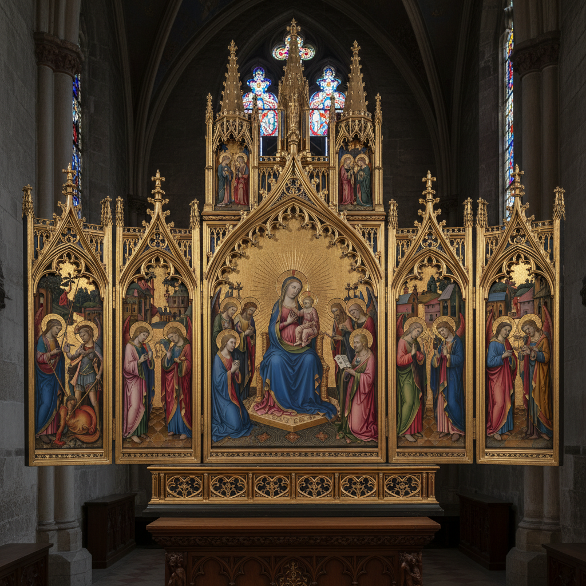

# Polyptych Art 多联画

> **时期：** 中世纪–至今  
> **关键词：** 多面板、祭坛画、折叠翼板、叙事序列、建筑框架

## 概述

Polyptych（多联画）是由多个面板组成的绘画作品，通常作为教堂祭坛装饰。从中世纪的三联画到凡·艾克的《根特祭坛画》，多联画通过可折叠的翼板创造了一种独特的观看体验——打开与关闭呈现不同的图像，节日与平日看到不同的面貌，时间和仪式赋予了画面生命。

## 风格特征

- **多面板结构**：两联（diptych）、三联（triptych）或更多
- **叙事展开**：面板间的故事连续性
- **折叠变化**：开合状态呈现不同内容
- **建筑框架**：精美的木雕或金属框架
- **等级秩序**：中央面板最重要，两翼辅助

## 代表人物与作品

- 扬·凡·艾克《根特祭坛画》
- 希罗尼穆斯·博斯《人间乐园》三联画
- 马蒂亚斯·格吕内瓦尔德《伊森海姆祭坛画》
- 弗朗西斯·培根 现代三联画

## 概念图

