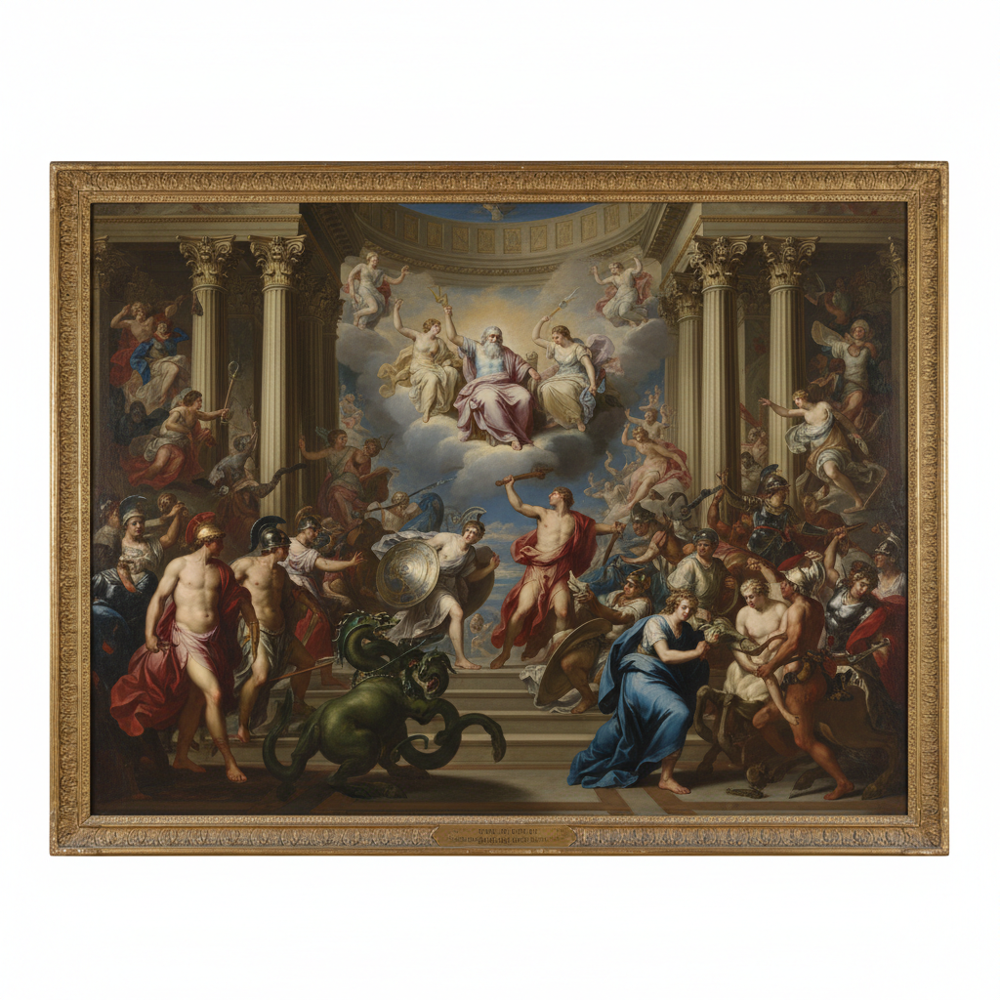

# Pompier Art 学院派绘画

> **时期：** 19世纪中后期  
> **关键词：** 官方沙龙、历史画、技法完美、保守主义、宏大叙事

## 概述

Pompier Art（学院派绘画，又称"消防员艺术"——因画中古典武士头盔形似消防帽而得名）是19世纪法国官方沙龙推崇的正统绘画风格。它追求完美的解剖学、光滑的笔触、宏大的历史或神话题材，代表了学院体制的最高技术标准——也正因此成为印象派和现代主义反叛的靶子。

## 风格特征

- **技法完美**：光滑无痕的笔触和精确解剖
- **宏大题材**：历史、神话、宗教、寓言
- **大尺幅**：沙龙展览级别的巨型画布
- **理想化**：人体和场景的古典美化
- **戏剧性**：强烈的光影和情感张力

## 代表人物与作品

- 威廉·阿道夫·布格罗《维纳斯的诞生》
- 让-莱昂·杰罗姆《角斗士》
- 亚历山大·卡巴内尔《堕落天使》
- 保罗·德拉罗什 历史场景

## 概念图

