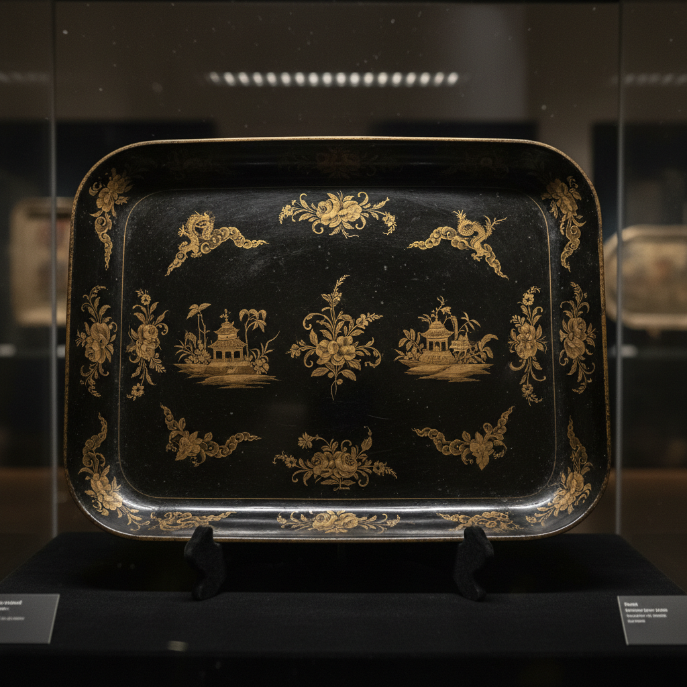

# Pontypool Art 庞蒂普尔漆器艺术

> "Pontypool ware is Japan brought to Wales — thin iron plates are coated with a heat-resistant lacquer of extraordinary hardness and lustre, then decorated with hand-painted flowers, birds, and chinoiserie scenes in gold and colors, creating objects that rival true Oriental lacquer in their depth of finish and durability, all produced in a small Welsh town that for two centuries held the secret of its unique varnish." — Unknown

## 概述

庞蒂普尔漆器艺术（Pontypool Art）是18至19世纪威尔士庞蒂普尔镇（Pontypool）发展出的独特金属漆器工艺——将特殊配方的耐热漆涂在铁皮上，经过反复涂漆和烘烤形成极其坚硬光亮的表面，然后进行精美的手绘装饰。庞蒂普尔漆器以其独特的漆面配方和精美的装饰著称，是英国仿东方漆器（japanning）传统中最优秀的代表。

庞蒂普尔漆器艺术的实践包括：1）铁皮准备——准备薄铁皮基材；2）涂漆——涂抹特殊配方的漆料；3）烘烤——在高温下烘烤使漆面硬化；4）多层——反复涂漆和烘烤建立厚度；5）手绘——在漆面上进行精美的手绘装饰；6）描金——金色装饰和边框；7）当代庞蒂普尔——对传统工艺的研究和复兴。

## 核心特征

| 特征 | 描述 |
|------|------|
| 漆面 | 独特配方的耐热漆 |
| 铁皮 | 铁皮基材 |
| 坚硬 | 极其坚硬的漆面 |
| 光亮 | 高度光亮的表面 |
| 手绘 | 精美的手绘装饰 |
| 威尔士 | 威尔士庞蒂普尔镇 |

## 视觉特征

- **光亮**：极其光亮的漆面
- **深色**：深色（通常黑色）底色
- **花卉**：精美的花卉装饰
- **金色**：金色的描边和装饰
- **东方**：东方风格的图案
- **精致**：精致的整体效果

## 代表作品

| 作品 | 艺术家/文化 | 年代 | 意义 |
|------|-------------|------|------|
| *Pontypool trays* | 威尔士 | 18世纪 | 庞蒂普尔托盘 |
| *Pontypool tea caddies* | 威尔士 | 18世纪 | 庞蒂普尔茶叶罐 |
| *Usk japanned ware* | 威尔士 | 18-19世纪 | 厄斯克漆器 |
| *Allgood family pieces* | 威尔士 | 18世纪 | 奥尔古德家族作品 |
| *Pontypool Museum collection* | 威尔士 | 18-19世纪 | 庞蒂普尔博物馆藏品 |

## 历史时间线

| 时期 | 事件 |
|------|------|
| 约1680年 | 托马斯·奥尔古德发明庞蒂普尔漆 |
| 18世纪 | 庞蒂普尔漆器的黄金时代 |
| 18世纪后期 | 厄斯克分支的发展 |
| 19世纪 | 逐渐衰落 |
| 当代 | 作为文化遗产的研究和保护 |

## 中国语境

庞蒂普尔漆器与中国的漆器传统有深厚的渊源。中国的漆器——是庞蒂普尔漆器试图模仿的原型。中国的出口漆器——在17-18世纪大量出口到欧洲，激发了庞蒂普尔等仿制品的出现。中国的漆艺传统——有数千年的历史，技术远比庞蒂普尔复杂。中国的漆器研究中，庞蒂普尔作为欧洲仿中国漆器的代表——是中西文化交流史的重要案例。中国的工艺美术教育中，庞蒂普尔作为欧洲japanning传统的代表——在相关课程中介绍。

## AI生成概念图

## 与其他风格的关系

- **Japanning** → 仿漆工艺
- **Toleware** → 铁皮彩绘
- **Chinoiserie** → 中国风
- **Lacquerware** → 漆器
- **Folk Art** → 民间艺术
- **Decorative Arts** → 装饰艺术

---

*浮光艺志 | Chronicle of Artistry*
