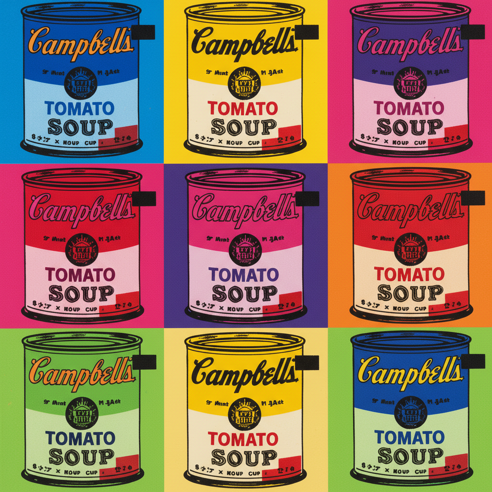

# Pop Art Painting 波普艺术绘画

> **时期：** 1950年代末–1970年代  
> **关键词：** 大众文化、消费主义、沃霍尔、利希滕斯坦、复制与挪用

## 概述

Pop Art（波普艺术）是1950年代末在英美兴起的艺术运动——画家们将大众文化中的图像（广告、漫画、商品包装、名人照片）直接搬上画布，模糊了高雅艺术与通俗文化的界限。沃霍尔的坎贝尔汤罐头、利希滕斯坦的漫画放大——波普艺术不评判消费社会，而是用冷静的目光将其变成艺术的原材料。

## 风格特征

- **大众图像**：广告、漫画、商品的直接挪用
- **机械复制**：丝网印刷和重复图案
- **鲜艳平涂**：商业印刷般的饱和色彩
- **大尺幅**：将日常物品放大到纪念碑规模
- **反讽距离**：不表达情感，只呈现事实

## 代表人物与作品

- 安迪·沃霍尔 坎贝尔汤罐头/玛丽莲
- 罗伊·利希滕斯坦 漫画放大
- 理查德·汉密尔顿 拼贴
- 克拉斯·奥尔登堡 软雕塑

## 概念图

