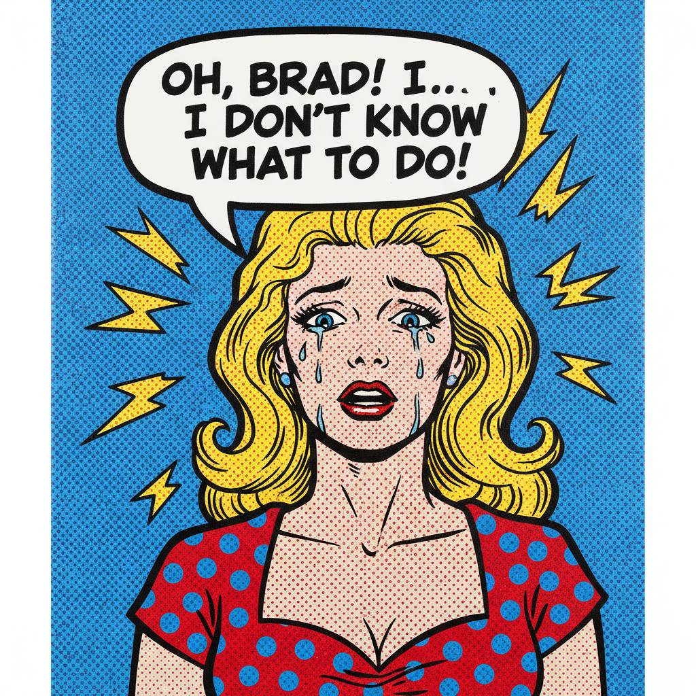

# Pop Art 波普艺术

> "In the future, everyone will be world-famous for 15 minutes." — Andy Warhol

## 概述

波普艺术（Pop Art）是1950年代中期起源于英国、1960年代在美国达到鼎盛的艺术运动。它将大众文化——广告、漫画、商品包装、名人照片、电影海报——提升为"高雅艺术"的题材，模糊了精英文化与大众文化、艺术与商业之间的界限。

波普艺术是对抽象表现主义精英主义的反叛——如果抽象表现主义说"艺术是灵魂的深度"，波普艺术则说"艺术就是表面，表面之下什么都没有"。

## 核心特征

| 特征 | 描述 |
|------|------|
| 大众文化 | 以广告、漫画、商品为题材 |
| 机械复制 | 丝网印刷、照片转印等机械手段 |
| 鲜艳色彩 | 商业印刷的鲜艳平涂色彩 |
| 反复重复 | 同一图像的反复重复（沃霍尔） |
| 反讽态度 | 对消费主义既拥抱又批判 |
| 去个性化 | 消除艺术家的"手迹"和情感 |

## 视觉特征

- **色彩**：商业印刷的鲜艳平涂色——CMYK 色彩
- **图像**：来自大众媒体的现成图像
- **技法**：丝网印刷、Ben-Day 网点、拼贴
- **尺寸**：通常是大尺寸——纪念碑式的日常物品
- **表面**：光滑的、机械的、无笔触的表面
- **文字**：商业标语和品牌文字

## 代表人物

| 画家 | 代表作 | 特点 |
|------|--------|------|
| Andy Warhol | *Campbell's Soup Cans*, *Marilyn* | "工厂"——机械复制的艺术 |
| Roy Lichtenstein | *Whaam!*, *Drowning Girl* | 漫画放大——Ben-Day 网点 |
| Richard Hamilton | *Just what is it...* | 英国波普的开创者 |
| Claes Oldenburg | 巨型软雕塑 | 日常物品的纪念碑化 |
| James Rosenquist | *F-111* | 广告牌尺度的拼贴 |
| Jasper Johns | *Flag*, *Target* | 符号与物体的模糊 |

## 与其他风格的关系

- **Abstract Expressionism** → 对抽象表现主义精英主义的反叛
- **Dada** → 继承了达达的反艺术态度
- **Consumerism** → 消费主义文化的镜像
- **Neo-Pop** → Jeff Koons 等人的新波普
- **Street Art** → 街头艺术继承了波普的大众性
- **Graphic Design** → 深刻影响了平面设计

## 概念图

---

*浮光艺志 | Chronicle of Artistry*
