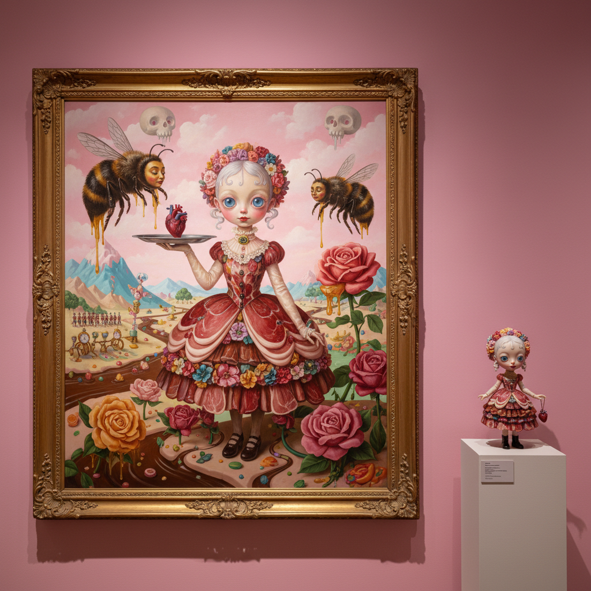

# Pop Surrealism Art 波普超现实主义艺术

> "Pop Surrealism is the bastard child of Dalí and Disney — a movement that refuses to choose between high and low culture, that paints with the technical skill of the Old Masters but depicts big-eyed girls with octopus tentacles, that finds the uncanny in the cute and the beautiful in the grotesque, that treats comic books and fairy tales with the same seriousness that academia reserves for Caravaggio, and that proves you can be simultaneously whimsical and disturbing, accessible and subversive, popular and profound." — Unknown

## 概述

波普超现实主义（Pop Surrealism），也常被称为"低眉艺术"（Lowbrow Art）的一个分支，是一种融合超现实主义的梦幻意象与流行文化元素的当代艺术运动。它起源于1970年代的南加州地下文化，融合了朋克音乐、热棒文化、漫画、科幻、恐怖电影和街头艺术的视觉语言。

波普超现实主义的特征包括：精湛的绘画技巧（通常是写实或超写实的）、梦幻和超现实的主题、流行文化的引用、可爱与恐怖的并置、以及对主流艺术界的有意疏离。代表性的艺术家包括：Mark Ryden（被称为"波普超现实主义教父"）、Marion Peck、Ray Caesar、Camille Rose Garcia、以及日本的奈良美智（虽然他通常被归入不同的类别）。这个运动通过《Juxtapoz》杂志和各种地下画廊获得了广泛的关注。

## 核心特征

| 特征 | 描述 |
|------|------|
| 技巧 | 精湛的绘画技巧 |
| 梦幻 | 超现实的梦幻场景 |
| 流行 | 流行文化的引用 |
| 并置 | 可爱与恐怖的并置 |
| 叙事 | 神秘的叙事性 |
| 地下 | 地下文化的根源 |

## 视觉特征

- **大眼**：大眼睛的人物形象
- **精细**：极度精细的细节
- **色彩**：糖果色与暗色的对比
- **动物**：拟人化的动物
- **玩具**：玩具和童年意象
- **肉**：肉体和有机形态

## 代表作品

| 作品 | 艺术家 | 年代 | 意义 |
|------|--------|------|------|
| *The Meat Show* | Mark Ryden | 1998 | 波普超现实主义的标志性展览 |
| *Feral* | Marion Peck | 2000年代 | 暗黑童话美学 |
| *Digital portraits* | Ray Caesar | 2000年代 | 数字波普超现实 |
| *Snow White* series | Camille Rose Garcia | 2012 | 暗黑迪士尼 |
| *The Gay 90s* | Mark Ryden | 2014 | 维多利亚时代的超现实 |

## 历史时间线

| 时期 | 事件 |
|------|------|
| 1970年代 | 南加州地下艺术场景 |
| 1994 | 《Juxtapoz》杂志创刊 |
| 1998 | Mark Ryden的突破性展览 |
| 2000年代 | 运动的国际化 |
| 当代 | 与数字艺术和NFT的融合 |

## 中国语境

波普超现实主义在中国有一定的影响力，特别是在年轻一代的插画师和数字艺术家中。中国的一些艺术家在创作具有波普超现实主义气质的作品——将中国传统元素（如仕女、神话生物、传统纹样）与超现实的梦幻场景和当代流行文化结合。中国的潮流艺术（Art Toy）市场也与波普超现实主义有密切关联——许多潮玩设计师的美学根源可以追溯到这个运动。中国的社交媒体平台上，波普超现实主义风格的插画和数字艺术有广泛的受众，特别是在小红书和微博的艺术社区中。

## AI生成概念图

## 与其他风格的关系

- **Surrealism** → 超现实主义
- **Lowbrow Art** → 低眉艺术
- **Pop Art** → 波普艺术
- **Illustration** → 插画
- **Street Art** → 街头艺术
- **Art Toy** → 潮流玩具

---

*浮光艺志 | Chronicle of Artistry*
