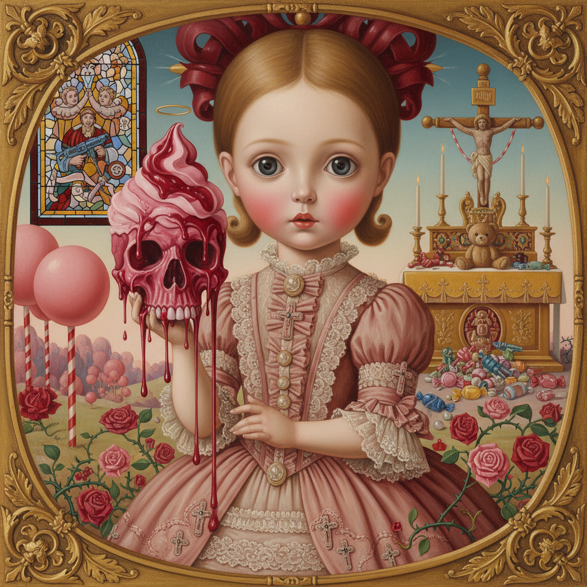

# Pop Surrealism 波普超现实主义



> **"大眼睛的女孩、融化的冰淇淋、可爱的恐怖——当流行文化遇见潜意识。"**

## 概述

| 维度 | 描述 |
|------|------|
| 时期 | 1970s–至今 |
| 别名 | Pop Surrealism, Lowbrow Art, 波普超现实 |
| 核心色彩 | 糖果色+暗色对比、粉色+黑色、饱和+诡异 |
| 关键元素 | 大眼睛角色、可爱与恐怖并存、流行文化引用、精细技法 |
| 代表人物 | Mark Ryden, Marion Peck, Ray Caesar, Camille Rose Garcia |
| 关联风格 | Surrealism, Pop Art, Kawaii, Gothic, Kitsch |

---

## 历史脉络

| 年份 | 事件 |
|------|------|
| 1970s | Robert Williams 创办《Juxtapoz》杂志前身 |
| 1994 | 《Juxtapoz》杂志创刊——运动命名 |
| 1990s | Mark Ryden "Meat Show"——Pop Surrealism 标志性展览 |
| 2000s | 运动全球化——日本、欧洲艺术家加入 |
| 2010s | 与街头艺术、玩具设计的融合 |
| 2020s | NFT和数字艺术中的Pop Surrealism复兴 |

### 核心哲学

Pop Surrealism的精神是**"可爱是一种伪装——在糖衣下面是不安"**：
- 可爱+恐怖 = 张力（"大眼睛的女孩手里拿着骷髅——你不确定该微笑还是害怕"）
- 流行+深度 = 颠覆（"用漫画的语言讲弗洛伊德的故事"）
- 精细+荒诞 = 认真的不认真（"用古典油画技法画融化的冰淇淋"）
- 低俗+高雅 = 模糊边界（"画廊和地下漫画之间没有墙"）
- "Pop Surrealism 证明了：'低俗'艺术可以和'高雅'艺术一样深刻"

---

## 视觉语法

### 色彩系统

```
主色：
  糖果粉 (#FF69B4) — 可爱、甜美
  血红 (#8B0000) — 不安、暗黑
  婴儿蓝 (#89CFF0) — 天真、讽刺
  金色 (#FFD700) — 华丽、宗教

辅色：
  黑色 (#000000) — 暗黑、对比
  肉色 (#FFDAB9) — 身体、不适
  森林绿 (#228B22) — 自然、腐烂

规则：
  - 糖果色+暗色的对比
  - "太甜"的颜色 = 不安
  - 精细渲染的色彩
  - 古典油画的色调+流行文化的饱和

质感：
  油画 — 精细、古典技法
  光滑 — 瓷器般的皮肤
  腐烂 — 融化、滴落
  华丽 — 金箔、装饰
```

### 标志性元素

| 类别 | 元素 |
|------|------|
| 角色 | 大眼睛女孩、变形动物、拟人食物 |
| 物品 | 骷髅、肉、冰淇淋、玩具、宗教符号 |
| 氛围 | 可爱+恐怖、天真+暗黑、甜美+腐烂 |
| 技法 | 古典油画技法、精细渲染、超现实构图 |
| 引用 | 流行文化、宗教、童话、广告 |
| 态度 | 颠覆、讽刺、暗黑幽默、精细、认真 |

---

## 与千禧怀旧的关系

### "可爱恐怖"的持续魅力
- Pop Surrealism → 当代玩具设计 (Designer Toys)
- → NFT艺术中的"cute horror"
- → 游戏角色设计中的暗黑可爱
- "2000s的Pop Surrealism预言了2020s的审美"

### 与Kawaii/Gothic的交叉
- 日本 Kawaii + 西方 Gothic = Pop Surrealism 的东方变体
- "可爱的恐怖" = 全球性的审美趋势
- Takashi Murakami 的 "Superflat" = 日本版 Pop Surrealism

---

## 中国语境

- 中国当代艺术中的Pop Surrealism影响
- 中国潮玩设计中的暗黑可爱
- 中国插画师的Pop Surrealism实践
- 与中国"暗黑萌"文化的交叉

---

## 设计应用

| 场景 | 应用方式 |
|------|----------|
| 潮玩 | Designer Toys+限量版+收藏+暗黑可爱 |
| 插画 | 精细油画+超现实+流行文化+讽刺 |
| 品牌 | 暗黑+可爱+独特+收藏+亚文化 |
| NFT | 数字艺术+限量+收藏+社区 |

---

## 相关风格

← [Surrealism 超现实主义](surrealism.md) | [Kawaii 卡哇伊](kawaii.md) →

↑ [返回千禧怀旧目录](README.md) | [返回总目录](../README.md)
