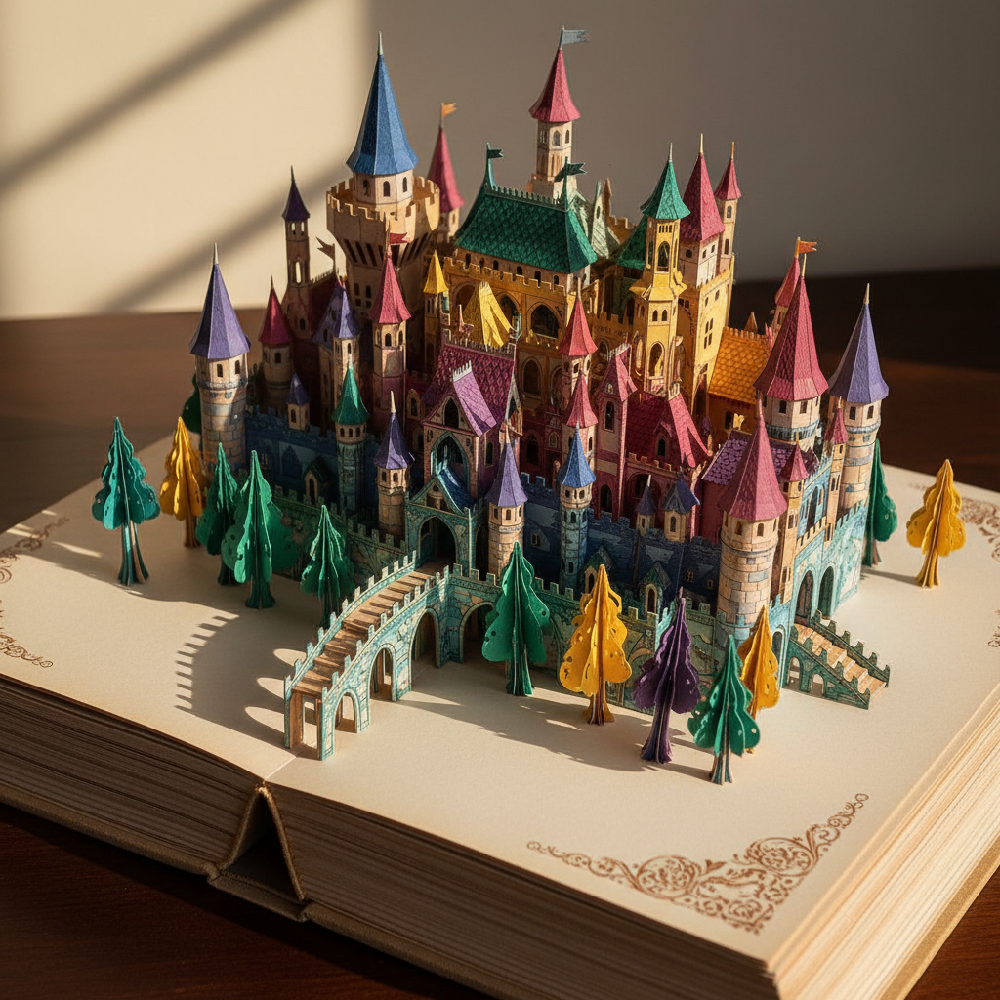

# Pop-up Art 立体书艺术

> "A pop-up is architecture that lives inside a book — flat paper transforms into three-dimensional space through nothing more than folds, cuts, and the physics of opening a page. The pop-up engineer must think simultaneously in two and three dimensions, designing structures that collapse perfectly flat and then spring to life with the turn of a page. It is theater in paper, surprise made mechanical." — Unknown

## 概述

立体书艺术（Pop-up Art）是一种通过精密的纸张折叠、切割和机械结构设计，使书页打开时纸张自动弹起形成三维立体造型的纸艺形式。Pop-up书籍将平面的纸张转化为建筑般的立体空间——结合了工程学、雕塑和叙事的多重维度。从儿童读物到艺术家书籍，立体书已发展为一种独立的艺术表达形式。

立体书艺术的实践包括：1）V形折叠——最基本的弹起结构；2）平行折叠——平行于书脊的弹起结构；3）拉片机关——通过拉动标签产生运动；4）转盘机关——旋转产生变化的结构；5）多层弹起——多个层次的立体结构；6）360度立体书——可以完全展开的立体结构；7）当代立体书——将传统技法与现代设计结合的创作。

## 核心特征

| 特征 | 描述 |
|------|------|
| 立体 | 从平面到立体的转化 |
| 机械 | 精密的纸张机械 |
| 惊喜 | 翻页的惊喜效果 |
| 工程 | 需要工程思维 |
| 叙事 | 结合叙事的空间 |
| 互动 | 读者的互动参与 |

## 视觉特征

- **立体**：从页面弹起的立体造型
- **层次**：多层次的空间深度
- **色彩**：丰富的印刷色彩
- **运动**：机关产生的运动效果
- **精密**：精密的折叠和切割
- **戏剧**：戏剧性的空间展开

## 代表作品

| 作品 | 艺术家/文化 | 年代 | 意义 |
|------|-------------|------|------|
| *Movable books* | 欧洲 | 13世纪起 | 最早的活动书 |
| *Lothar Meggendorfer works* | 德国 | 19世纪 | 立体书先驱 |
| *Robert Sabuda works* | 美国 | 当代 | 当代立体书大师 |
| *Matthew Reinhart works* | 美国 | 当代 | 当代立体书大师 |
| *Artist pop-up books* | 国际 | 当代 | 艺术家立体书 |

## 历史时间线

| 时期 | 事件 |
|------|------|
| 13世纪 | 最早的活动书（转盘书） |
| 18世纪 | 翻翻书和活动书的发展 |
| 19世纪 | 梅根多弗的精密机关书 |
| 20世纪 | 现代立体书的黄金时代 |
| 当代 | 立体书的艺术化发展 |

## 中国语境

立体书艺术在中国近年来获得了快速发展。中国的出版市场中，立体书是增长最快的品类之一——从引进版到原创立体书都有大量出版。中国的一些出版社和工作室开始创作具有中国文化特色的立体书——如故宫、长城等主题的立体书。中国的纸艺传统（剪纸、折纸）为立体书创作提供了丰富的灵感——一些设计师将中国传统纸艺与立体书结构结合。中国的儿童出版市场中，立体书是最受欢迎的互动读物形式——培养儿童的空间想象力和阅读兴趣。中国的一些设计院校开始开设立体书设计课程——培养专业的立体书设计师。中国的文创产业中，立体贺卡和立体明信片是重要的产品类别——将立体书技法应用于日常消费品。

## AI生成概念图

## 与其他风格的关系

- **Paper Art** → 纸艺
- **Origami** → 折纸
- **Book Art** → 书籍艺术
- **Paper Engineering** → 纸张工程
- **Illustration** → 插画艺术
- **Kinetic Art** → 动态艺术

---

*浮光艺志 | Chronicle of Artistry*
