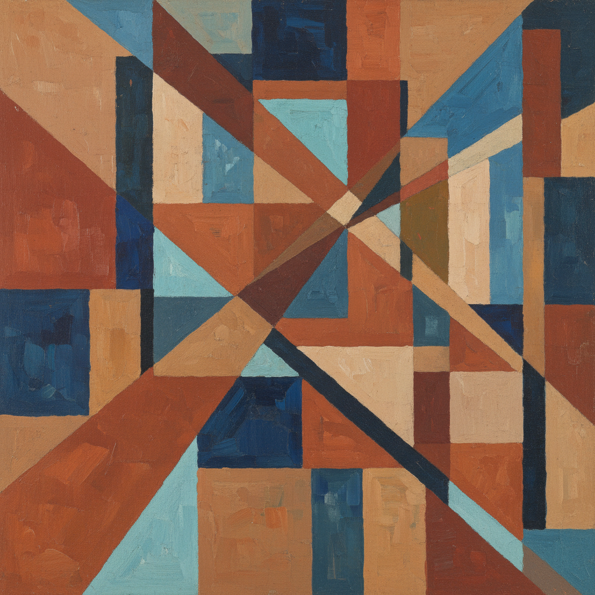

# Popova Art 波波娃艺术

> "No artistic system can be built on a single technique or a single idea." — Lyubov Popova

## 概述

波波娃艺术（Popova Art）是20世纪初俄罗斯先锋派女性艺术家柳博芙·谢尔盖耶芙娜·波波娃（Lyubov Sergeyevna Popova, 1889-1924）创立的绑画建筑学（Painterly Architectonics）风格。波波娃是俄罗斯先锋派运动中最杰出的女性艺术家之一——她在短暂的35年生命中，经历了从立体主义到至上主义再到构成主义的完整演变，并在每个阶段都创作出了具有独立价值的杰作。

波波娃最具原创性的贡献是她的"绑画建筑学"系列（1916-1918）——这些作品以几何平面的叠加和交错创造出一种建筑般的空间感，既不同于马列维奇的至上主义（漂浮在无限空间中），也不同于塔特林的材料构成（真实的三维空间）。1921年后，她与罗德钦科等人一起宣布放弃纯绑画，转向纺织品设计和舞台设计——将构成主义的美学带入了日常生活。

波波娃艺术的核心要素包括：1）绑画建筑学——几何平面的建筑性构成；2）空间力量——画面中的空间张力；3）色彩构成——色彩作为结构元素；4）跨风格——从立体主义到构成主义的演变；5）纺织设计——将先锋美学带入日用品；6）舞台设计——构成主义的戏剧空间；7）女性先锋——与男性同行平等的创造力。

## 核心特征

| 特征 | 描述 |
|------|------|
| 绑画建筑学 | 几何平面建筑性构成 |
| 空间力量 | 画面中空间张力 |
| 色彩构成 | 色彩作为结构元素 |
| 跨风格 | 从立体主义到构成主义 |
| 纺织设计 | 先锋美学带入日用品 |
| 舞台设计 | 构成主义戏剧空间 |

## 视觉特征

- **几何叠加**：几何平面的叠加和交错
- **建筑感**：如建筑般的空间结构
- **色彩层次**：透明和不透明色彩的层次
- **动态平衡**：倾斜中的平衡感
- **纹理对比**：不同纹理的对比
- **简洁有力**：简洁而充满力量的构图

## 代表作品

| 作品 | 年代 | 意义 |
|------|------|------|
| *绑画建筑学* (Painterly Architectonic) | 1917 | 最具原创性的系列 |
| *空间力量构成* (Space Force Construction) | 1921 | 构成主义转型 |
| *旅行者* (The Traveler) | 1915 | 立体未来主义 |
| *纺织品设计* (Textile Designs) | 1923-1924 | 实用设计 |
| *大方的布谷鸟* (The Magnanimous Cuckold) 舞台 | 1922 | 构成主义舞台 |
| *静物与乐器* (Still Life with Instruments) | 1915 | 立体主义时期 |

## 历史时间线

| 时期 | 事件 |
|------|------|
| 1889年 | 出生于莫斯科附近 |
| 1907-1913年 | 莫斯科学习，游历欧洲 |
| 1913-1915年 | 立体主义和未来主义时期 |
| 1916-1918年 | 绑画建筑学系列 |
| 1921年 | 宣布放弃纯绑画 |
| 1922-1924年 | 纺织和舞台设计 |
| 1924年 | 因猩红热在莫斯科去世 |

## 中国语境

波波娃在中国的知名度有限，但她的艺术对中国当代艺术和设计有多重启示。首先，她作为20世纪初与男性先锋艺术家完全平等的女性创作者——在马列维奇、塔特林等人主导的运动中保持了独立的艺术声音——为讨论中国女性艺术家的历史贡献提供了重要的比较视角。其次，她的"绑画建筑学"概念——将绑画视为一种空间构成——对中国当代抽象绑画的空间探索有参考价值。第三，她从纯艺术转向纺织品设计的选择——将先锋美学带入日常生活——与中国当代"艺术介入生活"的趋势有深层的呼应。波波娃证明了先锋艺术不必停留在画廊中——它可以通过设计改变人们的日常生活。

## 概念图

## 与其他风格的关系

- **Constructivism** → 构成主义
- **Suprematism** → 至上主义
- **Cubism** → 立体主义
- **Rodchenko** → 罗德钦科（构成主义同道）
- **Tatlin** → 塔特林（材料构成）
- **Textile Design** → 纺织设计

---

*浮光艺志 | Chronicle of Artistry*
