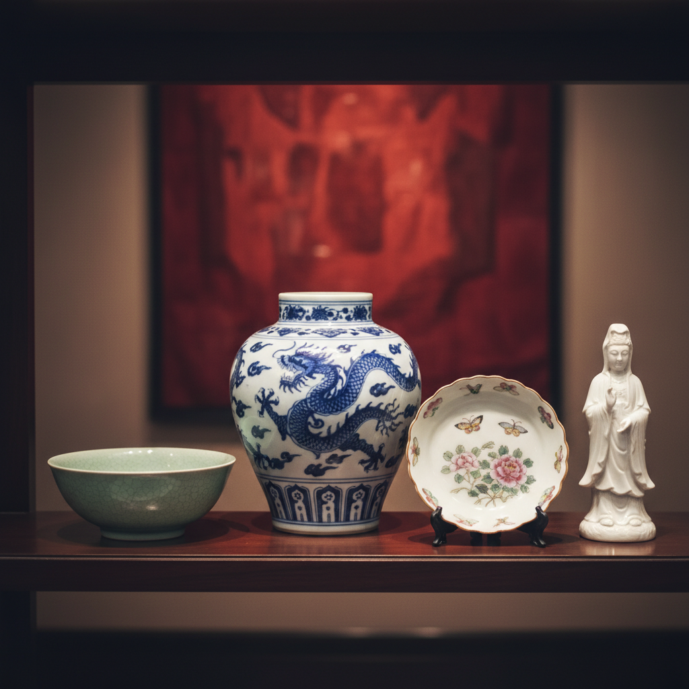

# Porcelain Art 瓷器艺术

> "Porcelain is the most perfect union of earth, water, and fire." — 中国古谚

## 概述

瓷器艺术（Porcelain Art）是以高岭土为主要原料、经1200°C以上高温烧制而成的精细陶瓷艺术。中国是瓷器的发明者——"China"一词本身就是瓷器的代名词。从东汉的原始青瓷到宋代五大名窑，从元青花到清代粉彩，瓷器是中国对世界文明最重要的物质贡献之一。

瓷器的魅力在于它将泥土转化为宝石——通过火的炼化，粗糙的泥土变成了温润如玉、薄如蝉翼的艺术品。

## 核心特征

| 特征 | 描述 |
|------|------|
| 高温烧制 | 1200°C以上的高温 |
| 白色胎体 | 高岭土的白色基底 |
| 釉面 | 玻璃质的光滑釉面 |
| 半透明 | 薄胎瓷器可以透光 |
| 坚硬 | 极其坚硬耐久 |
| 装饰多样 | 青花、粉彩、釉里红等多种装饰 |

## 视觉特征

- **光泽**：釉面的温润光泽
- **色彩**：从单色釉到五彩缤纷
- **图案**：精细的手绘或印花图案
- **造型**：从实用器到纯装饰的多种造型
- **质感**：光滑如玉的触感
- **透光**：薄胎瓷器的透光性

## 代表作品

| 作品/窑口 | 年代 | 特征 |
|-----------|------|------|
| 汝窑天青釉 | 北宋 | "雨过天青云破处"——极简之美 |
| 元青花 | 元代 | 青花瓷的开创——影响世界 |
| 明成化斗彩 | 明代 | 釉下青花与釉上彩的结合 |
| 清雍正粉彩 | 清代 | 粉彩瓷器的巅峰 |
| Meissen瓷器 | 1710+ | 欧洲第一个硬质瓷器 |
| 当代艺术瓷 | 当代 | 瓷器作为当代艺术媒介 |

## 历史时间线

| 时期 | 事件 |
|------|------|
| 东汉 | 中国发明原始青瓷 |
| 唐代 | "南青北白"——越窑、邢窑 |
| 宋代 | 五大名窑——中国瓷器的巅峰 |
| 元代 | 青花瓷的诞生 |
| 明清 | 景德镇——世界瓷都 |
| 1710 | Meissen——欧洲开始生产瓷器 |
| 当代 | 瓷器作为当代艺术和设计媒介 |

## 中国语境

瓷器是中国文化的核心符号——从"瓷器之国"的美誉到丝绸之路上的贸易明珠，瓷器承载了中国文明的精华。景德镇作为千年瓷都至今仍是世界陶瓷艺术的中心。当代中国的陶瓷艺术家如刘建华、白明等将瓷器从工艺品提升为当代艺术表达。中国的非物质文化遗产保护体系为传统制瓷技艺提供了制度保障。

## AI生成概念图

## 与其他风格的关系

- **Ceramic Art** → 瓷器是陶瓷艺术的最高形式
- **Decorative Arts** → 瓷器是装饰艺术的重要门类
- **Blue and White** → 青花是瓷器最具代表性的装饰
- **Enamel Art** → 珐琅彩瓷结合了珐琅和瓷器
- **Sculpture** → 瓷塑是雕塑的重要形式
- **Minimalism** → 宋瓷的极简美学

---

*浮光艺志 | Chronicle of Artistry*
