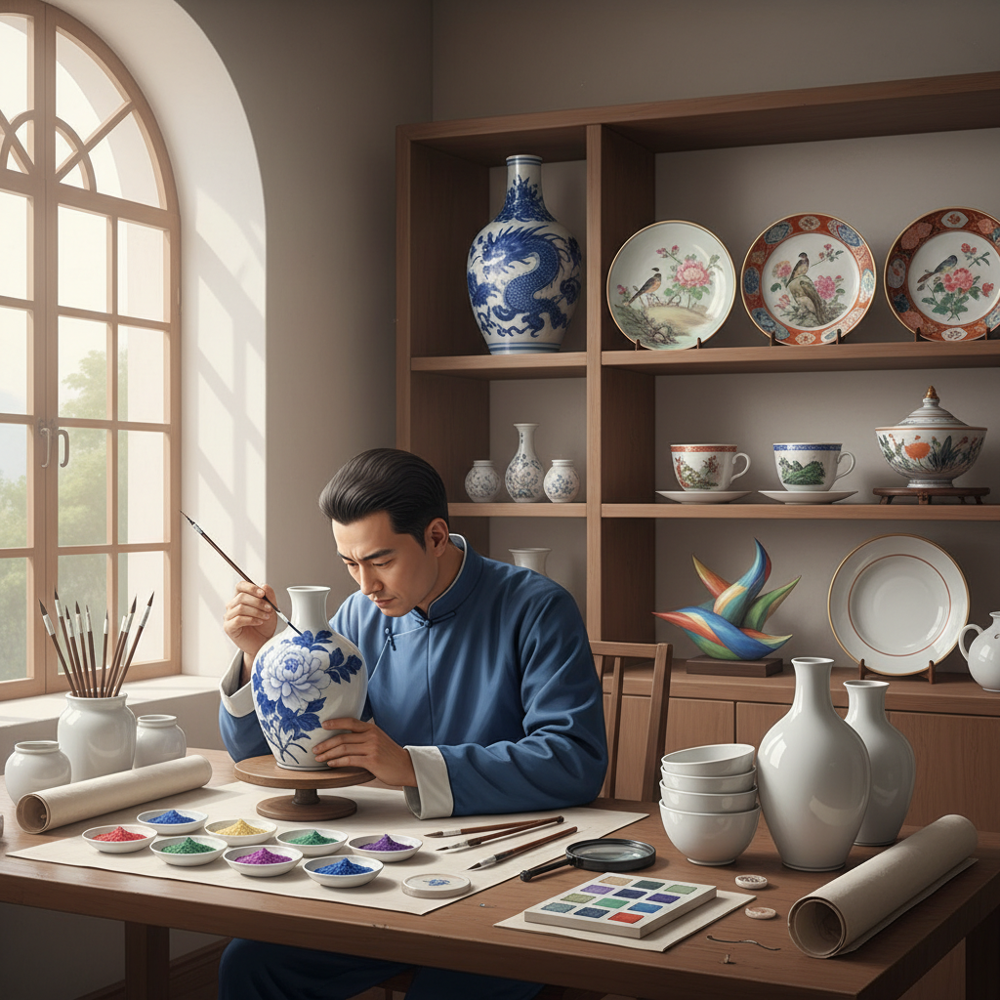

# Porcelain Painting Art 瓷绘艺术

> "Porcelain painting is painting on the most unforgiving of canvases — a curved, glazed surface that reveals every hesitation, every tremor of the brush. The porcelain painter works with mineral pigments that show their true colors only after firing, requiring an act of faith with every stroke. What emerges from the kiln is a painting fused permanently into glass, as vivid after centuries as the day it was painted." — Unknown

## 概述

瓷绘艺术（Porcelain Painting Art）是在瓷器表面使用矿物颜料进行绑画创作的装饰艺术——包括釉上彩和釉下彩两大类。瓷绘是将绘画艺术与陶瓷工艺结合的独特艺术形式，画面经过高温烧制后永久固定在瓷器表面，可以保存数百年不褪色。

瓷绘艺术的实践包括：1）釉上彩——在已烧成的釉面上绑画后低温烧制；2）釉下彩——在素坯上绑画后施釉高温烧制；3）粉彩——使用含砷的不透明颜料的细腻画法；4）新彩——使用现代化学颜料的瓷绘；5）青花——蓝色钴料的釉下彩绑画；6）珐琅彩——使用珐琅颜料的精细瓷绘；7）当代瓷绘——将传统技法与现代艺术结合的创作。

## 核心特征

| 特征 | 描述 |
|------|------|
| 永久 | 烧制后永不褪色 |
| 精细 | 极其精细的笔触 |
| 曲面 | 在曲面上作画 |
| 矿物 | 使用矿物颜料 |
| 烧制 | 需要窑炉烧制 |
| 变化 | 烧前烧后色彩变化 |

## 视觉特征

- **光泽**：釉面的玻璃光泽
- **色彩**：矿物颜料的独特色彩
- **精细**：极其精细的笔触
- **层次**：多次烧制的色彩层次
- **曲面**：适应器物曲面的构图
- **永恒**：历经岁月不变的色彩

## 代表作品

| 作品 | 艺术家/文化 | 年代 | 意义 |
|------|-------------|------|------|
| *景德镇青花瓷* | 中国 | 元明清 | 中国青花瓷绘 |
| *珐琅彩瓷器* | 中国清代 | 康雍乾 | 中国瓷绘巅峰 |
| *Meissen porcelain* | 德国 | 18世纪至今 | 欧洲瓷绘 |
| *Sèvres porcelain* | 法国 | 18世纪至今 | 法国瓷绘 |
| *有田焼* | 日本 | 17世纪至今 | 日本瓷绘 |

## 历史时间线

| 时期 | 事件 |
|------|------|
| 唐代 | 中国早期瓷绘的发展 |
| 元代 | 青花瓷的成熟 |
| 明清 | 中国瓷绘的黄金时代 |
| 18世纪 | 欧洲瓷绘的发展 |
| 当代 | 瓷绘的现代传承和创新 |

## 中国语境

瓷绘艺术在中国有最悠久和最辉煌的传统——中国是瓷器的发源地，也是瓷绘艺术的最高成就所在。景德镇作为"瓷都"有千年的瓷绘传统——从青花到粉彩，从五彩到珐琅彩，各种瓷绘技法在这里发展到极致。中国的珐琅彩瓷器（清代康雍乾三朝）代表了瓷绘艺术的最高水平——其精细程度和色彩丰富度至今无人超越。中国的青花瓷绘是世界上最具影响力的瓷绘风格——影响了日本、韩国、越南、中东和欧洲的陶瓷装饰。中国当代的瓷绘艺术家在继承传统的同时也在创新——将当代艺术理念融入瓷绘创作。中国的瓷绘技艺被列入多项国家级非物质文化遗产——包括景德镇手工制瓷技艺、醴陵釉下五彩瓷烧制技艺等。中国的陶瓷艺术教育中，瓷绘是核心课程——培养了大量的瓷绘艺术人才。

## AI生成概念图

## 与其他风格的关系

- **Underglaze** → 釉下彩
- **Overglaze** → 釉上彩
- **Ceramics** → 陶瓷艺术
- **Chinese Painting** → 中国画
- **Miniature Painting** → 细密画
- **Enamel Art** → 珐琅艺术

---

*浮光艺志 | Chronicle of Artistry*
