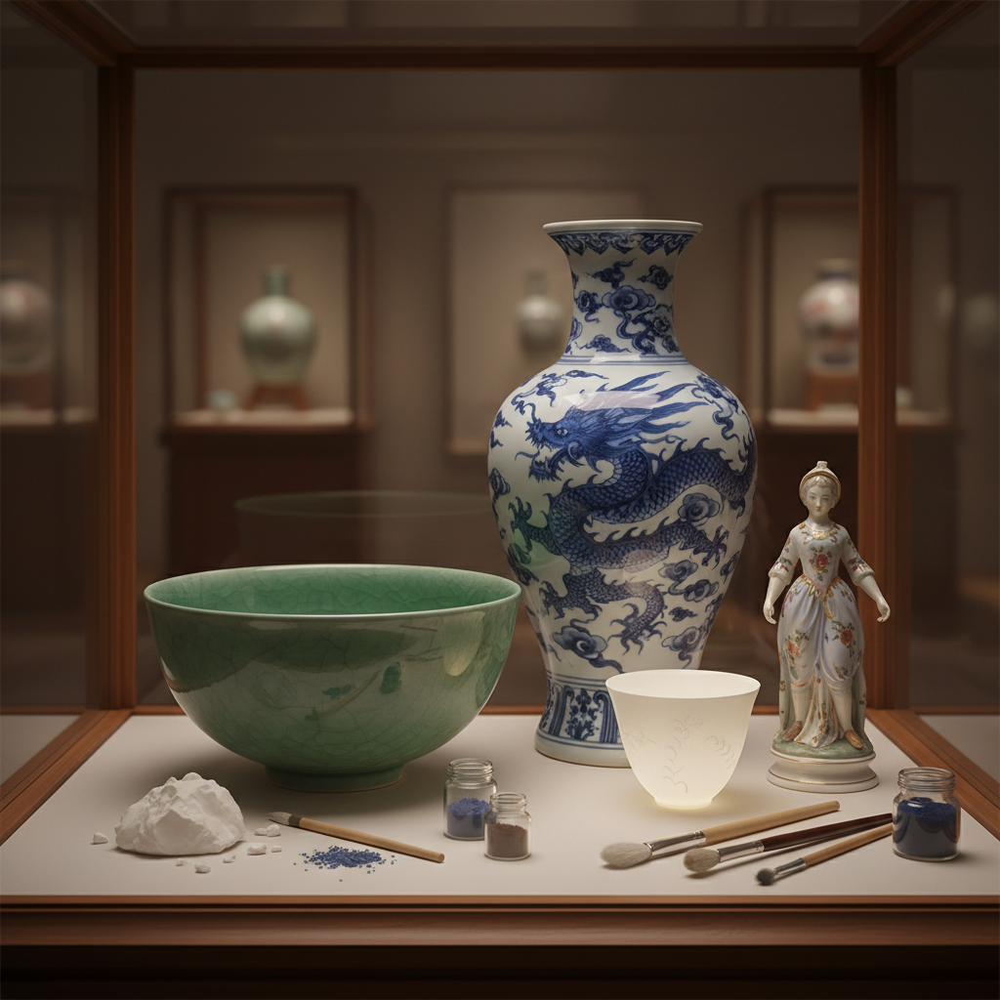

# Porcelain 瓷器

> "Porcelain is earth transformed into light — fired until translucent, it holds the sun within its walls." — Unknown

## 概述

瓷器（Porcelain）是使用高岭土（kaolin）等特殊原料在1300°C以上高温烧制的精细陶瓷。瓷器的独特之处在于它的白度、半透明性和玻璃般的光泽——当你将薄壁瓷器对着光源时，光线可以透过器壁。瓷器是中国对世界文明最重要的贡献之一——"China"这个词在英语中就是瓷器的意思。从宋代的青白瓷到元代的青花，从明代的五彩到清代的粉彩，中国瓷器代表了人类陶瓷艺术的最高成就。

瓷器的哲学在于：泥土的升华——最普通的泥土通过极端的高温和精确的配方，变成了如玉般温润、如冰般清透的材料。

## 核心特征

| 特征 | 描述 |
|------|------|
| 高温 | 1300°C以上烧制 |
| 白度 | 极高的白度 |
| 透光 | 薄壁可透光 |
| 坚硬 | 极其坚硬 |
| 光泽 | 玻璃般的光泽 |
| 精细 | 极其精细的工艺 |

## 视觉特征

- **白**：纯净的白色胎体
- **透光**：半透明的质感
- **光泽**：温润的釉面光泽
- **精细**：精细的装饰
- **薄**：薄如蛋壳的器壁
- **优雅**：优雅精致的形态

## 代表作品

| 作品 | 艺术家 | 年代 | 意义 |
|------|--------|------|------|
| *宋代汝窑* | 匿名 | 宋代 | 中国瓷器巅峰 |
| *元青花* | 匿名 | 元代 | 青花瓷的开端 |
| *明永乐甜白* | 匿名 | 明代 | 薄胎白瓷 |
| *Meissen porcelain* | Various | 1710+ | 欧洲瓷器的开端 |
| *Contemporary porcelain* | Various | 当代 | 当代瓷器艺术 |

## 历史时间线

| 时期 | 事件 |
|------|------|
| 东汉 | 中国最早的真正瓷器 |
| 唐代 | 南青北白的格局 |
| 宋代 | 五大名窑的巅峰 |
| 元代 | 青花瓷的诞生 |
| 1710 | 欧洲（迈森）发明瓷器 |
| 当代 | 当代瓷器艺术 |

## 中国语境

瓷器是中国文明的标志——中国发明瓷器比欧洲早1500年以上。景德镇是世界瓷都，至今仍是中国瓷器艺术的中心。中国瓷器的辉煌历史包括：唐代越窑青瓷和邢窑白瓷、宋代五大名窑（汝、官、哥、钧、定）、元代青花、明代五彩和斗彩、清代粉彩和珐琅彩。当代中国的瓷器艺术既有传承传统的匠人，也有探索当代表达的艺术家。德化白瓷、龙泉青瓷等也是重要的瓷器产地。

## AI生成概念图

## 与其他风格的关系

- **Pottery** → 陶艺
- **Stoneware** → 炻器（较低温）
- **Blue and White** → 青花瓷
- **Celadon** → 青瓷
- **Bone China** → 骨瓷
- **Ceramics** → 陶瓷总称

---

*浮光艺志 | Chronicle of Artistry*
