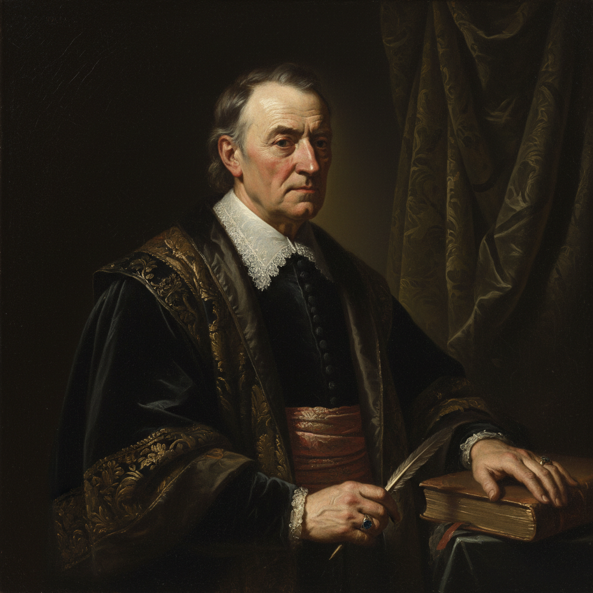

# Portrait Painting 肖像画

> **时期：** 古埃及–至今  
> **关键词：** 人物面容、身份表达、心理深度、权力象征、自我认知

## 概述

Portrait Painting（肖像画）是以捕捉个体面容和精神为目的的绘画类型，贯穿整个艺术史。从法尤姆木乃伊肖像到伦勃朗的自画像，从委拉斯开兹的宫廷肖像到弗朗西斯·培根的扭曲面孔——肖像画追问的不仅是"你长什么样"，更是"你是谁"。

## 风格特征

- **面部焦点**：面容是情感和性格的窗口
- **姿态语言**：手势、坐姿传达身份和态度
- **背景暗示**：环境物品揭示身份和兴趣
- **光影塑造**：用明暗赋予面部立体感和情绪
- **心理深度**：超越外表的内在精神捕捉

## 代表人物与作品

- 伦勃朗 自画像系列（跨越40年）
- 委拉斯开兹《教皇英诺森十世》
- 约翰·辛格·萨金特 社交肖像
- 卢西安·弗洛伊德 当代肖像

## 概念图

