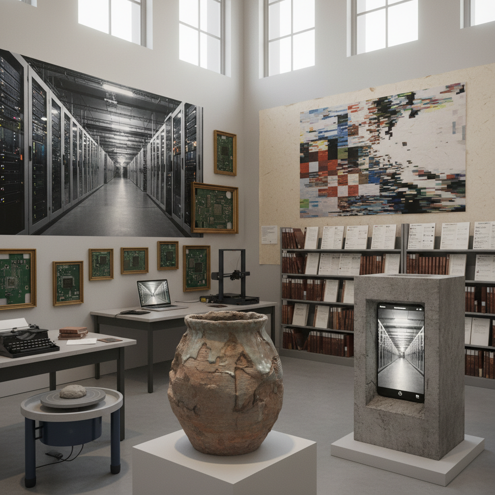

# Post-Digital Art 后数字艺术

> "Post-digital art does not come after the digital — it comes after the novelty of the digital has worn off, after we stop being amazed that computers can make images and start asking what it means to live in a world where computation is as ordinary as electricity, where the glitch is no longer avant-garde but nostalgic, where the distinction between online and offline has collapsed, where algorithms shape our perception without our awareness, and where the most interesting artistic question is no longer how to use technology but how technology has already used us, reshaping our bodies, attention, relationships, and sense of reality in ways we are only beginning to understand." — Unknown

## 概述

后数字艺术（Post-Digital Art）是2000年代末以来发展起来的一个概念，描述的不是"数字之后"的艺术，而是"数字不再新奇之后"的艺术状态。当数字技术变得像电力一样普遍和不可见时，艺术家不再需要将"使用数字技术"本身作为创作的主题或卖点，而是可以更自由地在数字和物理、在线和离线之间移动。

后数字艺术的关键特征是：拒绝数字/模拟的二元对立、对技术的批判性而非崇拜性态度、对物质性的重新关注（在数字时代重新发现物理材料的价值）、以及对算法和数据基础设施的政治性反思。后数字艺术家可能使用3D打印来创造"手工"外观的物品，或者用手工方式模拟数字效果，或者探索数字技术对身体和感知的影响。代表艺术家包括Hito Steyerl、Cory Arcangel、Katja Novitskova等。

## 核心特征

| 特征 | 描述 |
|------|------|
| 混合 | 数字与物理的混合 |
| 日常 | 技术作为日常 |
| 批判 | 对技术的批判性 |
| 物质 | 物质性的回归 |
| 算法 | 算法的可见化 |
| 基础设施 | 数字基础设施 |

## 视觉特征

- **混合**：数字和物理的混合
- **打印**：3D打印和数字制造
- **屏幕**：屏幕和界面的物质化
- **数据**：数据中心和服务器
- **身体**：技术化的身体
- **日常**：技术的日常化

## 代表作品

| 作品 | 艺术家 | 年代 | 意义 |
|------|--------|------|------|
| *How Not to be Seen* | Hito Steyerl | 2013 | 斯泰尔的隐身教程 |
| *Super Mario Clouds* | Cory Arcangel | 2002 | 阿坎格尔的游戏黑客 |
| *Post-Internet sculptures* | Katja Novitskova | 2012起 | 诺维茨科娃的切割雕塑 |
| *Anatomy of an AI System* | Crawford & Joler | 2018 | AI系统的解剖 |
| *Post-digital print* | Various | 2010年代 | 后数字出版 |

## 历史时间线

| 时期 | 事件 |
|------|------|
| 2000年代末 | "后数字"概念的提出 |
| 2010 | Kim Cascone的后数字音乐理论 |
| 2012 | 后网络艺术的兴起 |
| 2010年代 | 后数字美学的扩展 |
| 当代 | AI时代的后数字 |

## 中国语境

后数字艺术在中国有独特的语境。中国是全球数字化程度最高的社会之一——移动支付、社交媒体、电商、短视频已经深度嵌入日常生活。在这个意义上，中国可能是最"后数字"的社会——数字技术已经完全日常化，不再具有新奇感。中国的一些新媒体艺术家在探索后数字的主题：算法如何塑造我们的注意力和欲望、数据基础设施的物质性和政治性、以及在高度数字化的社会中物质体验的价值。中国的"数字劳动"问题（外卖骑手、直播主播、数据标注工人）也为后数字艺术提供了丰富的批判性素材。

## AI生成概念图

## 与其他风格的关系

- **Post-Internet Art** → 后网络艺术
- **New Media Art** → 新媒体艺术
- **Glitch Art** → 故障艺术
- **Net Art** → 网络艺术
- **New Aesthetic** → 新美学
- **Data Art** → 数据艺术

---

*浮光艺志 | Chronicle of Artistry*
