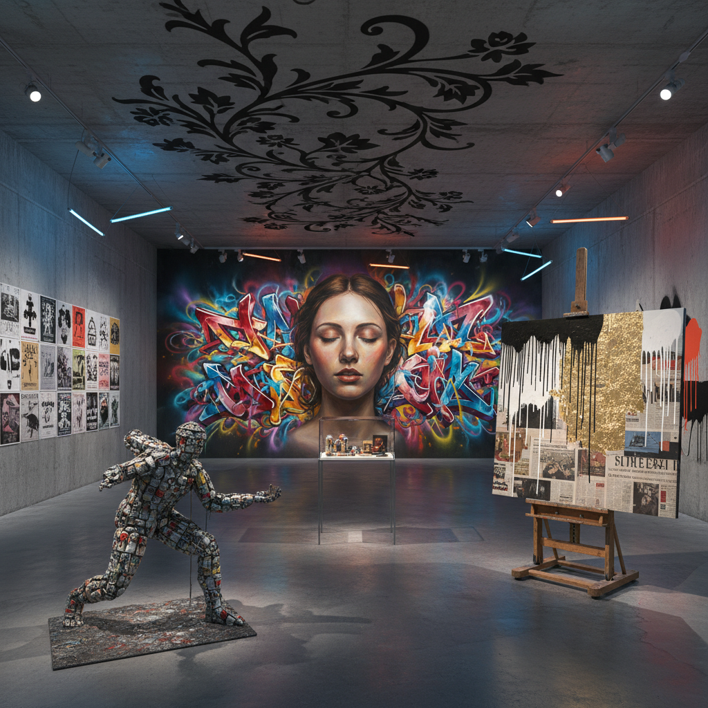

# Post-Graffiti Art 后涂鸦艺术

> "Post-graffiti is what happens when the street writer enters the gallery but refuses to leave the street behind — a hybrid practice that carries the energy, scale, and democratic impulse of graffiti into fine art contexts while simultaneously pushing street art beyond tags and throw-ups into conceptual territory, installation, sculpture, and digital media, creating a space where the raw urgency of illegal mark-making meets the critical discourse of contemporary art, where the can of spray paint becomes as legitimate as the oil brush, and where the city wall remains the ultimate canvas even as the work hangs in museums." — Unknown

## 概述

后涂鸦（Post-Graffiti）是一种从1980年代开始发展的艺术运动，指涂鸦艺术家从街头进入画廊和美术馆系统，同时将涂鸦的美学和精神带入当代艺术的语境中。后涂鸦不是涂鸦的终结，而是涂鸦的扩展——它保留了涂鸦的能量、即兴性和公共性，同时融入了更广泛的艺术实践。

后涂鸦的先驱包括Jean-Michel Basquiat、Keith Haring和Kenny Scharf，他们在1980年代的纽约将街头文化带入了画廊。后来的发展包括：Banksy将涂鸦与政治评论和概念艺术结合、Shepard Fairey（OBEY）将涂鸦与平面设计和政治宣传结合、KAWS将涂鸦美学带入雕塑和商业设计、以及JR将摄影与街头粘贴结合。后涂鸦已经成为当代艺术中最具活力和商业价值的领域之一。

## 核心特征

| 特征 | 描述 |
|------|------|
| 跨界 | 街头与画廊的跨界 |
| 能量 | 涂鸦的原始能量 |
| 公共 | 公共空间的意识 |
| 混合 | 媒介的混合使用 |
| 民主 | 艺术的民主化 |
| 品牌 | 个人品牌的建立 |

## 视觉特征

- **喷漆**：喷漆的质感和滴落
- **字体**：独特的字体设计
- **色彩**：大胆的色彩
- **规模**：大尺度的作品
- **层叠**：多层的视觉信息
- **符号**：重复的个人符号

## 代表作品

| 作品 | 艺术家 | 年代 | 意义 |
|------|--------|------|------|
| *Untitled (Skull)* | Jean-Michel Basquiat | 1981 | 涂鸦进入画廊 |
| *Girl with Balloon* | Banksy | 2002 | 概念涂鸦 |
| *OBEY Giant* | Shepard Fairey | 1989起 | 涂鸦与宣传 |
| *Companion* | KAWS | 1999起 | 涂鸦与雕塑 |
| *Women Are Heroes* | JR | 2008 | 摄影与街头 |

## 历史时间线

| 时期 | 事件 |
|------|------|
| 1980年代 | Basquiat、Haring进入画廊 |
| 1990年代 | 街头艺术的全球传播 |
| 2000年代 | Banksy的国际影响力 |
| 2010年代 | 街头艺术的商业化和制度化 |
| 当代 | 数字时代的后涂鸦 |

## 中国语境

后涂鸦在中国有快速的发展。中国的涂鸦文化从2000年代开始在北京、上海、广州等城市兴起，受到嘻哈文化和西方街头艺术的影响。中国的后涂鸦艺术家在探索将涂鸦美学与中国文化元素结合——如将书法的笔法融入涂鸦字体、将传统图案与街头美学混合、以及在城市更新项目中创作大型壁画。一些中国艺术家如DALeast（华达）以其独特的金属丝般的动物壁画在国际街头艺术界获得了认可。中国的城市管理对涂鸦的态度也在变化——从完全禁止到在特定区域允许甚至鼓励，一些城市开辟了"涂鸦墙"和"街头艺术区"。

## AI生成概念图

## 与其他风格的关系

- **Graffiti** → 涂鸦
- **Street Art** → 街头艺术
- **Pop Art** → 波普艺术
- **Neo-Expressionism** → 新表现主义
- **Urban Art** → 城市艺术
- **Lowbrow Art** → 低眉艺术

---

*浮光艺志 | Chronicle of Artistry*
