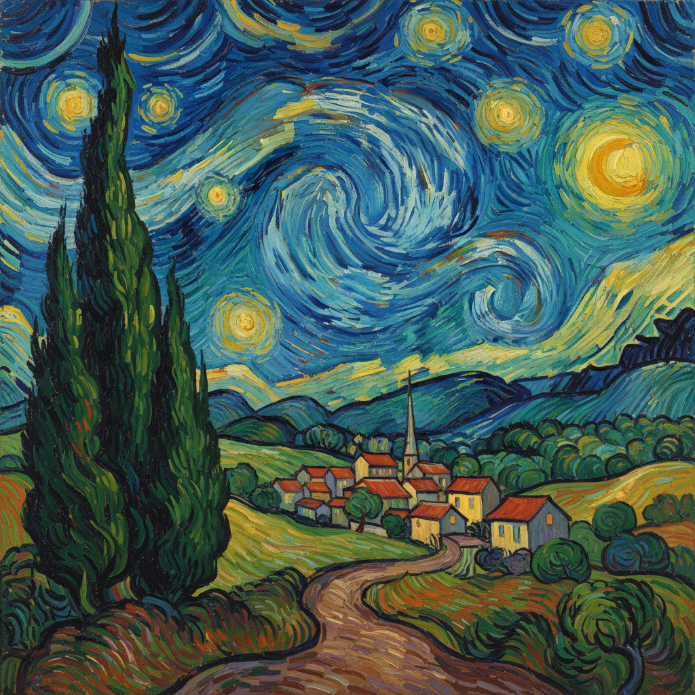

# Post-Impressionism Painting 后印象派绘画

> **时期：** 1886年–1905年  
> **关键词：** 个人表达、结构重建、塞尚、梵高、高更

## 概述

Post-Impressionism（后印象派）不是一个统一的运动，而是1886年后一群画家对印象派的各自超越——他们保留了印象派的色彩解放，但拒绝满足于仅仅记录光线的瞬间。塞尚要重建自然的永恒结构，梵高要表达内心的情感烈焰，高更要逃离文明寻找原始纯真——每个人都从印象派出发，走向了完全不同的方向，共同为20世纪的现代艺术铺平了道路。

## 风格特征

- **个人风格**：每位画家都有独特的视觉语言
- **结构意识**：超越表面印象，追求深层秩序
- **情感色彩**：色彩服务于表达而非描述
- **形式简化**：将自然还原为基本形状
- **象征意味**：画面承载精神和哲学含义

## 代表人物与作品

- 保罗·塞尚《圣维克多山》
- 文森特·梵高《星夜》
- 保罗·高更《我们从哪里来？》
- 乔治·修拉《大碗岛的星期天下午》

## 概念图

