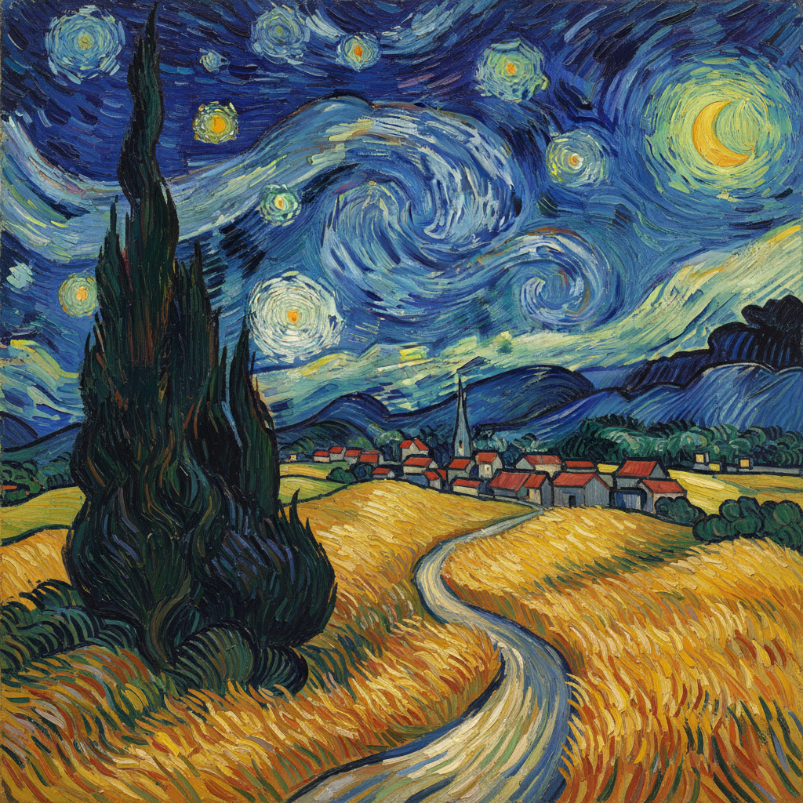

# Post-Impressionism 后印象派



> **"印象派画光——我们画结构、情感和永恒。"**

## 概述

| 维度 | 描述 |
|------|------|
| 时期 | 1886–1910s |
| 别名 | Post-Impressionism, 后印象主义, 后印象派 |
| 核心色彩 | 大胆纯色、互补色对比、非自然主义用色 |
| 关键元素 | 结构化构图、主观色彩、厚涂笔触、几何简化 |
| 代表人物 | Cézanne, Van Gogh, Gauguin, Seurat, Toulouse-Lautrec |
| 关联风格 | Impressionism, Pointillism, Fauvism, Cubism, Expressionism |

---

## 历史脉络

| 年份 | 事件 |
|------|------|
| 1886 | 最后一次印象派展览——后印象派开始 |
| 1886 | Seurat展出《大碗岛的星期天下午》——点彩派 |
| 1888 | Van Gogh在阿尔勒——表现性色彩的巅峰 |
| 1891 | Gauguin前往塔希提——原始主义 |
| 1895 | Cézanne回顾展——"现代艺术之父" |
| 1910 | Roger Fry命名"Post-Impressionism" |

### 核心哲学

后印象派的精神是**"印象派解放了色彩——我们要解放形式"**：
- Cézanne："我要用圆柱体、球体和锥体来画自然"
- Van Gogh："我要用色彩表达人类的激情"
- Gauguin："我要在原始中找到文明丢失的东西"
- "印象派太被动——我们要主动地重建世界"
- "不是画眼睛看到的——是画心灵理解的"

---

## 视觉语法

### 色彩系统

```
Cézanne系：
  土绿 (#556B2F) — 普罗旺斯
  赭石 (#CC7722) — 圣维克多山
  灰蓝 (#6699CC) — 结构

Van Gogh系：
  铬黄 (#FFC300) — 向日葵、星光
  钴蓝 (#0047AB) — 星夜
  翠绿 (#00A86B) — 柏树

Gauguin系：
  深红 (#B22222) — 塔希提
  芒果黄 (#FF8243) — 热带
  靛蓝 (#4B0082) — 神秘

规则：
  - 色彩可以不写实但必须有情感逻辑
  - 笔触是表达的一部分
  - 轮廓线可以强化
  - 平面化空间是有意为之
```

### 标志性元素

| 类别 | 元素 |
|------|------|
| 笔触 | Van Gogh旋涡、Cézanne平行斜笔、Seurat点彩 |
| 构图 | Cézanne多视点、Gauguin平面装饰、几何简化 |
| 主题 | 风景、静物、人物、日常生活——但主观化 |
| 色彩 | 互补色对比、非自然用色、情感色彩 |
| 空间 | 压缩透视、平面化、多视点 |
| 态度 | 个人表达、结构探索、原始回归 |

---

## 对现代艺术的影响

- **Cézanne** → Cubism（几何简化+多视点）
- **Van Gogh** → Expressionism（情感色彩+笔触）
- **Gauguin** → Fauvism（大胆用色+原始主义）
- **Seurat** → 科学色彩理论 → 光学艺术
- "没有后印象派——就没有20世纪的一切"

---

## 设计应用

| 场景 | 应用方式 |
|------|----------|
| 插画 | 表现性笔触+主观色彩 |
| 品牌 | 艺术感+手工感+文化品位 |
| 室内 | 艺术复制品+色彩灵感 |
| 教育 | 现代艺术史的关键节点 |

---

## 相关风格

← [Impressionism 印象派](impressionism.md) | [Fauvism 野兽派](fauvism.md) →

↑ [返回千禧怀旧目录](README.md) | [返回总目录](../README.md)
