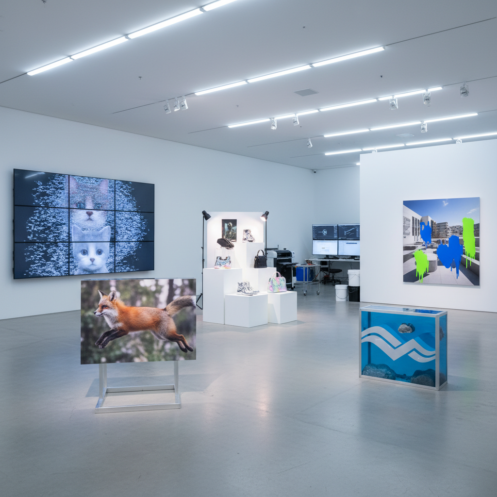

# Post-Internet Art 后网络艺术

> "Post-Internet art does not celebrate the internet or critique it — it simply acknowledges that the internet has already changed everything, that there is no longer an offline world untouched by digital logic, and that art made in this condition must reckon with how images circulate, how attention is monetized, how identity is performed online, and how the physical and virtual have become permanently entangled in ways that make the distinction between them meaningless." — Unknown

## 概述

后网络艺术（Post-Internet Art）是2000年代末至2010年代兴起的一个艺术概念，描述在互联网已经完全渗透日常生活之后创作的艺术——这些艺术不是"关于"互联网的，而是在互联网已经成为基础设施的条件下产生的。"后网络"不意味着"互联网之后"，而是意味着"在互联网已经无处不在之后"。

这个术语由艺术家马里萨·奥尔森（Marisa Olson）在2008年左右首次使用，后来由批评家吉恩·麦克休（Gene McHugh）在其博客"Post Internet"（2009-2010）中发展。后网络艺术的特征包括：数字图像的物质化（将网络图像转化为实体雕塑或绘画）、对注意力经济的反思、对数字身份和自我表演的探索、以及对图像在线上线下之间流通方式的关注。

## 核心特征

| 特征 | 描述 |
|------|------|
| 渗透 | 互联网已渗透一切 |
| 物质化 | 数字的物质化 |
| 流通 | 图像的流通方式 |
| 身份 | 数字身份的表演 |
| 注意力 | 注意力经济 |
| 混合 | 线上线下的混合 |

## 视觉特征

- **光滑**：光滑的数字美学
- **渲染**：3D渲染的质感
- **屏幕**：屏幕截图的美学
- **物化**：数字图像的物质化
- **品牌**：品牌和商业美学
- **混合**：虚拟与实体的混合

## 代表作品

| 作品 | 艺术家 | 年代 | 意义 |
|------|--------|------|------|
| *DIS Magazine* | DIS Collective | 2010-17 | DIS的后网络美学 |
| *89+ project* | Hans Ulrich Obrist & Simon Castets | 2013起 | 数字原住民一代 |
| *Sculptures* | Katja Novitskova | 2010年代 | 数字图像的物质化 |
| *Default to Public* | Hito Steyerl | 2012 | 斯泰尔的图像政治 |
| *New Sculpture* | Timur Si-Qin | 2010年代 | 品牌美学的雕塑 |

## 历史时间线

| 时期 | 事件 |
|------|------|
| 2008 | Marisa Olson使用"post-internet" |
| 2009-10 | Gene McHugh的博客 |
| 2010-15 | 后网络艺术的鼎盛期 |
| 2016 | DIS策划柏林双年展 |
| 当代 | 后网络条件的持续影响 |

## 中国语境

后网络艺术在中国有活跃的实践。中国作为全球最大的互联网市场之一，有独特的数字文化生态（微信、抖音、淘宝等平台）。中国的年轻一代艺术家（如陆扬、苗颖、林科等）创作了大量回应中国特有数字文化的后网络作品。中国的"淘宝美学"、"山寨文化"、"表情包文化"等都成为后网络艺术的创作素材。中国的后网络艺术往往关注中国特有的数字治理、网络审查、电商文化和社交媒体生态。

## AI生成概念图

## 与其他风格的关系

- **Net Art** → 网络艺术
- **New Media Art** → 新媒体艺术
- **Conceptual Art** → 概念艺术
- **Pop Art** → 波普艺术
- **Appropriation Art** → 挪用艺术
- **Digital Art** → 数字艺术

---

*浮光艺志 | Chronicle of Artistry*
