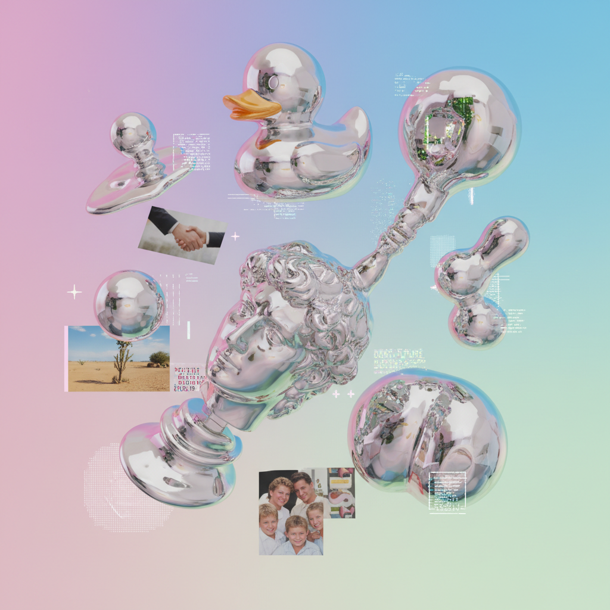

# Post-Internet Art 后网络艺术



> **"互联网不再是新事物——它是空气。后网络艺术在这片空气中呼吸。"**

## 概述

| 维度 | 描述 |
|------|------|
| 时期 | 2008–至今 |
| 别名 | Post-Internet Art, 后网络艺术, Post-Digital |
| 核心色彩 | 屏幕蓝、3D渲染光泽、stock photo色调、故障色 |
| 关键元素 | 线上/线下模糊、数字材料物理化、网络文化批判 |
| 代表人物 | Artie Vierkant, Hito Steyerl, DIS Magazine, Katja Novitskova |
| 关联风格 | Net Art, New Media Art, Glitch Art, Vaporwave, Conceptual Art |

---

## 历史脉络

| 年份 | 事件 |
|------|------|
| 2008 | Marisa Olson首次使用"Post-Internet" |
| 2010 | Artie Vierkant《The Image Object Post-Internet》 |
| 2012 | "Post-Internet"成为艺术界热词 |
| 2013 | DIS Magazine——后网络美学的平台 |
| 2015 | 后网络艺术进入主流美术馆 |
| 2016 | DIS策展柏林双年展——后网络的巅峰 |
| 2020s | 后网络已成为默认状态——术语本身过时 |

### 核心哲学

后网络艺术的精神是**"互联网不是工具——是我们存在的条件"**：
- "Post-Internet ≠ 反互联网——是'在互联网之后'的状态"
- "线上和线下不再是两个世界——是同一个世界的两个界面"
- "图像在网络中流通——每次复制都改变了它"
- "3D渲染的光滑表面 = 我们时代的'自然'"
- "Stock photo、emoji、meme = 我们时代的'现成品'"

---

## 视觉语法

### 美学系统

```
视觉特征：
  3D渲染 — 光滑、反射、超现实
  Stock photo — 通用、无个性、诡异
  屏幕截图 — 界面作为材料
  物理化 — 数字图像打印/雕塑化
  透明 — PNG透明背景、浮动物体

色彩：
  屏幕蓝 (#0000FF) — 超链接、默认
  Chrome银 (#C0C0C0) — 3D渲染、金属
  肉粉 (#FFDAB9) — 身体、uncanny
  故障色 — RGB分离、数据错误
  渐变 — iOS风格、商业数字

材料（物理化）：
  UV打印 — 数字图像→物理表面
  亚克力 — 透明、光滑、屏幕感
  铝板 — 金属、反射、工业
  泡沫 — 轻、廉价、临时

规则：
  - 线上/线下同等重要
  - 图像是流通的——不是固定的
  - 材料可以是数字的也可以是物理的
  - 批判但不拒绝商业美学
```

### 标志性元素

| 类别 | 元素 |
|------|------|
| 图像 | 3D渲染、stock photo、截图、meme |
| 材料 | UV打印、亚克力、铝板、屏幕 |
| 主题 | 身份、监控、劳动、图像流通 |
| 形式 | 装置+网站+社交媒体+出版 |
| 态度 | 批判性参与、不讽刺也不天真 |

---

## 与千禧怀旧/当代的关系

### Vaporwave = 后网络的流行版本
- Vaporwave的3D渲染+商业图像 = 后网络美学的音乐化
- "Vaporwave是后网络艺术的meme化"
- 两者共享：stock photo、3D、商业美学的挪用

### AI时代的后网络
- AI生成图像 = 后网络的终极形态？
- "当所有图像都是生成的——'原创'还有意义吗？"
- 后网络的核心问题在AI时代更加尖锐

---

## 设计应用

| 场景 | 应用方式 |
|------|----------|
| 品牌 | 3D渲染+数字原生+元宇宙 |
| 时尚 | 数字时尚+虚拟服装+AR |
| 空间 | 数字/物理混合展览 |
| 出版 | 网络原生出版+社交媒体 |

---

## 相关风格

← [New Media Art 新媒体艺术](new-media-art.md) | [Vaporwave 蒸汽波](vaporwave.md) →

↑ [返回千禧怀旧目录](README.md) | [返回总目录](../README.md)
