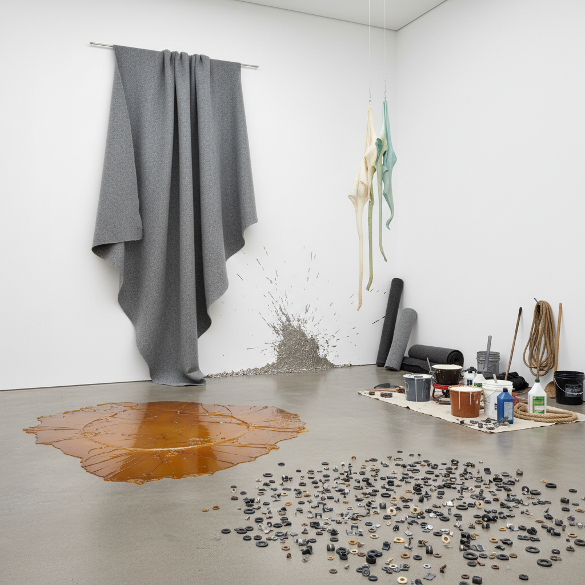

# Post-Minimalism Art 后极简主义艺术

> "Post-Minimalism kept Minimalism's interest in materials and process but rejected its industrial perfection — where Minimalism was hard, geometric, and factory-made, Post-Minimalism was soft, organic, and handmade, where Minimalism suppressed the body, Post-Minimalism celebrated it, where Minimalism sought the absolute, Post-Minimalism embraced the contingent, creating works from felt, latex, rope, and lead that sagged, draped, scattered, and piled according to gravity and chance rather than geometric will, proving that reduction did not require rigidity and that less could be messy, vulnerable, and alive." — Unknown

## 概述

后极简主义（Post-Minimalism）是1960年代末至1970年代在美国发展起来的一个艺术趋势，作为对极简主义（Minimalism）的回应和扩展。后极简主义保留了极简主义对材料、过程和物理性的关注，但拒绝了其工业化的完美和几何的严格性。代表艺术家包括伊娃·海瑟（Eva Hesse）、理查德·塞拉（Richard Serra）、布鲁斯·瑙曼（Bruce Nauman）、罗伯特·莫里斯（Robert Morris）的后期作品、以及林达·本格利斯（Lynda Benglis）。

后极简主义的关键转变是从"硬"到"软"、从"几何"到"有机"、从"工厂制造"到"手工过程"。伊娃·海瑟使用乳胶、玻璃纤维和绳索创造出既有机又工业的形态；理查德·塞拉将熔化的铅泼洒在墙角；罗伯特·莫里斯展示了毛毡的自然垂坠。这些作品强调重力、偶然性和材料的物理行为，而非预设的几何形式。

## 核心特征

| 特征 | 描述 |
|------|------|
| 软性 | 软性材料的使用 |
| 过程 | 过程的可见性 |
| 重力 | 重力的作用 |
| 有机 | 有机的形态 |
| 身体 | 身体性的回归 |
| 偶然 | 偶然和不确定 |

## 视觉特征

- **垂坠**：材料的自然垂坠
- **散落**：散落和堆积
- **乳胶**：乳胶和橡胶材料
- **毛毡**：毛毡的柔软形态
- **绳索**：绳索和纤维
- **铅**：铅的重量和可塑性

## 代表作品

| 作品 | 艺术家 | 年代 | 意义 |
|------|--------|------|------|
| *Hang Up* | Eva Hesse | 1966 | 海瑟的框架与绳索 |
| *Splashing* | Richard Serra | 1968 | 塞拉的泼铅 |
| *Felt pieces* | Robert Morris | 1967-68 | 莫里斯的毛毡 |
| *Fallen* | Lynda Benglis | 1968 | 本格利斯的泼洒乳胶 |
| *Corridor installations* | Bruce Nauman | 1969-70 | 瑙曼的走廊装置 |

## 历史时间线

| 时期 | 事件 |
|------|------|
| 1966 | "Eccentric Abstraction"展 |
| 1968 | "Anti-Illusion"展 |
| 1969 | "When Attitudes Become Form"展 |
| 1970年代 | 后极简主义的扩展 |
| 当代 | 持续的影响力 |

## 中国语境

后极简主义对中国当代艺术有重要的影响，特别是在装置艺术和雕塑领域。中国的一些当代艺术家在创作中探索类似的"过程性"和"材料性"——让材料按照自身的物理特性行为，而非强加预设的形式。中国传统美学中对"自然"和"无为"的重视与后极简主义的精神有共鸣——尊重材料的本性，让事物按照自身的逻辑展开。中国的一些年轻雕塑家和装置艺术家在探索软性材料、有机形态和过程性创作，发展出融合中国材料传统（如纸、丝、竹）与后极简主义方法论的新实践。

## AI生成概念图

## 与其他风格的关系

- **Minimalism** → 极简主义
- **Process Art** → 过程艺术
- **Arte Povera** → 贫穷艺术
- **Land Art** → 大地艺术
- **Conceptual Art** → 概念艺术
- **Feminist Art** → 女性主义艺术

---

*浮光艺志 | Chronicle of Artistry*
