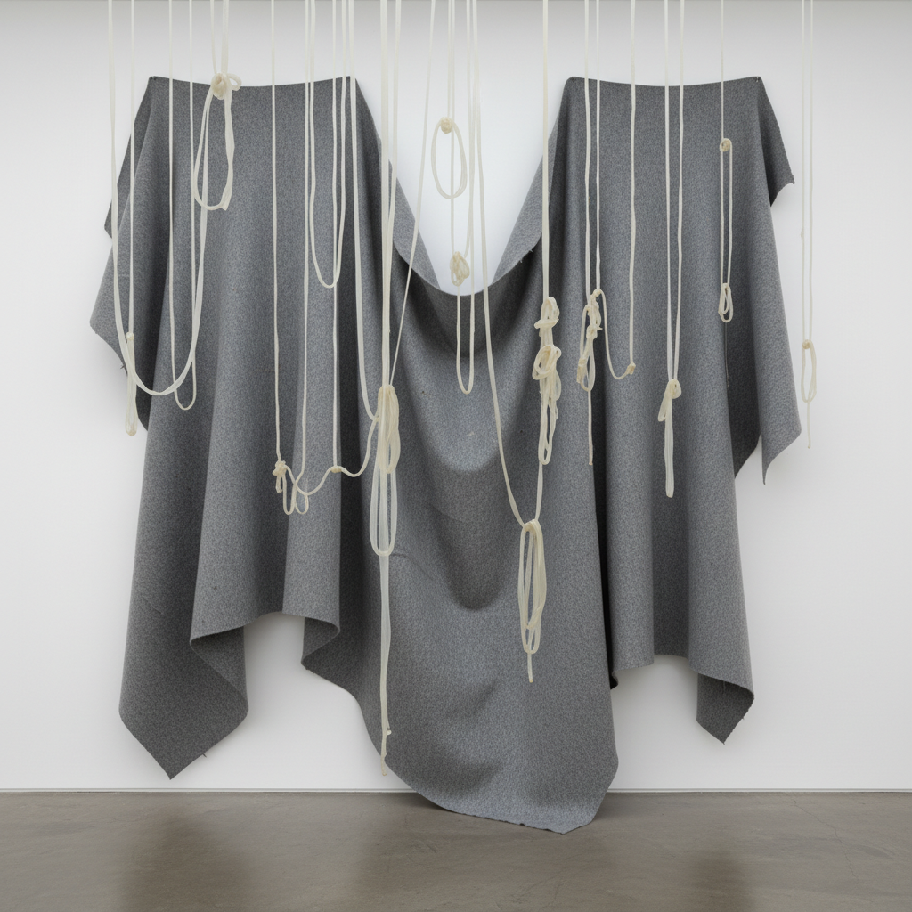

# Post-Minimalism 后极简主义

> "I am interested in the way things look, but I am more interested in the way things are." — Robert Morris

## 概述

后极简主义（Post-Minimalism）是1960年代末至1970年代兴起的艺术运动，作为对极简主义冷硬几何的回应而发展。它保留了极简主义对材料和过程的关注，但重新引入了身体性、有机形态、临时性和过程痕迹——让艺术从工业化的完美回归到手工的、脆弱的、会衰败的物质存在。

后极简主义是一个松散的伞状概念，涵盖了过程艺术、反形式、软雕塑、大地艺术等多种实践。

## 核心特征

| 特征 | 描述 |
|------|------|
| 过程可见 | 创作过程的痕迹成为作品的一部分 |
| 材料本性 | 让材料按自身物理属性行为——重力、流动、堆积 |
| 有机形态 | 柔软的、不规则的、会变化的形状 |
| 临时性 | 作品可能会腐烂、融化、坍塌 |
| 身体性 | 重新引入艺术家身体的痕迹 |
| 反纪念碑 | 拒绝永恒性和纪念碑式的庄严 |

## 视觉特征

- **材料**：毛毡、乳胶、蜡、铅、绳索、泥土
- **形态**：下垂的、堆积的、散落的、流淌的
- **色彩**：材料本色——灰、棕、黑、肉色
- **空间**：占据地面而非墙面，蔓延而非直立
- **质感**：柔软的、粗糙的、有机的
- **尺度**：从亲密到环境性的各种尺度

## 代表作品

| 作品 | 艺术家 | 年代 | 意义 |
|------|--------|------|------|
| *Contingent* | Eva Hesse | 1969 | 乳胶和纤维玻璃的脆弱悬挂 |
| *Felt Pieces* | Robert Morris | 1967-68 | 让重力决定形态 |
| *Splashing* | Richard Serra | 1968 | 熔铅泼洒在墙角 |
| *One Ton Prop* | Richard Serra | 1969 | 铅板的危险平衡 |
| *Untitled (Rope Piece)* | Eva Hesse | 1970 | 绳索的自由悬垂 |
| *Floor Piece* | Barry Le Va | 1966 | 碎片的随机散落 |

## 历史时间线

| 时期 | 事件 |
|------|------|
| 1966 | "Eccentric Abstraction"展览——后极简主义的预兆 |
| 1967 | Morris开始毛毡作品 |
| 1968 | "Anti-Illusion: Procedures/Materials"展览 |
| 1969 | Serra的泼铅作品，Hesse的乳胶悬挂 |
| 1970 | Eva Hesse去世（年仅34岁） |
| 1970s | 后极简主义扩展为过程艺术、大地艺术等 |
| 1980s | 影响新一代雕塑家（Kiki Smith等） |

## 子类型

| 子类型 | 特征 |
|--------|------|
| 过程艺术 | Serra、Le Va——创作过程即作品 |
| 反形式 | Morris——让重力和材料决定形态 |
| 软雕塑 | Hesse、Oldenburg——柔软材料的有机形态 |
| 散落作品 | Le Va、Andre——碎片在空间中的分布 |
| 身体/女性主义 | Hesse、Bourgeois——身体性和脆弱性 |

## 中国语境

后极简主义对中国当代艺术影响深远。1990年代以来，许多中国艺术家采用后极简主义的材料实验和过程关注：隋建国的铸铁作品、展望的不锈钢假山石、梁绍基的蚕丝装置都体现了"让材料说话"的后极简精神。中国传统的"物性"观念（如文人对石头、木头天然形态的欣赏）与后极简主义有深层共鸣。

## 争议与遗产

- **争议**：被批评为"极简主义的软化版"，缺乏理论严谨性
- **女性主义维度**：Eva Hesse等女性艺术家的参与挑战了极简主义的男性主导
- **保存困境**：许多作品使用会降解的材料，面临保存难题
- **遗产**：为装置艺术、过程艺术、身体艺术奠定基础
- **当代回响**：当代雕塑中的材料实验、临时性装置、生态艺术

## AI生成概念图

## 与其他风格的关系

- **Minimalism** → 后极简主义是对极简主义的回应和超越
- **Process Art** → 过程艺术是后极简主义的核心分支
- **Land Art** → 大地艺术共享后极简主义的材料关注
- **Arte Povera** → 贫穷艺术与后极简主义平行发展
- **Body Art** → 身体艺术继承了后极简主义的身体性
- **Installation Art** → 装置艺术是后极简主义的自然延伸

---

*浮光艺志 | Chronicle of Artistry*
