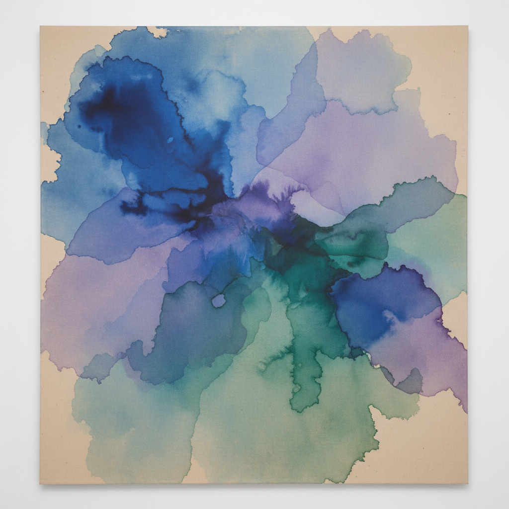

# Post-Painterly Abstraction 后绘画性抽象

> **时期：** 1960年代  
> **关键词：** 色彩浸染、硬边、清晰轮廓、去笔触、光学纯净

## 概述

后绘画性抽象是批评家克莱门特·格林伯格（Clement Greenberg）在1964年策划的同名展览中提出的概念，用以描述一批超越抽象表现主义"绘画性"（painterly）特征的艺术家。他们追求色彩的纯粹光学体验——通过浸染未上底的画布、使用胶带制造硬边、或大面积平涂单色，消除笔触的个人痕迹，让颜色本身成为唯一的主角。

## 风格特征

- **色彩浸染（Stain）**：颜料直接渗入未上底的画布
- **硬边（Hard-edge）**：用胶带或尺子制造锐利的色彩边界
- **去笔触**：消除画家手的痕迹
- **大尺幅**：巨大的画面让观者沉浸在色彩中
- **平面性**：强调画布的二维本质

## 代表人物与作品

- Helen Frankenthaler《山与海》（1952）
- Morris Louis 面纱系列
- Kenneth Noland 靶心系列
- Jules Olitski 喷涂绘画
- Frank Stella 条纹绘画

## 概念图

