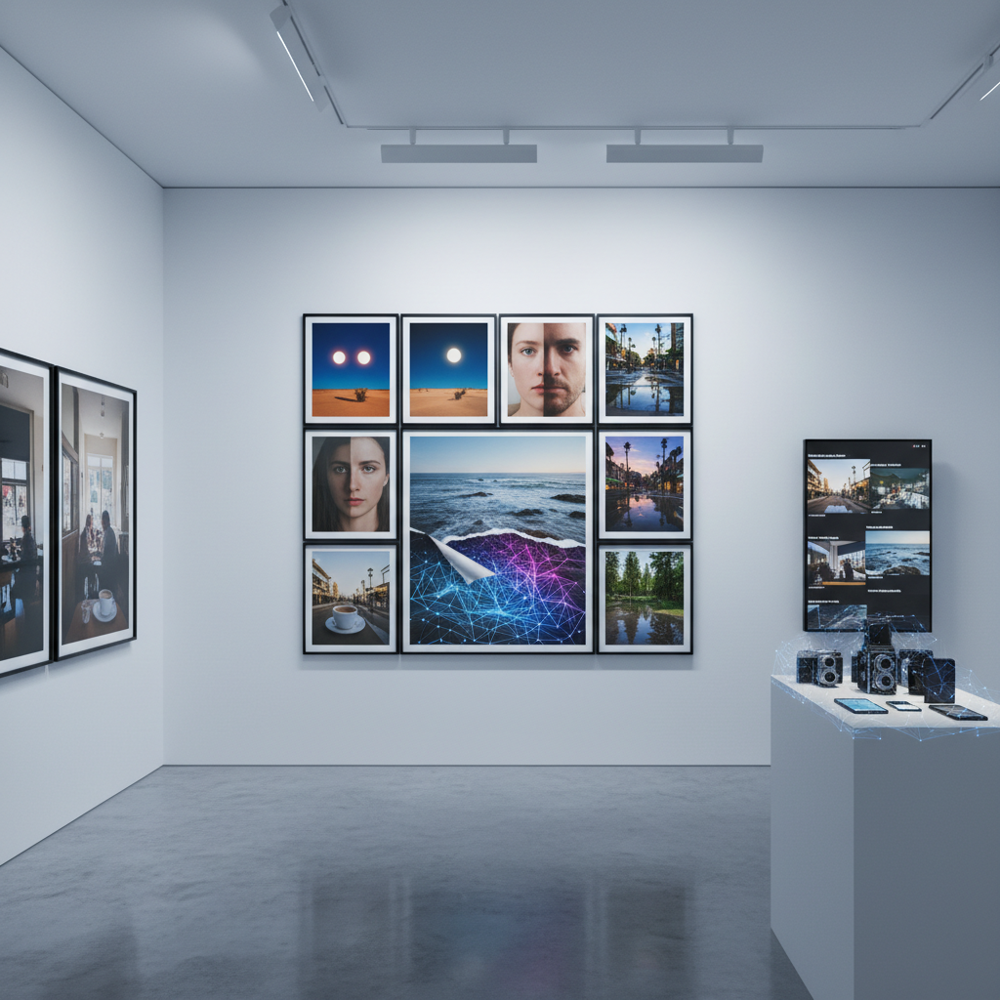

# Post-Photography Art 后摄影艺术

> "Post-photography is not the death of photography but its liberation — freed from the burden of truth-telling, freed from the indexical bond to reality, freed from the camera as necessary apparatus, photography can finally become what it always secretly was: not a window onto the world but a way of constructing worlds, not a record of what exists but a tool for imagining what could exist, not evidence but fiction, not document but dream." — Joan Fontcuberta

## 概述

后摄影艺术（Post-Photography Art）是在数字技术彻底改变了图像的生产、流通和意义之后出现的摄影实践。后摄影认为：传统摄影的核心假设——照片是现实的忠实记录——已经被数字技术瓦解。在AI生成图像、深度伪造、无限后期处理和计算摄影的时代，"摄影"的含义已经根本改变。

后摄影艺术的实践包括：1）非相机图像——不使用相机创造"摄影"图像（如AI生成、3D渲染、扫描仪摄影）；2）图像的再利用——从互联网上收集和重新组合已有图像；3）元摄影——关于摄影本身的摄影，反思图像的本质和功能；4）算法图像——由算法和AI生成或处理的图像；5）摄影的扩展——将摄影扩展到传统边界之外（如光场摄影、全景摄影、显微摄影）。

## 核心特征

| 特征 | 描述 |
|------|------|
| 非索引 | 脱离现实索引 |
| 生成 | 计算生成 |
| 流通 | 图像的流通 |
| 元 | 元摄影 |
| 混合 | 真实与虚构混合 |
| 过剩 | 图像过剩 |

## 视觉特征

- **合成**：明显的数字合成
- **完美**：过度完美的图像
- **故障**：数字故障和伪影
- **拼贴**：图像的拼贴重组
- **AI**：AI生成的痕迹
- **屏幕**：屏幕截图美学

## 代表作品

| 作品 | 艺术家 | 年代 | 意义 |
|------|--------|------|------|
| *Googlescapes* | Various | 2010年代 | Google街景艺术 |
| *AI portraits* | Various | 2018至今 | AI肖像 |
| *Found footage* | Various | 2010年代 | 网络找到的图像 |
| *Computational photography* | Various | 2020年代 | 计算摄影 |
| *Deepfake art* | Various | 2020年代 | 深度伪造艺术 |

## 历史时间线

| 时期 | 事件 |
|------|------|
| 2011 | Joan Fontcuberta提出后摄影概念 |
| 2014 | 计算摄影的普及 |
| 2018 | GAN生成图像的突破 |
| 2022 | Stable Diffusion等AI图像生成 |
| 当代 | 摄影真实性的全面危机 |

## 中国语境

后摄影艺术在中国有独特的发展语境。中国是世界上最大的智能手机摄影市场——数亿人每天用手机拍摄和分享图像，计算摄影（AI美颜、夜景模式、多帧合成）已经成为日常。中国的社交媒体文化中，图像的"真实性"早已不是核心关注——美颜滤镜、P图文化、AI换脸等技术被广泛接受。中国的一些当代艺术家在探索后摄影的可能性：利用AI生成技术创作、从中国互联网的海量图像中进行"考古"、以及反思中国特有的图像文化（如证件照美颜、房产广告渲染图、电商产品图的过度修饰）。

## AI生成概念图

## 与其他风格的关系

- **Photography** → 摄影
- **Digital Art** → 数字艺术
- **AI Art** → 人工智能艺术
- **Glitch Art** → 故障艺术
- **Appropriation Art** → 挪用艺术
- **Conceptual Photography** → 观念摄影

---

*浮光艺志 | Chronicle of Artistry*
