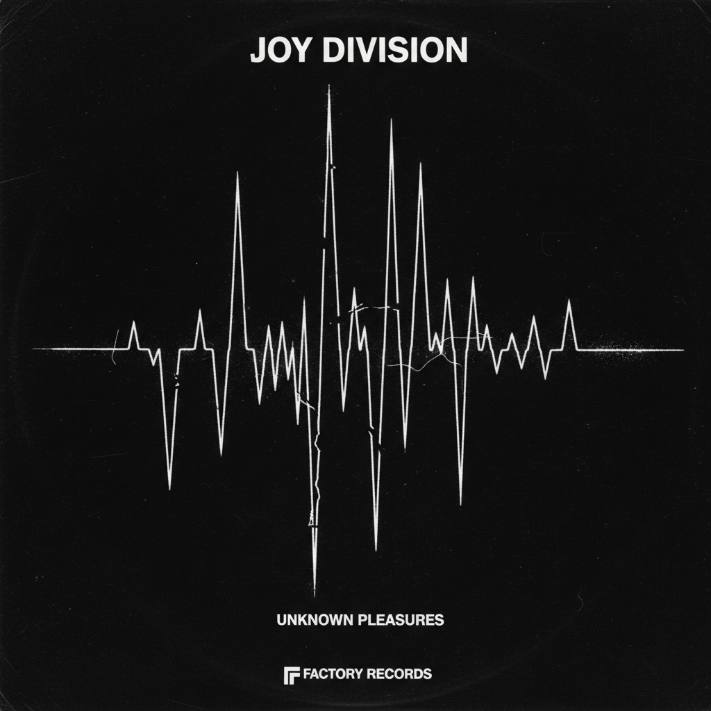

# Post-Punk 后朋克



> **"Joy Division 的鼓机、Peter Saville 的封面——当朋克学会了冷静。"**

## 概述

| 维度 | 描述 |
|------|------|
| 时期 | 1978–1984 原版 / 2000s 复兴 |
| 别名 | Post-Punk, Gothic Rock, Darkwave |
| 核心色彩 | 黑色、灰色、白色、深蓝、暗红 |
| 关键元素 | 极简封面设计、鼓机、贝斯线、冷峻 |
| 代表人物 | Joy Division、Bauhaus、Siouxsie、The Cure |
| 关联风格 | New Wave, Goth, Synthwave, Dark Academia |

---

## 历史脉络

### 从朋克的灰烬到艺术的冰冷

| 年份 | 事件 |
|------|------|
| 1978 | 朋克"死了"——后朋克从废墟中诞生 |
| 1979 | Joy Division《Unknown Pleasures》——Peter Saville 封面 |
| 1979 | Bauhaus "Bela Lugosi's Dead"——哥特摇滚诞生 |
| 1980 | Ian Curtis 自杀——Joy Division 成为传奇 |
| 1982 | The Cure《Pornography》——黑暗的巅峰 |
| 1983 | 后朋克逐渐分化为哥特、新浪潮等 |
| 2001 | Interpol、The Strokes——后朋克复兴 |
| 2020s | Fontaines D.C.、Dry Cleaning——新一波后朋克 |

### 核心哲学

Post-Punk 的精神是**"朋克的能量 + 艺术的智识 + 存在主义的冷峻"**：
- 保留朋克的DIY和反叛
- 但加入文学、哲学、电影的深度
- "我不愤怒——我绝望"
- 极简 = 力量（少即是多）
- Peter Saville 的封面 = 音乐可以看起来像艺术

---

## 视觉语法

### 色彩系统

```
主色：
  黑色 (#000000) — 基础、虚无
  灰色 (#404040) — 工业、阴郁
  白色 (#FFFFFF) — 对比、空旷

辅色：
  深蓝 (#191970) — 夜晚
  暗红 (#8B0000) — 血、激情
  银色 (#C0C0C0) — 金属、冷

规则：
  - 极度克制的用色
  - 黑白灰为主
  - 偶尔一个强调色
  - 大量留白/留黑
  - "少"比"多"更有力量

质感：
  粗糙 — 工业、混凝土
  光滑 — 乙烯基、金属
  颗粒 — 暗房摄影
```

### 标志性元素

| 类别 | 元素 |
|------|------|
| 封面 | Peter Saville 极简设计、数据可视化 |
| 字体 | Futura、极简无衬线、大量留白 |
| 摄影 | 高对比黑白、颗粒感、阴影 |
| 时尚 | 黑色大衣、尖头靴、苍白妆容 |
| 空间 | 工厂、废墟、混凝土、阴暗俱乐部 |
| 态度 | 冷峻、智识、内省、存在主义 |

---

## 与千禧怀旧的关系

### Unknown Pleasures 的永恒
- Joy Division 的脉冲星图 = 设计史最被复制的图像之一
- 出现在无数T恤、海报、纹身上
- "我不知道这是什么乐队但这个图很酷"
- Peter Saville = 音乐视觉设计的教父

### 2000s/2020s 后朋克复兴
- Interpol、Editors = 2000s 复兴
- Fontaines D.C.、Shame = 2020s 新浪潮
- 后朋克美学在独立音乐中从未真正消失
- 黑色+极简+冷峻 = 永恒的"酷"

---

## 中国语境

- 中国后朋克乐队的兴起（重塑雕像的权利等）
- "冷波"/"暗潮"在中国独立音乐圈
- 与中国地下音乐场景的关系
- 后朋克美学在中国设计中的应用

---

## 设计应用

| 场景 | 应用方式 |
|------|----------|
| 音乐 | 极简封面+黑白+数据图形+留白 |
| 品牌 | 冷峻+极简+黑白灰+智识感 |
| 空间 | 工业+混凝土+暗光+极简 |
| 数字 | 大量留白+极简字体+单色+克制 |

---

## 相关风格

← [Punk 朋克美学](punk.md) | [New Wave 新浪潮](new-wave.md) →

↑ [返回千禧怀旧目录](README.md) | [返回总目录](../README.md)
