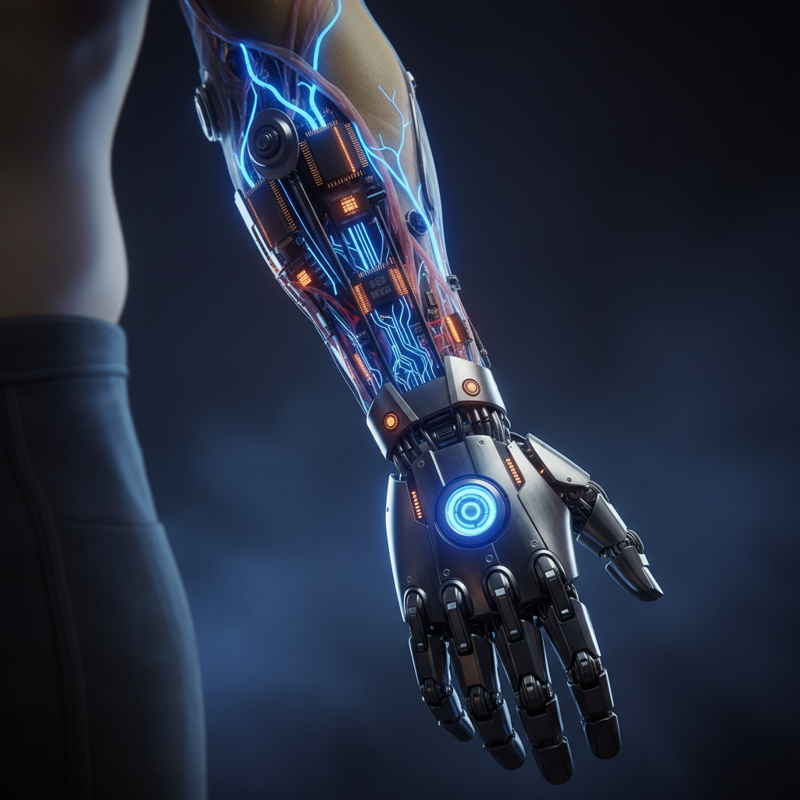

# Posthuman Art 后人类艺术

> **时期：** 2000年代–至今  
> **关键词：** 赛博格、人机融合、身体增强、技术进化、物种边界

## 概述

后人类艺术探索人类与技术、动物、机器之间日益模糊的边界。受唐娜·哈拉维（Donna Haraway）赛博格宣言和后人类主义哲学影响，艺术家们通过在自己身体中植入芯片、与AI协作创作、培养活体组织雕塑等方式，质问"人类"这个类别本身——当我们与技术深度融合后，"我们"还是谁？

## 风格特征

- **身体改造**：植入物、假肢、生物接口
- **人机协作**：与AI、机器人、算法共同创作
- **物种混合**：跨越人类/动物/机器的边界
- **感官扩展**：创造新的感知方式
- **进化思辨**：想象人类的未来形态

## 代表人物与作品

- Stelarc 第三只手、耳朵手臂
- Neil Harbisson 头颅天线（色彩听觉）
- Moon Ribas 地震感知植入
- Patricia Piccinini 混种生物雕塑
- ORLAN 手术表演艺术

## 概念图

