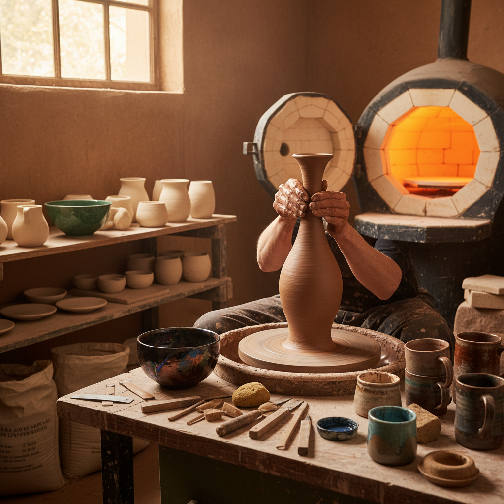

# Pottery Art 陶艺

> "Pottery is the marriage of earth, water, fire, and air — clay dug from the ground, mixed with water to become plastic, shaped by human hands into form, dried in air, then transformed by fire into something permanent. It is the oldest technology and the newest art, practiced continuously for twelve thousand years yet still capable of surprising us with new forms and glazes that no one has seen before." — Unknown

## 概述

陶艺（Pottery Art）是以黏土为主要材料，通过成型、干燥和烧制创造器物和艺术品的艺术形式——包括拉坯、手捏、泥条盘筑等成型技法，以及施釉、烧制等后续工艺。陶艺是人类最古老的工艺之一，也是当代最活跃的手工艺术领域。

陶艺的实践包括：1）拉坯——在转盘上用手拉制器皿；2）手捏成型——用手直接捏塑造型；3）泥条盘筑——用泥条层层盘筑成型；4）注浆成型——将泥浆注入模具；5）施釉——在坯体上施加各种釉料；6）烧制——在窑炉中高温烧制；7）当代陶艺——将陶瓷作为当代艺术媒介的创作。

## 核心特征

| 特征 | 描述 |
|------|------|
| 泥土 | 以泥土为基本材料 |
| 火焰 | 通过火焰转化 |
| 手工 | 手工成型的触感 |
| 功能 | 功能性与艺术性结合 |
| 釉色 | 丰富的釉色变化 |
| 永久 | 烧制后极其持久 |

## 视觉特征

- **质感**：陶土的质朴质感
- **釉色**：丰富多变的釉色
- **圆润**：拉坯的圆润造型
- **纹理**：手工留下的纹理
- **窑变**：烧制中的偶然效果
- **朴素**：泥土的朴素之美

## 代表作品

| 作品 | 艺术家/传统 | 年代 | 意义 |
|------|-------------|------|------|
| *Jōmon pottery* | 日本绳纹 | 公元前14000年 | 最古老的陶器 |
| *Chinese celadon* | 中国传统 | 宋代 | 中国青瓷 |
| *Raku ware* | 日本传统 | 16世纪至今 | 日本乐烧 |
| *Studio pottery* | Bernard Leach | 20世纪 | 工作室陶艺运动 |
| *Contemporary ceramics* | Various | 当代 | 当代陶艺 |

## 历史时间线

| 时期 | 事件 |
|------|------|
| 公元前14000年 | 最早的陶器（日本绳纹） |
| 古代 | 世界各文明的陶器传统 |
| 宋代 | 中国陶瓷的黄金时代 |
| 20世纪 | 工作室陶艺运动 |
| 当代 | 陶艺的当代艺术化 |

## 中国语境

陶艺在中国有举世无双的传统——中国是瓷器的发明国，"China"一词本身就是瓷器的代名词。中国的陶瓷传统从新石器时代的彩陶开始——经历了商周的原始瓷、汉代的青瓷、唐代的三彩、宋代的五大名窑、元代的青花、明清的彩瓷等辉煌发展。景德镇是世界陶瓷之都——千年窑火不断。中国当代陶艺在传统与创新之间寻找平衡——一些艺术家在传承传统技艺的同时探索新的表现形式。中国的陶艺教育和体验越来越普及——许多城市都有陶艺工作室供公众体验。中国的陶瓷产业规模巨大——从日用瓷到艺术瓷，中国仍然是世界最大的陶瓷生产国。

## AI生成概念图

## 与其他风格的关系

- **Ceramic Art** → 陶瓷艺术
- **Sculpture** → 雕塑
- **Craft Art** → 工艺美术
- **Glaze Art** → 釉艺
- **Raku** → 乐烧
- **Porcelain** → 瓷器

---

*浮光艺志 | Chronicle of Artistry*
