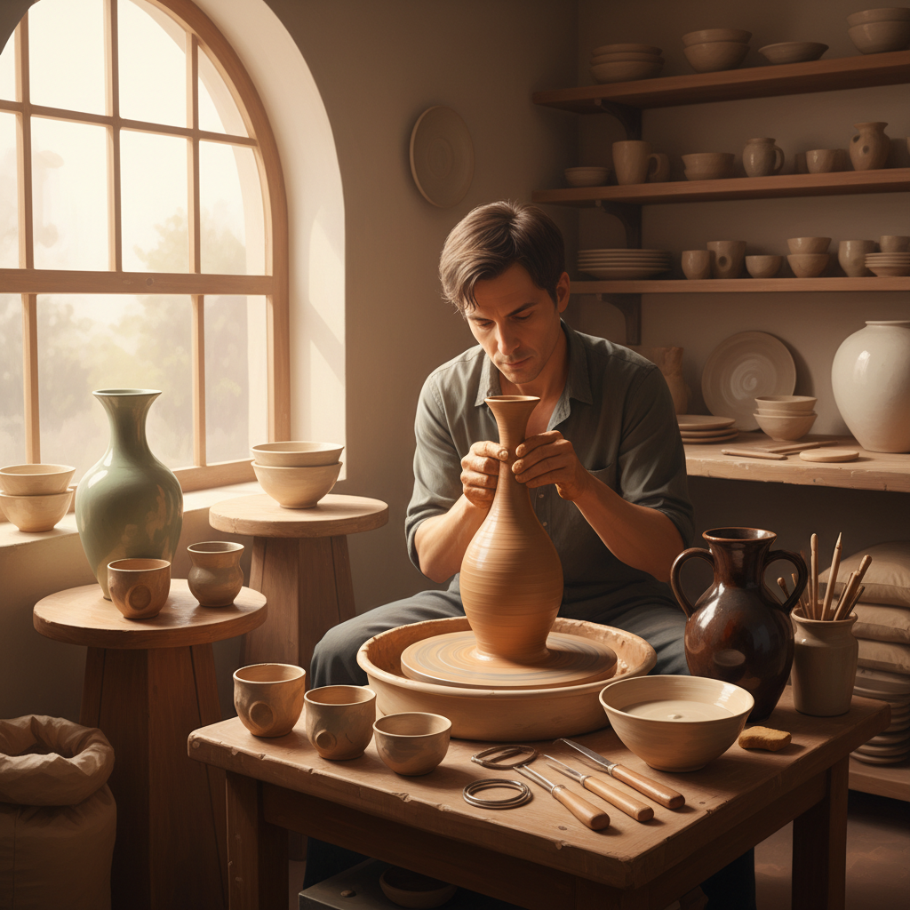

# Pottery Wheel Art 拉坯艺术

> "The wheel is the potter's partner — a spinning disc that transforms a lump of clay into a vessel through the dialogue between centrifugal force and the potter's hands. There is no hiding on the wheel: every tremor, every hesitation, every moment of inattention is recorded in the clay. But when the hands are steady and the mind is quiet, the wheel becomes a meditation, and the clay rises as if by its own will into forms of breathtaking symmetry and grace." — Unknown

## 概述

拉坯艺术（Pottery Wheel Art）是使用陶轮（拉坯机）通过旋转和手工塑形将黏土制作成各种器物的陶瓷工艺——是陶瓷制作中最核心、最具技术性的成型方法。拉坯是一种需要长期练习才能掌握的技艺，被认为是陶艺中最优雅和最具表现力的技法。

拉坯艺术的实践包括：1）拉坯成型——在旋转的陶轮上用手塑造器物；2）修坯——在半干状态下修整器物形状；3）利坯——用刀具修整器壁厚度；4）组合——将拉坯部件组合成复杂器物；5）大件拉坯——制作大型器物的特殊技法；6）薄胎——极薄器壁的高难度拉坯；7）当代拉坯——将拉坯作为当代艺术表达的创作。

## 核心特征

| 特征 | 描述 |
|------|------|
| 旋转 | 利用旋转力成型 |
| 对称 | 天然的旋转对称 |
| 手感 | 手与泥的直接对话 |
| 流畅 | 流畅的曲线造型 |
| 冥想 | 冥想般的创作过程 |
| 技艺 | 需要长期练习的技艺 |

## 视觉特征

- **旋纹**：旋转留下的同心纹理
- **对称**：完美的旋转对称
- **曲线**：优雅的曲线轮廓
- **薄壁**：均匀的器壁厚度
- **底足**：修整后的底足
- **釉面**：与釉料结合的效果

## 代表作品

| 作品 | 艺术家/文化 | 年代 | 意义 |
|------|-------------|------|------|
| *Song Dynasty celadon* | 中国宋代 | 960-1279 | 宋代青瓷拉坯 |
| *Bernard Leach pottery* | Bernard Leach | 20世纪 | 东西方陶艺融合 |
| *Lucie Rie vessels* | Lucie Rie | 20世纪 | 现代主义拉坯 |
| *Japanese tea bowls* | 日本传统 | 16世纪至今 | 日本茶碗 |
| *Jingdezhen porcelain* | 景德镇 | 宋代至今 | 景德镇瓷器 |

## 历史时间线

| 时期 | 事件 |
|------|------|
| 公元前4500年 | 最早的陶轮出现（美索不达米亚） |
| 古代 | 各文明发展陶轮技术 |
| 中世纪 | 陶轮技术的全球传播 |
| 20世纪 | 工作室陶艺运动 |
| 当代 | 拉坯作为艺术表达 |

## 中国语境

拉坯艺术在中国有极其深厚的传统——中国是世界上最早使用陶轮的文明之一。中国的景德镇是世界瓷都——其拉坯技艺代表了人类陶瓷工艺的最高水平。中国传统的拉坯讲究"一气呵成"——从揉泥到拉坯到修坯形成完整的工艺流程。中国的薄胎瓷（如景德镇的"蛋壳瓷"）展示了拉坯技艺的极致——器壁薄如蝉翼，透光如纸。中国当代的陶艺教育中，拉坯是最基础也是最重要的课程——几乎所有陶艺学习者都从拉坯开始。中国的陶艺体验馆在城市中越来越普及——拉坯成为一种流行的休闲和减压活动。中国当代的一些陶艺家将传统拉坯技法与现代审美相结合——创造出既有传统韵味又具当代感的作品。

## AI生成概念图

## 与其他风格的关系

- **Ceramics** → 陶瓷艺术
- **Pottery** → 陶器艺术
- **Porcelain** → 瓷器艺术
- **Glaze Art** → 釉料艺术
- **Sculpture** → 雕塑
- **Craft Art** → 工艺美术

---

*浮光艺志 | Chronicle of Artistry*
