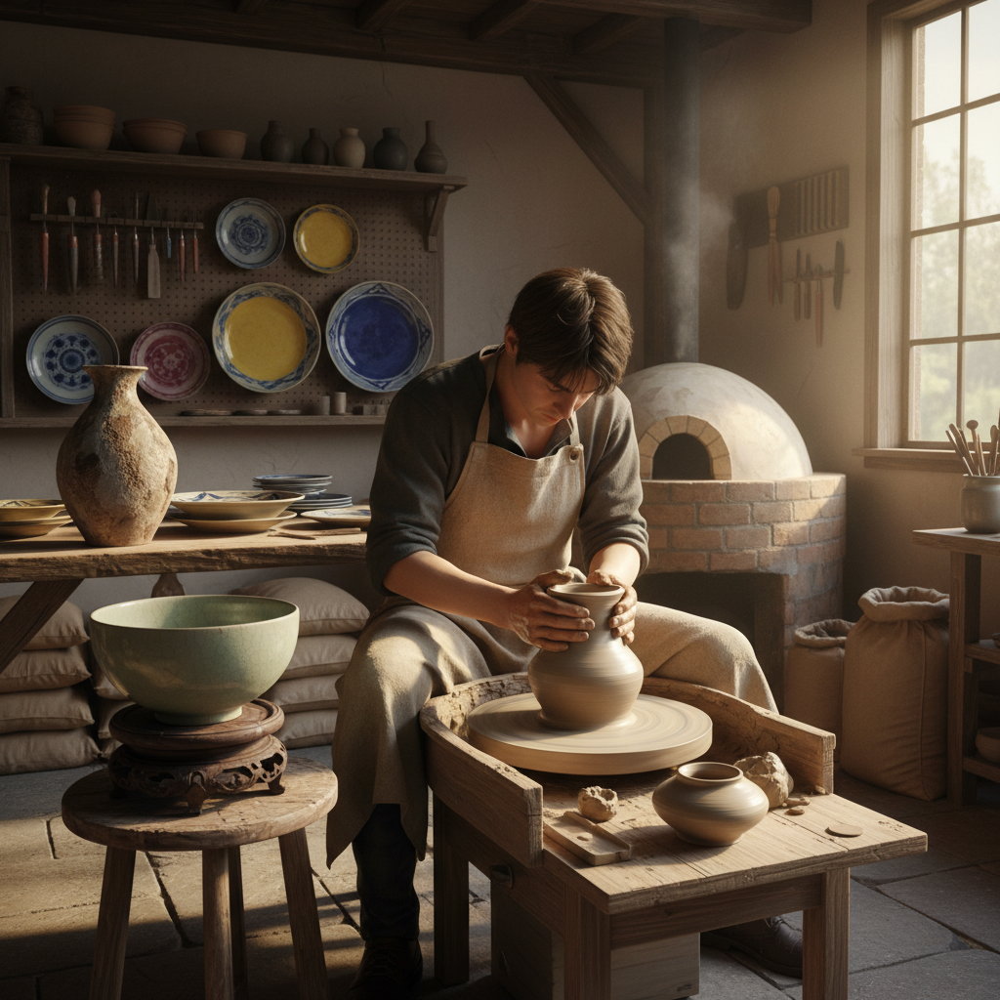

# Pottery 陶艺

> "Pottery is earth, water, and fire transformed by human hands — the most elemental of all arts." — Unknown

## 概述

陶艺（Pottery）是使用黏土通过成型、干燥和烧制来制作器物的古老工艺。陶艺是人类最早的"化学工程"——通过火的力量将柔软的泥土永久转化为坚硬的陶器。从新石器时代的粗陶到当代的精美瓷器，陶艺伴随人类文明走过了一万多年。陶艺的核心技法包括：手捏（pinching）、盘条（coiling）、泥板（slab building）和拉坯（wheel throwing）。

陶艺的哲学在于：转化——泥土通过水变得可塑，通过火变得永恒。这是物质最深刻的转化——从柔软到坚硬，从临时到永久，从自然到文化。

## 核心特征

| 特征 | 描述 |
|------|------|
| 黏土 | 使用黏土为材料 |
| 烧制 | 通过火烧制成型 |
| 转化 | 材料的根本转化 |
| 功能 | 功能性与艺术性 |
| 触感 | 强调触觉体验 |
| 古老 | 万年以上的历史 |

## 视觉特征

- **质感**：泥土的质感
- **釉色**：丰富的釉色变化
- **形态**：圆润的器物形态
- **温暖**：泥土的温暖感
- **手感**：手工的痕迹
- **自然**：自然的色彩

## 代表作品

| 作品 | 艺术家 | 年代 | 意义 |
|------|--------|------|------|
| *Jōmon pottery* | 匿名 | 公元前14000年 | 最古老的陶器 |
| *Greek black-figure vases* | Various | 公元前6世纪 | 希腊彩陶 |
| *Song dynasty celadon* | 匿名 | 宋代 | 宋代青瓷 |
| *Bernard Leach stoneware* | Bernard Leach | 20世纪 | 现代陶艺之父 |
| *Peter Voulkos sculptures* | Peter Voulkos | 1950s+ | 陶艺雕塑革命 |

## 历史时间线

| 时期 | 事件 |
|------|------|
| 公元前14000年 | 日本绳文陶器 |
| 公元前7000年 | 中国最早的陶器 |
| 公元前3000年 | 陶轮的发明 |
| 宋代 | 中国瓷器的巅峰 |
| 20世纪 | 现代工作室陶艺运动 |
| 当代 | 当代陶艺的多元发展 |

## 中国语境

中国是世界陶瓷艺术的发源地和最高成就者——"China"这个词本身就意味着瓷器。从仰韶文化的彩陶到商代的白陶，从唐三彩到宋代五大名窑（汝、官、哥、钧、定），从元青花到明清彩瓷，中国陶瓷史就是一部辉煌的艺术史。景德镇是世界瓷都，至今仍是中国陶瓷艺术的中心。当代中国的陶艺创作非常活跃，既有传承传统的匠人，也有探索当代表达的艺术家。

## AI生成概念图

## 与其他风格的关系

- **Ceramics** → 陶瓷（更广义的术语）
- **Porcelain** → 瓷器
- **Sculpture** → 陶塑
- **Raku** → 乐烧
- **Glaze Art** → 釉艺
- **Kintsugi** → 金缮（修复陶器）

---

*浮光艺志 | Chronicle of Artistry*
