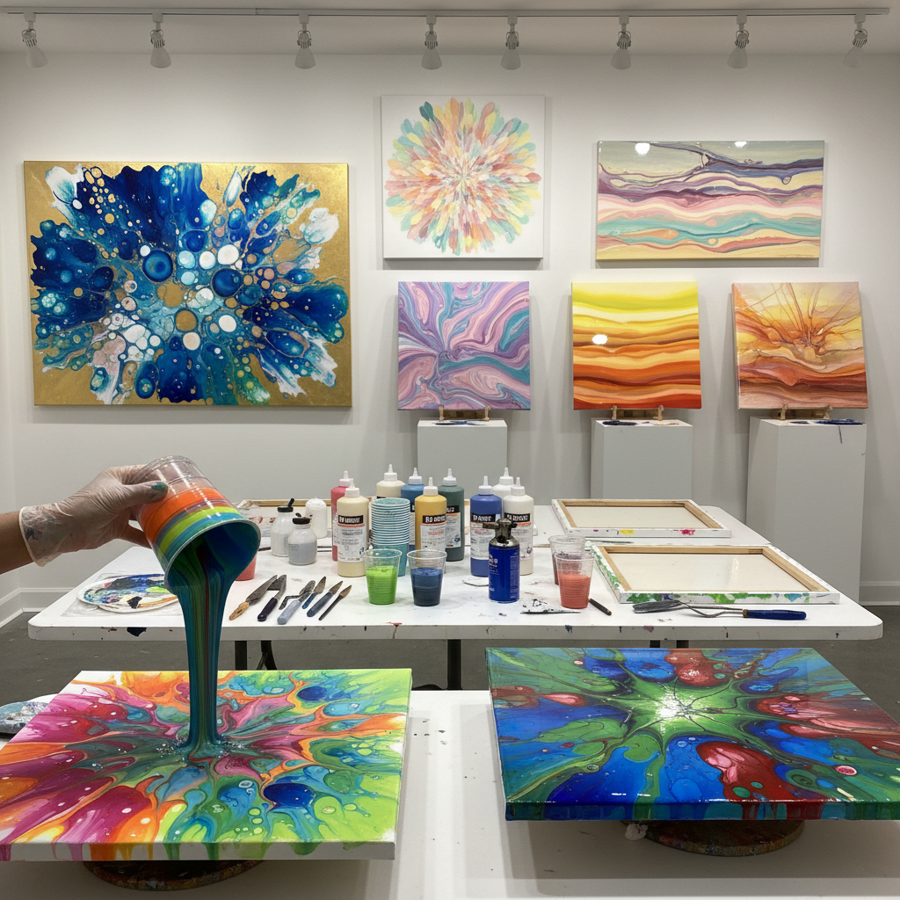

# Pour Painting 倾倒绘画

> "Pour painting surrenders control to gravity and chemistry — liquid paint poured onto canvas finds its own path, colors meeting and separating in cellular patterns that mimic the structures of nature itself, each pour a unique collaboration between the artist's choices and the physics of fluid dynamics." — Unknown

## 概述

倾倒绘画（Pour Painting）是一种将液态丙烯颜料（通常混合了倾倒介质/pouring medium）直接倾倒在画布或面板上，让颜料自由流动、混合和分离形成图案的抽象绘画技法。倾倒绘画属于流体艺术（Fluid Art）的范畴，其核心是利用颜料的流动性和不同颜料之间的密度差异来创造有机的、细胞状的图案。

倾倒绘画的主要技法包括：脏倒法（dirty pour，将多种颜色层叠在一个杯中再一次倒出）、翻杯法（flip cup，将装有颜料的杯子翻扣在画布上再提起）、吹气法（用吹风机或吸管引导颜料流动）、旋转法（swipe，用工具在颜料表面刮过创造细胞效果）。添加硅油可以产生更多的"细胞"效果——颜料中的硅油使不同颜色相互排斥形成圆形细胞。

## 核心特征

| 特征 | 描述 |
|------|------|
| 倾倒 | 液态颜料倾倒 |
| 流动 | 颜料自由流动 |
| 细胞 | 细胞状图案 |
| 偶然 | 偶然性的效果 |
| 抽象 | 抽象的图案 |
| 化学 | 利用化学反应 |

## 视觉特征

- **流动**：液态的流动感
- **细胞**：细胞状的图案
- **色彩**：丰富的色彩混合
- **有机**：有机的自然形态
- **层次**：多层次的深度
- **光泽**：丙烯的光泽表面

## 代表作品

| 作品 | 艺术家 | 年代 | 意义 |
|------|--------|------|------|
| *Acrylic pour paintings* | Various | 当代 | 丙烯倾倒绘画 |
| *Dirty pour abstracts* | Various | 当代 | 脏倒法抽象画 |
| *Cellular pour art* | Various | 当代 | 细胞效果倾倒画 |
| *Large scale pours* | Various | 当代 | 大型倾倒绘画 |
| *Resin-coated pours* | Various | 当代 | 树脂涂层倾倒画 |

## 历史时间线

| 时期 | 事件 |
|------|------|
| 1930年代 | 墨西哥壁画家的早期实验 |
| 1960年代 | Morris Louis的倾倒色域绘画 |
| 2010年代 | 社交媒体推动的全球流行 |
| 2015年后 | 倾倒绘画的商业化和普及 |
| 当代 | 倾倒绘画的持续发展 |

## 中国语境

倾倒绘画在中国有爆发式的流行——2018年前后通过社交媒体（抖音、小红书）传入中国后迅速走红。中国的手工体验工作室和创意空间大量开设倾倒绘画课程。中国的电商平台上有丰富的倾倒绘画材料（倾倒介质、硅油、丙烯颜料套装）。中国的一些当代艺术家将倾倒绘画与中国传统水墨的"泼墨"概念联系，探索东西方流体艺术的对话。

## AI生成概念图

## 与其他风格的关系

- **Fluid Art** → 流体艺术
- **Abstract Expressionism** → 抽象表现主义
- **Resin Art** → 树脂艺术
- **Alcohol Ink Art** → 酒精墨水艺术
- **Action Painting** → 行动绘画
- **Bubble Painting** → 气泡绘画

---

*浮光艺志 | Chronicle of Artistry*
