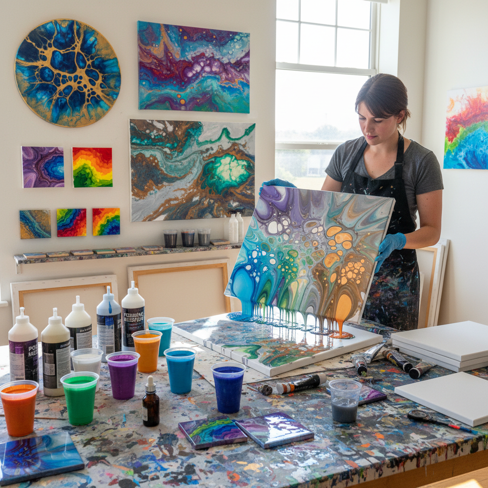

# Pouring Medium 倾倒画

> "Pouring medium transforms paint from a paste into a river — thinned to liquid consistency, colors cascade across the canvas under gravity's direction, mingling and separating in cellular patterns that no brush could orchestrate with such fluid grace." — Unknown

## 概述

倾倒画（Pouring Medium / Acrylic Pouring）是一种将丙烯颜料与倾倒介质（pouring medium）混合至液态，然后倾倒到画布上，让颜料在重力和表面张力的作用下自由流动和混合的绘画技法。倾倒画产生的效果包括：细胞状图案（cells）、大理石纹、流动的色彩河流和有机的抽象图案。

倾倒画在2010年代经历了爆发式的流行——社交媒体上大量的倾倒画视频吸引了全球的关注。倾倒画的技法包括：脏倒（dirty pour，多种颜色在一个杯中层叠后倾倒）、翻杯（flip cup）、吹画（blow painting）、旋转画（spin painting）等。添加硅油（silicone oil）可以产生独特的"细胞"效果——硅油使颜料层之间产生排斥，形成圆形的细胞状图案。

## 核心特征

| 特征 | 描述 |
|------|------|
| 液态 | 颜料稀释至液态 |
| 倾倒 | 倾倒到画布上 |
| 流动 | 颜料自由流动 |
| 细胞 | 细胞状图案 |
| 随机 | 结果不完全可控 |
| 丙烯 | 主要使用丙烯颜料 |

## 视觉特征

- **流动**：流动的色彩
- **细胞**：细胞状的图案
- **有机**：有机的自然形态
- **鲜艳**：鲜艳的色彩
- **大理石**：大理石纹效果
- **光泽**：光泽的表面

## 代表作品

| 作品 | 艺术家 | 年代 | 意义 |
|------|--------|------|------|
| *Pour paintings* | Various | 当代 | 倾倒画艺术 |
| *Cell art* | Various | 当代 | 细胞效果艺术 |
| *Dirty pour abstracts* | Various | 当代 | 脏倒抽象画 |
| *Large-scale pours* | Various | 当代 | 大型倾倒画 |
| *Resin-coated pours* | Various | 当代 | 树脂涂层倾倒画 |

## 历史时间线

| 时期 | 事件 |
|------|------|
| 1930s-40s | 墨西哥壁画家的早期倾倒实验 |
| 1960s | Morris Louis的倾倒画 |
| 2000s | 丙烯倾倒画的社区发展 |
| 2010s | 社交媒体推动的爆发式流行 |
| 2015+ | 细胞效果技法的发现和传播 |
| 当代 | 倾倒画作为全球流行的艺术形式 |

## 中国语境

倾倒画在中国有极其广泛的流行——特别是在社交媒体时代。中国的短视频平台上有大量倾倒画创作视频。中国的手工艺爱好者群体中，倾倒画因其"易上手、效果惊艳、解压"的特点而极受欢迎。中国市场上有丰富的倾倒画材料——包括专用倾倒介质、硅油和丙烯颜料。中国的一些画室和手工坊开设倾倒画体验课程。倾倒画在中国被视为一种"治愈系"艺术活动。

## AI生成概念图

## 与其他风格的关系

- **Fluid Art** → 流体艺术
- **Alcohol Ink** → 酒精墨水
- **Abstract Art** → 抽象艺术
- **Resin Art** → 树脂艺术
- **Action Painting** → 行动绘画
- **Acrylic Painting** → 丙烯画

---

*浮光艺志 | Chronicle of Artistry*
