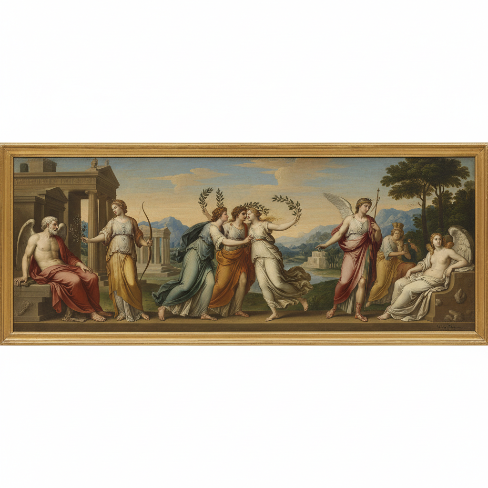

# Nicolas Poussin 普桑

> "The goal of painting is delight." — Nicolas Poussin

## 概述

尼古拉·普桑（Nicolas Poussin，1594–1665）是法国古典主义绑画的奠基人，虽长期居住在罗马，却被视为法国绑画传统的精神之父。他以严谨的构图、理性的秩序和古典题材闻名——将古希腊罗马的神话和历史转化为庄严的视觉叙事，强调理智对情感的控制。

## 核心特征

| 特征 | 描述 |
|------|------|
| 古典构图 | 几何化的严谨画面结构 |
| 理性秩序 | 理智控制情感的表达 |
| 古典题材 | 希腊罗马神话与历史 |
| 雕塑感人物 | 如浮雕般的人物排列 |
| 理想风景 | 有序的阿卡迪亚田园 |
| 色彩节制 | 和谐而克制的调色 |

## 代表作品

| 作品 | 年代 | 意义 |
|------|------|------|
| *Et in Arcadia Ego* | 1637–38 | 田园中的死亡冥想 |
| *The Rape of the Sabine Women* | 1634–35 | 古典叙事的戏剧张力 |
| *A Dance to the Music of Time* | 1634–36 | 时间寓言的优雅 |
| *Landscape with the Funeral of Phocion* | 1648 | 理想风景的典范 |

## AI生成概念图

## 与其他风格的关系

- **French Classicism** → 法国古典主义的奠基人
- **Jacques-Louis David** → 直接影响新古典主义
- **Raphael** → 继承拉斐尔的和谐理想
- **Claude Lorrain** → 同代理想风景画家
