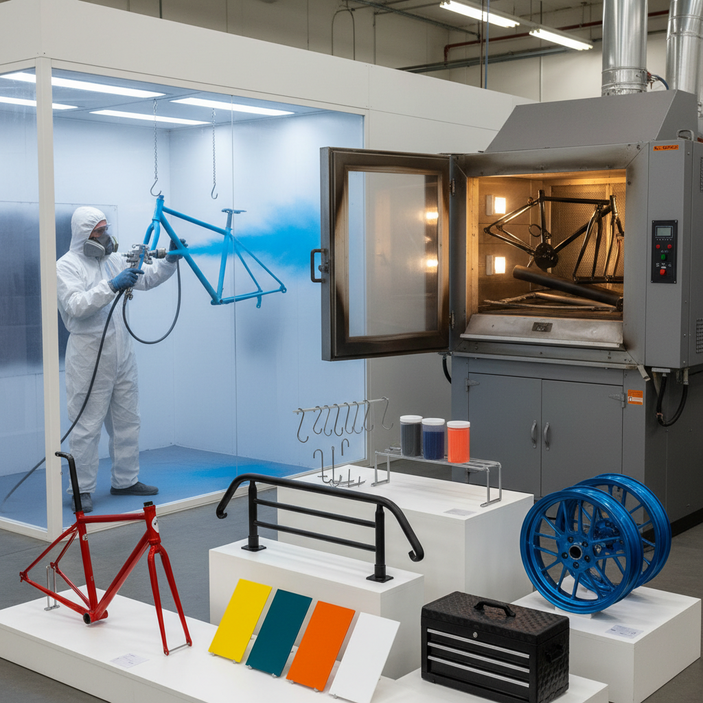

# Powder Coating 粉末涂装

> "Powder coating is color fused to metal — dry pigment particles charged with static electricity cling to the surface, then melt in the oven into a seamless skin tougher than any liquid paint could achieve." — Unknown

## 概述

粉末涂装（Powder Coating）是一种干式表面涂装工艺——将带有静电荷的干燥粉末颗粒（由树脂、颜料、固化剂等组成）喷涂到接地的金属表面上，粉末颗粒因静电吸附而均匀附着在金属表面。然后将涂覆了粉末的工件送入烤箱（通常180-200°C），粉末熔融、流平并固化，形成坚硬、均匀、耐久的涂层。

粉末涂装相比传统液体涂料有诸多优势：无溶剂排放（环保）、涂层更厚更均匀、耐磨耐腐蚀性更强、颜色选择极其丰富、可回收未附着的粉末。粉末涂装广泛应用于：家具（金属家具、办公家具）、汽车零部件、自行车车架、建筑金属件、家电外壳、工业设备等几乎所有需要金属表面涂装的领域。

## 核心特征

| 特征 | 描述 |
|------|------|
| 干式 | 干燥粉末喷涂 |
| 静电 | 静电吸附 |
| 烘烤 | 高温固化 |
| 耐久 | 极其耐久 |
| 环保 | 无溶剂排放 |
| 多色 | 颜色极其丰富 |

## 视觉特征

- **均匀**：极其均匀的涂层
- **光滑**：光滑的表面
- **色彩**：丰富的色彩选择
- **质感**：可实现多种质感
- **光泽**：从哑光到高光
- **厚实**：比液体涂料更厚实

## 代表作品

| 作品 | 艺术家 | 年代 | 意义 |
|------|--------|------|------|
| *Powder coated furniture* | Various | 当代 | 粉末涂装家具 |
| *Custom bicycle frames* | Various | 当代 | 定制自行车车架 |
| *Architectural metalwork* | Various | 当代 | 建筑金属件 |
| *Automotive parts* | Various | 当代 | 汽车零部件 |
| *Art sculptures* | Various | 当代 | 艺术雕塑涂装 |

## 历史时间线

| 时期 | 事件 |
|------|------|
| 1945 | 粉末涂装概念的提出 |
| 1950s | 流化床浸涂法的开发 |
| 1960s | 静电喷涂法的发明 |
| 1970s | 粉末涂装的工业化普及 |
| 1990s | 环保法规推动粉末涂装替代液体涂料 |
| 当代 | 特殊效果粉末和低温固化粉末的开发 |

## 中国语境

粉末涂装在中国有着巨大的工业规模——中国是全球最大的粉末涂料生产和消费国。中国的粉末涂装广泛应用于：铝型材（门窗、幕墙）、家电（冰箱、洗衣机外壳）、汽车零部件、金属家具、自行车等。中国的粉末涂料行业年产量超过200万吨。在艺术和设计领域，中国的一些设计师和艺术家使用粉末涂装作为金属雕塑和装置艺术的表面处理方式。中国的定制自行车和改装车文化中，粉末涂装是热门的个性化选择。

## AI生成概念图

## 与其他风格的关系

- **Anodizing** → 阳极氧化
- **Electroplating** → 电镀
- **Spray Painting** → 喷漆
- **Industrial Design** → 工业设计
- **Metal Finishing** → 金属表面处理
- **Automotive Art** → 汽车艺术

---

*浮光艺志 | Chronicle of Artistry*
