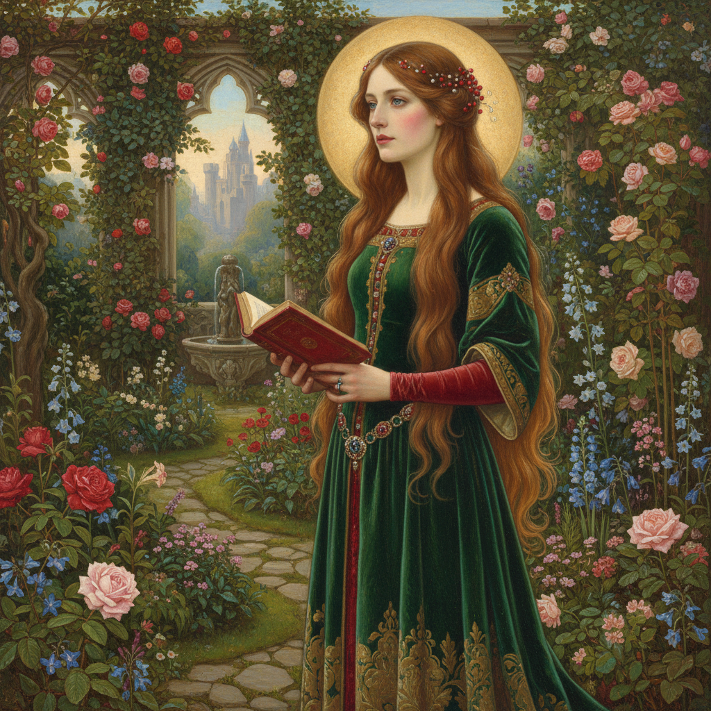

# Pre-Raphaelite Painting 拉斐尔前派绘画

> **时期：** 1848年–1870年代  
> **关键词：** 中世纪复兴、自然忠实、鲜艳色彩、文学性、反学院

## 概述

Pre-Raphaelite Painting（拉斐尔前派绘画）是1848年由英国年轻画家组成的兄弟会发起的艺术革命——他们反对皇家美术学院的陈腐传统，主张回到拉斐尔之前的中世纪和早期文艺复兴的真诚与细致。罗塞蒂的神秘女性、米莱斯的溺水奥菲利亚、亨特的宗教象征——他们用宝石般的色彩和极致的自然细节，创造出一个比现实更美、比梦境更真的世界。

## 风格特征

- **极致细节**：每片叶子、每根发丝都精确描绘
- **鲜艳色彩**：湿壁画般的宝石色调
- **文学主题**：莎士比亚、丁尼生、亚瑟王传说
- **自然忠实**：户外写生的真实光线
- **象征主义**：花卉和物品承载隐喻

## 代表人物与作品

- 但丁·加布里埃尔·罗塞蒂 神秘女性
- 约翰·埃弗里特·米莱斯《奥菲利亚》
- 威廉·霍尔曼·亨特《世界之光》
- 爱德华·伯恩-琼斯 中世纪幻想

## 概念图

